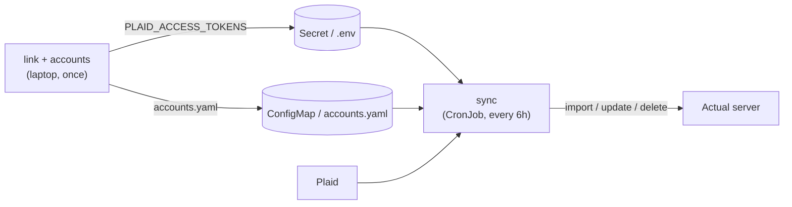

# actual-plaid-sync

Pull bank transactions from [Plaid](https://plaid.com) into a self-hosted [Actual Budget](https://actualbudget.org) server, including pending ones.

Actual's built-in bank sync doesn't cover every bank or show pending transactions. This tool does both. It runs on a schedule (a Kubernetes CronJob) with no database of its own: the configuration lives in env vars plus a small accounts file, and all state lives in Actual.

- **Pending-aware.** Pending transactions show up right away. When they post, the same row is updated and your payee, category and notes are kept. Cancelled holds are removed.
- **OAuth banks work** (Chase etc.) with no HTTPS or redirect URI setup. You connect each bank once from your laptop.
- **Multi-arch image:** `ghcr.io/msheiny/actual-plaid-sync` (`linux/amd64`, `linux/arm64`).

## How it works

There are three commands. You run the first two once, on your laptop, and the third runs on a schedule:

| Command | What it does | Needs | Output |
|---|---|---|---|
| `link` | Serves a local page at <http://localhost:8484> where you log in to your bank through Plaid Link | Plaid keys | an **access token** for that bank login |
| `accounts` | Lists your Plaid accounts next to your Actual accounts | Plaid keys, access tokens, **Actual login** (`ACTUAL_SERVER_URL`, `ACTUAL_PASSWORD`, `ACTUAL_SYNC_ID`) | a suggested **`accounts.yaml`** |
| `sync` | Fetches recent transactions for each access token and imports, updates or deletes them in the mapped Actual accounts | everything above, plus `accounts.yaml` | one summary line per account |



## Try it with Plaid Sandbox first

Yes, you can test the whole flow without real bank data. Plaid's **Sandbox** gives you fake banks and transactions. You don't need Production approval, and Sandbox Items don't count against your Trial limit. You need [mise](https://mise.jdx.dev), Docker, and about ten minutes.

### 1. Get Sandbox keys

Sign up at <https://dashboard.plaid.com/signup>. Under *Developers → Keys*, copy your `client_id` and the **Sandbox** secret.

### 2. Set up the checkout

```bash
git clone https://github.com/msheiny/actual-plaid-sync && cd actual-plaid-sync
cp .env.example .env
```

In `.env`, set `PLAID_CLIENT_ID`, `PLAID_SECRET` (the Sandbox one), and keep `PLAID_ENV=sandbox`.

That's all the setup. Every `mise run` loads `.env`, installs Node, pnpm and the dependencies if they're missing, and builds before it runs.

### 3. Start a throwaway Actual server

```bash
mise run actual:start    # digest-pinned actual-server container on localhost:5006
```

Open <http://localhost:5006>, set a password, create a new budget, and add an account (for example "Checking"). Then find the budget's sync ID: open the budget, go to *Settings*, click **Show advanced settings** at the bottom, and copy **Sync ID** from the *IDs* section. Don't copy the *Budget ID* shown next to it. In `.env`, set `ACTUAL_PASSWORD` (the server password you just set) and `ACTUAL_SYNC_ID`. `ACTUAL_SERVER_URL` already points at `localhost:5006`.

Nothing here touches your real Actual server or budget.

### 4. Link a fake bank

```bash
mise run link
```

Open <http://localhost:8484> and click **Connect bank**. Pick any bank (for example *First Platypus Bank*) and log in with `user_good` / `pass_good`. If it asks for a phone number, any number works; the verification code is `123456`. The link page lists these values on its left side. The terminal prints `PLAID_ACCESS_TOKENS=access-sandbox-...`. Copy that line into `.env`.

### 5. Map accounts

```bash
mise run accounts
```

This logs in to Actual with the `ACTUAL_*` values from step 3, so those must be set in `.env` first. It prints the Plaid and Actual accounts side by side, plus a suggested `accounts.yaml`. Sandbox account names ("Plaid Checking") won't match yours, so when nothing matches, the command prints a complete example with `REPLACE_WITH_ACTUAL_ACCOUNT_NAME` placeholders. Copy the YAML into `accounts.yaml` in the checkout, replace the placeholders with your Actual account names, and remove entries you do not want to sync:

```yaml
accounts:
  - plaid: "0000"      # Plaid Checking; keep the quotes
    actual: Checking
```

### 6. Sync

```bash
mise run sync                  # .env.example ships with DRY_RUN=true: prints the plan, writes nothing
DRY_RUN=false mise run sync    # actually import
```

Refresh Actual and the transactions appear. If the log says `PRODUCT_NOT_READY`, Plaid is still preparing the new Item; wait a minute and run it again. Run `sync` twice to confirm the second run adds nothing.

When you're done, run `mise run actual:stop`. This deletes the container and its data.

> **Docker instead of a checkout?** Every command also runs from the image, with the same `.env`:
> `docker run --rm -it --network host --env-file .env -e ACCOUNTS_FILE=/config/accounts.yaml -v "$PWD/accounts.yaml:/config/accounts.yaml:ro" ghcr.io/msheiny/actual-plaid-sync:0.1.0 <link|accounts|sync>`.
> Host networking lets the container reach Actual on `localhost:5006` and serve the link page on `localhost:8484`. On Docker Desktop, turn host networking on in its settings first.

## Going to production

The steps are the same as the Sandbox walkthrough, with real keys, a real Actual server and real banks.

### 1. Get Plaid Production access

In the Plaid Dashboard, request Production access and choose the free **Trial** plan. Fill in the company and use-case profile; personal use is fine. Once you're approved, copy the **Production** secret (the `client_id` doesn't change).

Trial allows **10 Production Items**, where one Item is one bank login. **Removing an Item does not give its slot back.** If a connection breaks, repair it with `link --update` ([see below](#fixing-a-broken-bank-connection)) instead of linking again.

### 2. Check your Actual version

The image bundles a specific `@actual-app/api`, and your server must run the matching version:

| actual-plaid-sync | bundled `@actual-app/api` | Actual server |
|---|---|---|
| `0.1.x` | `26.9.0` | `26.9.x` |

With a mismatched server, commands fail with `out-of-sync-migrations` and a hint that names both versions.

### 3. Link your banks and write the accounts file

Make a copy of your `.env` (or edit it in place) with `PLAID_ENV=production`, the Production secret, and your real Actual login:

- `ACTUAL_SERVER_URL`: the URL you open Actual at, for example `https://actual.example.com`
- `ACTUAL_PASSWORD`: the server password you log in to Actual with
- `ACTUAL_SYNC_ID`: in the budget, *Settings* → **Show advanced settings** → *IDs* → **Sync ID** (not *Budget ID*)
- `ACTUAL_ENCRYPTION_PASSWORD`: only if the budget is end-to-end encrypted

`accounts` and `sync` both need these. Then:

1. Run `mise run link` once per bank login. Collect the tokens into `PLAID_ACCESS_TOKENS`, separated by commas. Link requests 730 days of history, and that can only be set at link time.
2. Run `mise run accounts`, copy the suggested block into `accounts.yaml`, and check it. Plaid accounts not listed are skipped.
3. Run `mise run sync` with `DRY_RUN=true`, and read the plan before running it for real.

> **Map only accounts this tool feeds exclusively.** An uncleared transaction with an imported ID that Plaid no longer reports (for example, from an earlier bank-file import) is treated as a cancelled hold and deleted.

### 4. Deploy the CronJob

[`deploy/cronjob.yaml`](deploy/cronjob.yaml) contains a Secret, a ConfigMap with `accounts.yaml`, and a CronJob that runs `sync` every 6 hours as a non-root user with a read-only root filesystem. Either replace every `change-me` value in it, or delete the Secret and ConfigMap documents and create them from your `.env` and `accounts.yaml`:

```bash
grep -v '^#' .env | grep '=.' | grep -v -e '^DRY_RUN=' -e '^ACCOUNTS_FILE=' > .env.k8s
kubectl create secret generic actual-plaid-sync --from-env-file=.env.k8s
rm .env.k8s
kubectl create configmap actual-plaid-sync-accounts --from-file=accounts.yaml
kubectl apply -f deploy/cronjob.yaml
```

For reproducible deploys, pin the image by digest.

Trigger a run and watch it:

```bash
kubectl create job --from=cronjob/actual-plaid-sync actual-plaid-sync-manual
kubectl logs -f job/actual-plaid-sync-manual
```

Each mapped account logs one line, for example `Chase Checking: 5 added, 2 posted, 1 amount updated, 1 cancelled hold, 0 skipped`.

## Fixing a broken bank connection

If a run logs `ITEM_LOGIN_REQUIRED`, `PENDING_EXPIRATION` or `PENDING_DISCONNECT` for a token (shown masked, for example `…a1b2`), repair that login in update mode:

```bash
mise run link -- --update --access-token access-production-aaa
```

Update mode keeps the same access token and Item slot, so the Secret doesn't change. You can also use it to add or remove accounts on that login.

## Configuration

Settings come from env vars, and `sync` also reads the [accounts file](#accounts-file). All problems are reported together, and the command exits with code `2`.

| Var | Used by | Default | Notes |
|---|---|---|---|
| `PLAID_CLIENT_ID` | all | — | |
| `PLAID_SECRET` | all | — | different for Sandbox and Production |
| `PLAID_ENV` | all | — | `sandbox` \| `production` |
| `PLAID_COUNTRY_CODES` | link | `US` | comma list |
| `PLAID_ACCESS_TOKENS` | sync, accounts | — | comma list, one per bank login (Item) |
| `ACTUAL_SERVER_URL` | sync, accounts | — | |
| `ACTUAL_PASSWORD` | sync, accounts | — | |
| `ACTUAL_SYNC_ID` | sync, accounts | — | *Settings → Show advanced settings → IDs → Sync ID* (not *Budget ID*) |
| `ACTUAL_ENCRYPTION_PASSWORD` | sync, accounts | unset | only for end-to-end encrypted budgets |
| `ACCOUNTS_FILE` | sync | `accounts.yaml` | path to the accounts file, relative to the working directory |
| `SYNC_DAYS` | sync | `30` | how many days back to fetch from Plaid |
| `DRY_RUN` | sync | `false` | print the planned changes, write nothing |
| `LINK_PORT` | link | `8484` | |
| `LINK_HOST` | link | `127.0.0.1` | set `0.0.0.0` inside Docker without host networking |
| `LINK_ACCESS_TOKEN` | link --update | — | the token to repair; `--access-token` overrides it |
| `LOG_LEVEL` | all | `info` | `debug` \| `info` \| `warn` \| `error` |

Exit codes: `0` success; `1` a Plaid or Actual failure, or an entry that doesn't match a live account (healthy accounts are still synced); `2` configuration error.

### Accounts file

`sync` only touches the accounts listed in `accounts.yaml`:

```yaml
accounts:
  - plaid: "1234"            # Plaid mask (last 4 digits); keep the quotes
    actual: Chase Checking   # Actual account name
  - plaid: BxBXxLj1m4HMXBm9WZZmCWVbPjX16EHwv99vp
    actual: Joint Visa
```

- `plaid` is the Plaid account ID from `accounts`, or a quoted digits-only mask (last digits). Existing `{ id: ... }` entries are also accepted. Use the ID when two accounts share a mask or an account has no mask. An unquoted mask is rejected, since YAML reads `0123` as the number 123.
- `actual` is the name of an open Actual account, ignoring case. If you rename the account in Actual, update the file.
- Each Plaid account and each Actual account can be listed once.
- Masks survive linking a bank again. Plaid account IDs stay the same when you repair a login with `link --update`, but change if you remove the bank and link it from scratch.

## How pending transactions are handled

- Pending transactions are imported **uncleared** and posted ones **cleared**.
- When a pending transaction posts, Plaid gives it a new ID that points back to the pending one. The existing Actual row gets the posted ID, amount, date and cleared flag. **Your payee, category and notes are kept.**
- If a pending amount or date changes, the row is updated.
- A pending row that disappears from Plaid is treated as a cancelled hold and deleted, but only if it is dated at least 3 days inside the sync window. Older ones only get a log notice.
- Reconciled transactions and split parents are never changed or deleted. They get a log notice instead.
- A pending transaction you delete in Actual comes back once it posts, because the posted transaction has a new ID.
- Actual may match an imported pending transaction to an uncleared transaction you entered by hand (same amount, dated within about 7 days) instead of adding a new row. If that hold is later cancelled, your hand-entered transaction is the one deleted. A warning is logged whenever such a match happens.
- Some banks (e.g. Capital One, USAA) don't link pending transactions to posted ones. For those, the posted transaction is imported as a new row and the pending row is removed. You get no duplicates, but a category set on the pending row is lost.

## Development

```bash
mise run check        # lint + typecheck + unit tests
mise run build        # pnpm install + tsc -> dist/
```

Node and pnpm versions are pinned in `mise.toml` / `mise.lock`; mise installs them on first use.

`mise tasks` lists all tasks. Unit tests don't read your `.env`.

End-to-end test (Plaid Sandbox + a throwaway Actual server). Set `PLAID_SANDBOX_CLIENT_ID` and `PLAID_SANDBOX_SECRET` in `.env` or in your shell:

```bash
mise run actual:start    # must be a fresh server: the test sets its own password
mise run build && mise run e2e
mise run actual:stop
```

Without those two variables the sync suite is skipped. CI runs it when repository secrets of the same names are set.

## Releasing

```bash
git tag v0.1.0 && git push --tags
```

`release.yml` publishes `ghcr.io/msheiny/actual-plaid-sync:0.1.0` and `:0.1`, with SBOM and provenance attestations. Every push to `main` also publishes `:edge` and `:sha-<short>`.

One-time step after the first publish: GitHub → *Packages* → `actual-plaid-sync` → *Package settings* → *Change visibility* → **Public**.

When bumping `@actual-app/api` (Renovate labels these PRs `actual-api`), update the compatibility table above. The same PR should also bump the `actual-server` image in `.github/workflows/ci.yml` and in the `actual:start` task in `mise.toml`.
