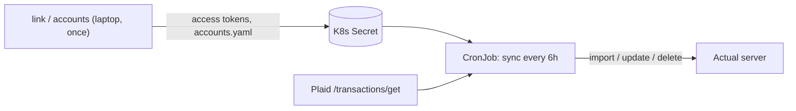

# actual-plaid-sync

Sync bank transactions from [Plaid](https://plaid.com) into a self-hosted [Actual Budget](https://actualbudget.org) server, including pending transactions.

- **Stateless.** Runs as a Kubernetes CronJob, configured through env vars and accounts.yaml. Actual is the only state.
- **Pending-aware.** Pending transactions are imported right away, then updated in place when they post. Cancelled holds are removed.
- **OAuth banks work** (Chase etc.) through a one-time local `link` command. No HTTPS or redirect URI setup.
- Ships as a multi-arch (`linux/amd64`, `linux/arm64`) image: `ghcr.io/msheiny/actual-plaid-sync`.



## Requirements

- **A Plaid account with Production access.** The free **Trial** plan is enough for personal use:
  1. Sign up at <https://dashboard.plaid.com/signup>.
  2. In the Dashboard, request Production access and choose the Trial plan. Fill in the company/use-case profile. Personal use is fine.
  3. Once approved, copy your `client_id` and **Production** secret from *Developers → Keys*. The Sandbox secret is different.
  4. Trial limits: 10 Production Items (one Item = one bank login). **Removing an Item does not free its slot.** Repair broken connections with `link --update`, never by linking again.
- **An Actual server** whose version matches the `@actual-app/api` bundled in the image:

  | actual-plaid-sync image | bundled `@actual-app/api` | Actual server |
  |---|---|---|
  | `0.1.x` | `26.9.0` | `26.9.x` |

  A mismatched server fails with `out-of-sync-migrations` and a hint naming both versions.
- **Kubernetes** (any distribution) for the scheduled sync. Docker or [mise](https://mise.jdx.dev) on your laptop for `link`.

## Quickstart

### 1. Get Plaid keys

See [Requirements](#requirements). Export them in your shell:

```bash
export PLAID_CLIENT_ID=... PLAID_SECRET=... PLAID_ENV=production
```

### 2. Link each bank (`link`)

With Docker:

```bash
docker run --rm -it -p 127.0.0.1:8484:8484 \
  -e LINK_HOST=0.0.0.0 -e PLAID_CLIENT_ID -e PLAID_SECRET -e PLAID_ENV \
  ghcr.io/msheiny/actual-plaid-sync:0.1.0 link
```

Or from a checkout: `mise install && pnpm install && mise run build && mise run link`.

Open <http://localhost:8484>, then connect the bank in Plaid Link. The command prints the access token and the Item's accounts, then exits. Repeat for each bank login, collecting the tokens into a comma-separated `PLAID_ACCESS_TOKENS`. Link requests 730 days of history; that can only be set at link time.

### 3. Build `accounts.yaml` (`accounts`)

```bash
export PLAID_ACCESS_TOKENS=access-production-aaa,access-production-bbb
export ACTUAL_SERVER_URL=https://actual.example.com ACTUAL_PASSWORD=... ACTUAL_SYNC_ID=...
docker run --rm -e PLAID_CLIENT_ID -e PLAID_SECRET -e PLAID_ENV -e PLAID_ACCESS_TOKENS \
  -e ACTUAL_SERVER_URL -e ACTUAL_PASSWORD -e ACTUAL_SYNC_ID \
  ghcr.io/msheiny/actual-plaid-sync:0.1.0 accounts
```

(or `mise run accounts`). It lists the Plaid and Actual accounts side by side and prints a suggested `accounts.yaml`. Copy the YAML into that file and review it. When nothing matches, it prints full Plaid IDs with placeholder Actual names; replace those names or remove unwanted entries. Accounts left out of the file are skipped.

### 4. Create the Secret and accounts ConfigMap

Edit `deploy/cronjob.yaml` and replace every `change-me` value, or create the Secret yourself:

```bash
kubectl create secret generic actual-plaid-sync \
  --from-literal=PLAID_CLIENT_ID="$PLAID_CLIENT_ID" --from-literal=PLAID_SECRET="$PLAID_SECRET" \
  --from-literal=PLAID_ENV=production --from-literal=PLAID_ACCESS_TOKENS="$PLAID_ACCESS_TOKENS" \
  --from-literal=ACTUAL_SERVER_URL="$ACTUAL_SERVER_URL" \
  --from-literal=ACTUAL_PASSWORD="$ACTUAL_PASSWORD" --from-literal=ACTUAL_SYNC_ID="$ACTUAL_SYNC_ID"
```

Create the accounts ConfigMap from your reviewed file:

```bash
kubectl create configmap actual-plaid-sync-accounts --from-file=accounts.yaml
```

If you create these yourself, delete the `Secret` and `ConfigMap` documents from `deploy/cronjob.yaml` before applying.

### 5. Apply the CronJob

```bash
kubectl apply -f deploy/cronjob.yaml
```

It runs every 6 hours as a non-root user with a read-only root filesystem. Pin the image by digest for reproducible deploys.

### 6. Check the logs

```bash
kubectl create job --from=cronjob/actual-plaid-sync actual-plaid-sync-manual
kubectl logs -f job/actual-plaid-sync-manual
```

Each mapped account logs one summary line, for example `Chase Checking: 5 added, 2 posted, 1 amount updated, 1 cancelled hold, 0 skipped`.

## Configuration

| Var | Required for | Default | Notes |
|---|---|---|---|
| `PLAID_CLIENT_ID` | all | — | |
| `PLAID_SECRET` | all | — | Sandbox and production secrets differ |
| `PLAID_ENV` | all | — | `sandbox` \| `production` |
| `PLAID_COUNTRY_CODES` | link | `US` | comma list |
| `PLAID_ACCESS_TOKENS` | sync, accounts | — | comma list, one per bank login (Item) |
| `ACCOUNTS_FILE` | sync | `accounts.yaml` | path to the accounts file, relative to the working directory |
| `ACTUAL_SERVER_URL` | sync, accounts | — | |
| `ACTUAL_PASSWORD` | sync, accounts | — | |
| `ACTUAL_SYNC_ID` | sync, accounts | — | Settings → Advanced → Sync ID |
| `ACTUAL_ENCRYPTION_PASSWORD` | — | unset | only for E2E-encrypted budgets |
| `SYNC_DAYS` | sync | `30` | Plaid fetch window |
| `DRY_RUN` | sync | `false` | print planned changes, write nothing |
| `LINK_PORT` | link | `8484` | |
| `LINK_HOST` | link | `127.0.0.1` | set `0.0.0.0` inside Docker |
| `LINK_ACCESS_TOKEN` | link --update | — | token to repair; `--access-token` flag overrides |
| `LOG_LEVEL` | all | `info` | `debug` \| `info` \| `warn` \| `error` |

All config problems are reported together and the command exits with code `2`. Exit codes: `0` success, `1` any Plaid/Actual failure (healthy accounts are still synced), `2` config error.

## Accounts file

`sync` only touches the accounts listed in `accounts.yaml`:

```yaml
accounts:
  - plaid: "1234"            # Plaid mask (last 4 digits); keep the quotes
    actual: Chase Checking   # Actual account name
  - plaid: BxBXxLj1m4HMXBm9WZZmCWVbPjX16EHwv99vp
    actual: Joint Visa
```

- `plaid` is the Plaid account ID from `accounts`, or a quoted digits-only mask (last digits). Existing `{ id: ... }` entries are also accepted. Use the ID when two accounts share a mask or an account has no mask. An unquoted mask is rejected, since YAML reads `0123` as the number 123.
- `actual` is the name of an open Actual account, ignoring case. If you rename the account in Actual, update the file.
- Each Plaid account and each Actual account can be listed once.
- Masks survive linking a bank again. Plaid account IDs stay the same when you repair a login with `link --update`, but change if you remove the bank and link it from scratch.


## Relinking a bank (`link --update`)

When a run logs `ITEM_LOGIN_REQUIRED`, `PENDING_EXPIRATION` or `PENDING_DISCONNECT` for a token (shown as `…a1b2`), repair it in update mode:

```bash
docker run --rm -it -p 127.0.0.1:8484:8484 -e LINK_HOST=0.0.0.0 \
  -e PLAID_CLIENT_ID -e PLAID_SECRET -e PLAID_ENV -e LINK_ACCESS_TOKEN=access-production-aaa \
  ghcr.io/msheiny/actual-plaid-sync:0.1.0 link --update
```

Update mode keeps the same access token and Item slot, so the Secret does not change. It also lets you add or remove accounts on that login.

## How pending transactions are handled

- Pending transactions are imported uncleared, and posted ones cleared.
- When a pending transaction posts, Plaid gives it a new id that points back to the pending one. The existing Actual row gets the posted id, amount, date, and cleared flag. **Your payee, category, and notes are kept.**
- If a pending amount or date changes, the row is updated.
- A pending row that disappears from Plaid is treated as a cancelled hold and deleted, but only when dated at least 3 days inside the sync window. Older ones only get a log notice.
- Reconciled transactions and split parents are never changed or deleted; they get a notice instead.
- Map only accounts that this tool feeds exclusively. An *uncleared* transaction with an imported ID in a mapped account (for example from a manual bank-file import) that Plaid no longer reports is treated as a cancelled hold and deleted.
- A pending transaction you delete in Actual comes back once it posts: Plaid gives the posted transaction a new id, so it is imported again as a new row.
- Actual may match an imported pending transaction to an existing uncleared transaction you entered by hand instead of adding a new row, if it has the same amount and is dated within about 7 days. If that hold is later cancelled, the matched transaction (not a newly-added one) can be deleted. The sync logs a warning whenever a match like this happens.
- Some banks (e.g. Capital One, USAA) don't link pending and posted transactions. For those, the posted transaction is imported as new and the pending row is removed. There are no duplicates, but a category set on the pending row is lost.

## Dry run

```bash
DRY_RUN=true mise run sync
# or
docker run --rm -e DRY_RUN=true -e PLAID_CLIENT_ID ... ghcr.io/msheiny/actual-plaid-sync:0.1.0 sync
```

This prints the planned adds, updates, and deletes per account and writes nothing.

## Development

```bash
mise install                  # Node 24 + pnpm 12 from mise.toml / mise.lock
pnpm install
mise run check                # lint + typecheck + unit tests
mise run build                # tsc -> dist/
```

End-to-end test (Plaid Sandbox + a throwaway Actual server):

```bash
docker run -d --rm --name actual-e2e -p 5006:5006 \
  actualbudget/actual-server:26.9.0@sha256:552beab3dec8c93d46b8b9245612d63c3f123b8a45063a474f53e229b17621d3
export PLAID_SANDBOX_CLIENT_ID=... PLAID_SANDBOX_SECRET=...
mise run build && mise run e2e
docker stop actual-e2e
```

Without the two `PLAID_SANDBOX_*` variables the e2e suite is skipped. CI runs it when the repository secrets of the same names are set.

To try `link` by hand against Sandbox, set `PLAID_ENV=sandbox` with your Sandbox secret and log in with `user_good` / `pass_good`.

## Releasing

```bash
git tag v0.1.0 && git push --tags
```

`release.yml` publishes `ghcr.io/msheiny/actual-plaid-sync:0.1.0` and `:0.1` (every push to `main` publishes `:edge` and `:sha-<short>`), with SBOM and provenance attestations.

One-time step after the first publish: GitHub → *Packages* → `actual-plaid-sync` → *Package settings* → *Change visibility* → **Public**.

When bumping `@actual-app/api` (Renovate labels these PRs `actual-api`), update the compatibility table above and the e2e `actual-server` image in `.github/workflows/ci.yml`.
