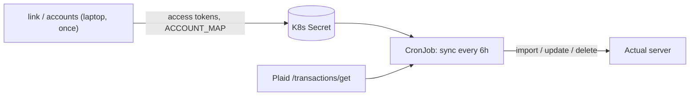

# actual-plaid-sync Implementation Plan

> **For agentic workers:** REQUIRED SUB-SKILL: Use superpowers:subagent-driven-development (recommended) or superpowers:executing-plans to implement this plan task-by-task. Steps use checkbox (`- [ ]`) syntax for tracking.

**Goal:** Build a stateless TypeScript CLI that syncs Plaid transactions (including pending) into Actual Budget, shipped as a digest-pinned container on GHCR and run as a Kubernetes CronJob.

**Architecture:** `commander` CLI with three commands (`link`, `accounts`, `sync`). `sync` fetches a rolling Plaid window, loads Actual transactions, computes changes with a pure `planAccount` function, then executes them through an `ActualGateway` interface. `link` is a short-lived `node:http` server serving Plaid Link. All config comes from env vars validated by zod.

**Tech Stack:** Node 24 LTS, pnpm 12 (via mise), TypeScript 7 (`tsc`, no bundler), ESM, `plaid` (v47), `@actual-app/api` 26.9.0 (exact), `commander`, `zod` v4, `vitest`, `biome` v2, Docker (`node:24-trixie-slim` by digest), GitHub Actions, Renovate.

**Spec:** `docs/superpowers/specs/2026-09-13-actual-plaid-sync-design.md` — read it before starting any task.

## Global Constraints

- Node 24 LTS; pnpm 12; both pinned in `mise.toml` with `mise.lock` committed.
- ESM package (`"type": "module"`), `tsconfig` `module`/`moduleResolution` = `nodenext`; relative imports in `.ts` source use the `.js` extension (`import { x } from './log.js'`).
- `@actual-app/api` pinned to exactly `26.9.0` (no caret). Import as `import * as actual from '@actual-app/api'`.
- No bundler. Build is `tsc -p tsconfig.build.json` into `dist/`. Entry: `dist/cli.js`.
- `better-sqlite3` must be allowlisted for pnpm build scripts.
- Every GitHub Action outside the `actions/` org is pinned to a full 40-char commit SHA with a `# vX.Y.Z` comment.
- Every Docker `FROM` image is pinned by `@sha256:` digest. pnpm in Docker is installed from its standalone binary verified with `sha256sum -c`.
- Never log secrets. Access tokens appear only via `maskToken()` (last 4 chars).
- Exit codes: `0` success, `1` runtime failure, `2` config error.
- Amounts: `Math.round(plaidAmount * -100)` for all account types.
- `importTransactions` always called with `{ reimportDeleted: false }`.
- Never update or delete Actual rows with `reconciled: true` or `isParent: true`.
- Default ports/values: `LINK_PORT=8484`, `LINK_HOST=127.0.0.1`, `SYNC_DAYS=30`, `PLAID_COUNTRY_CODES=US`, `LOG_LEVEL=info`, `DRY_RUN=false`.
- Container image: `ghcr.io/msheiny/actual-plaid-sync`. Runs as user `node`. `ENTRYPOINT ["node","dist/cli.js"]`, `CMD ["sync"]`.
- Tests use `vitest`; test files live under `test/` mirroring `src/` (e.g. `test/sync/plan.test.ts`).
- Commits use conventional-commit prefixes (`feat:`, `test:`, `chore:`, `ci:`, `docs:`) and end with the line `Claude-Session: https://claude.ai/code/session_01VhN7ZQwRwJENgRPQ5GauVo`.

## File Map

| File | Responsibility | Task |
|---|---|---|
| `mise.toml`, `mise.lock`, `package.json`, `pnpm-workspace.yaml`, `tsconfig.json`, `tsconfig.build.json`, `biome.json`, `vitest.config.ts`, `.gitignore` | Toolchain | 1 |
| `src/log.ts` | Leveled logger, `maskToken` | 1 |
| `src/config.ts` | zod env schemas per command, `ConfigError` | 2 |
| `src/sync/types.ts` | Shared domain types | 3 |
| `src/sync/window.ts` | Date window math | 3 |
| `src/sync/mapping.ts` | Plaid txn → Actual import txn | 3 |
| `src/sync/plan.ts` | Pure `planAccount` | 4 |
| `src/plaid/client.ts` | PlaidApi factory, error classification, retry | 5 |
| `src/plaid/transactions.ts` | Windowed, paged `/transactions/get` | 5 |
| `src/plaid/accounts.ts` | `/accounts/get` | 5 |
| `src/actual/session.ts`, `src/actual/errors.ts` | `withBudget`, `ActualGateway`; `ActualError` in an SDK-free module, re-exported by session | 6 |
| `src/sync/run.ts` | `runSync`, `executePlan`, `formatSummary` | 7 |
| `src/commands/accounts.ts` | `suggestAccountMap`, `runAccounts` | 8 |
| `src/link/server.ts`, `src/link/page.ts`, `src/link/plaid-link.ts` | Local Link server | 9 |
| `src/cli.ts` | commander wiring, exit codes | 10 |
| `Dockerfile`, `.dockerignore` | Image | 11 |
| `.github/workflows/ci.yml`, `.github/workflows/release.yml`, `renovate.json` | CI/CD | 12 |
| `test/e2e/*`, e2e CI job | Sandbox + actual-server end-to-end | 13 |
| `deploy/cronjob.yaml`, `README.md` | Docs & example deploy | 14 |

## Shared Interfaces (contract for all tasks)

Every task must use exactly these names, signatures, and field names.

```ts
// src/log.ts
export type LogLevel = 'debug' | 'info' | 'warn' | 'error';
export interface Logger {
  debug(msg: string): void;
  info(msg: string): void;
  warn(msg: string): void;
  error(msg: string): void;
}
export function createLogger(level: LogLevel, write?: (line: string) => void): Logger; // default write = console.log; line format: `${ISO timestamp} ${LEVEL} ${msg}`
export function maskToken(token: string): string; // "…" + last 4 chars; tokens shorter than 4 chars -> "…"
```

```ts
// src/config.ts
import type { LogLevel } from './log.js';
export type PlaidEnvName = 'sandbox' | 'production';
export interface PlaidConfig { clientId: string; secret: string; env: PlaidEnvName }
export interface ActualConfig { serverUrl: string; password: string; syncId: string; encryptionPassword?: string }
export interface AccountMapping { plaidAccountId: string; actualAccountId: string }
export interface SyncConfig {
  plaid: PlaidConfig; actual: ActualConfig;
  accessTokens: string[]; accountMap: AccountMapping[];
  syncDays: number; dryRun: boolean; logLevel: LogLevel;
}
export interface AccountsConfig { plaid: PlaidConfig; actual: ActualConfig; accessTokens: string[]; logLevel: LogLevel }
export interface LinkConfig {
  plaid: PlaidConfig; countryCodes: string[]; port: number; host: string;
  accessToken?: string; // LINK_ACCESS_TOKEN
  logLevel: LogLevel;
}
export class ConfigError extends Error { readonly problems: string[]; constructor(problems: string[]) }
export function loadSyncConfig(env: NodeJS.ProcessEnv): SyncConfig;       // throws ConfigError listing ALL problems
export function loadAccountsConfig(env: NodeJS.ProcessEnv): AccountsConfig;
export function loadLinkConfig(env: NodeJS.ProcessEnv): LinkConfig;
```

```ts
// src/sync/types.ts
export interface PlaidTxn {
  transactionId: string; accountId: string;
  amount: number;                 // Plaid convention: positive = money out
  date: string;                   // YYYY-MM-DD
  authorizedDate: string | null;
  name: string; merchantName: string | null;
  pending: boolean; pendingTransactionId: string | null;
}
export interface ActualTxn {
  id: string; account: string;
  date: string;                   // YYYY-MM-DD
  amount: number;                 // integer cents, negative = outflow
  importedId: string | null;
  cleared: boolean; reconciled: boolean; isParent: boolean;
}
export interface PlaidFetchResult {
  accountIds: string[];           // every account on the Item (from the /transactions/get `accounts` field), even with zero txns
  transactions: PlaidTxn[];
}
export interface ImportTxn {       // passed directly to actual.importTransactions
  date: string; amount: number;
  payee_name: string; imported_payee: string; imported_id: string; cleared: boolean;
}
export interface UpdateFields { imported_id?: string; amount?: number; date?: string; cleared?: boolean }
export interface PlannedUpdate { kind: 'posted' | 'changed'; actualId: string; fields: UpdateFields }
export interface PlannedDelete { actualId: string; importedId: string }
export interface Notice { actualId: string; reason: 'reconciled' | 'split' | 'stale-pending'; detail: string }
export interface AccountPlan {
  actualAccountId: string;
  updates: PlannedUpdate[]; imports: ImportTxn[]; deletes: PlannedDelete[]; notices: Notice[];
}
export interface SyncWindow {
  start: string;          // today - syncDays  (Plaid fetch start)
  end: string;            // today
  trustedStart: string;   // start + 3 days    (cancelled-hold deletes allowed on/after this)
  lookbackStart: string;  // start - 30 days   (Actual load start)
}
```

```ts
// src/sync/window.ts
export function addDays(date: string, days: number): string;   // UTC date math on YYYY-MM-DD
export function computeWindow(today: string, syncDays: number): SyncWindow;
export function todayUtc(now?: Date): string;
```

```ts
// src/sync/mapping.ts
export function toActualAmount(plaidAmount: number): number;   // Math.round(plaidAmount * -100), and normalize -0 to 0
export function effectiveDate(t: PlaidTxn): string;             // authorizedDate ?? date
export function toImportTxn(t: PlaidTxn): ImportTxn;            // payee_name = merchantName ?? name; imported_payee = name; cleared = !pending
```

```ts
// src/sync/plan.ts
export function planAccount(actualAccountId: string, plaidTxns: PlaidTxn[], actualTxns: ActualTxn[], window: SyncWindow): AccountPlan;
export function isEmptyPlan(plan: AccountPlan): boolean; // no updates, imports, deletes (notices ignored)
```

```ts
// src/plaid/client.ts
import type { PlaidApi } from 'plaid';
export function createPlaidClient(cfg: PlaidConfig): PlaidApi;
export type PlaidErrorKind = 'relink' | 'not-ready' | 'retryable' | 'fatal';
export class PlaidRequestError extends Error {
  readonly kind: PlaidErrorKind; readonly code: string | null; readonly requestId: string | null;
  constructor(message: string, kind: PlaidErrorKind, code: string | null, requestId: string | null, cause?: unknown);
}
export function classifyPlaidError(err: unknown): PlaidRequestError;
// relink: ITEM_LOGIN_REQUIRED, PENDING_EXPIRATION, PENDING_DISCONNECT
// not-ready: PRODUCT_NOT_READY
// retryable: HTTP 429, HTTP >= 500, error_type RATE_LIMIT_EXCEEDED, no response (network)
// fatal: everything else
export function withRetry<T>(fn: () => Promise<T>, opts?: { attempts?: number; baseDelayMs?: number; sleep?: (ms: number) => Promise<void> }): Promise<T>;
// attempts default 4 (1 try + 3 retries), baseDelayMs default 1000, exponential; retries only kind === 'retryable'; always throws PlaidRequestError
```

```ts
// src/plaid/transactions.ts
export function fetchTransactions(client: PlaidApi, accessToken: string, start: string, end: string): Promise<PlaidFetchResult>;
export function toPlaidTxn(t: Transaction): PlaidTxn; // Transaction from 'plaid'
// pages with options.count=500 / options.offset until offset >= total_transactions; wraps each call in withRetry
```

```ts
// src/plaid/accounts.ts
export interface PlaidAccountInfo { accountId: string; name: string; officialName: string | null; mask: string | null; type: string; subtype: string | null }
export function fetchAccounts(client: PlaidApi, accessToken: string): Promise<PlaidAccountInfo[]>;
```

```ts
// src/actual/session.ts
export interface ActualAccountInfo { id: string; name: string; closed: boolean; offbudget: boolean }
export interface ImportResult { added: string[]; updated: string[]; errors: string[] }
export interface ActualGateway {
  getAccounts(): Promise<ActualAccountInfo[]>;
  getTransactions(accountId: string, start: string, end: string): Promise<ActualTxn[]>;
  importTransactions(accountId: string, txns: ImportTxn[]): Promise<ImportResult>; // passes { reimportDeleted: false }
  updateTransaction(id: string, fields: UpdateFields): Promise<void>;
  deleteTransaction(id: string): Promise<void>;
}
// ActualError lives in src/actual/errors.ts (imports nothing from @actual-app/api) and is re-exported from session.ts
export class ActualError extends Error {
  readonly code: string | null; readonly hint: string;
  constructor(message: string, code: string | null, hint: string, cause?: unknown);
}
export function toActualError(err: unknown, serverVersion?: string | null): ActualError;
export function bundledApiVersion(): string; // version of the installed @actual-app/api, or 'unknown'
export function withBudget<T>(cfg: ActualConfig, log: Logger, fn: (gw: ActualGateway) => Promise<T>): Promise<T>;
// mkdtemp(os.tmpdir()/actual-plaid-sync-) -> init({dataDir, serverURL, password, verbose:false}) -> downloadBudget(syncId, {password: encryptionPassword})
// -> fn(gw) -> finally: shutdown() then rm -rf dataDir. Actual failures rethrown as ActualError with a hint.
```

```ts
// src/sync/run.ts
export interface SyncDeps {
  fetchTransactions(accessToken: string, start: string, end: string): Promise<PlaidFetchResult>;
  gateway: ActualGateway;
  log: Logger;
  today: string;
}
export function runSync(cfg: SyncConfig, deps: SyncDeps): Promise<0 | 1>;
export function executePlan(gw: ActualGateway, plan: AccountPlan): Promise<ImportResult>; // updates, then imports, then deletes
export function formatSummary(accountName: string, plan: AccountPlan): string;
// e.g. "Chase Checking: 5 added, 2 posted, 1 amount updated, 1 cancelled hold, 0 skipped"
```

```ts
// src/commands/accounts.ts
export function suggestAccountMap(plaidAccounts: PlaidAccountInfo[], actualAccounts: ActualAccountInfo[]): AccountMapping[];
export interface AccountsDeps {
  fetchAccounts(accessToken: string): Promise<PlaidAccountInfo[]>;
  gateway: ActualGateway;
  log: Logger;
  print(line: string): void;
}
export function runAccounts(cfg: AccountsConfig, deps: AccountsDeps): Promise<0 | 1>;
export function formatTable(headers: string[], rows: string[][]): string[]; // aligned text table lines
```

```ts
// src/link/plaid-link.ts
export interface LinkDeps {
  createLinkToken(): Promise<string>;                          // create mode (products: transactions, days_requested: 730) or update mode (access_token, no products, update.account_selection_enabled)
  exchangePublicToken(publicToken: string): Promise<{ accessToken: string; itemId: string }>;
  fetchAccounts(accessToken: string): Promise<PlaidAccountInfo[]>;
}
export function createLinkDeps(client: PlaidApi, cfg: LinkConfig, mode: 'create' | 'update'): LinkDeps;

// src/link/page.ts
export function renderLinkPage(mode: 'create' | 'update'): string; // HTML string; loads https://cdn.plaid.com/link/v2/stable/link-initialize.js

// src/link/server.ts
export interface LinkResult { accessToken: string; itemId: string | null; accounts: PlaidAccountInfo[] }
export function formatLinkResult(result: LinkResult): string; // ready-to-paste env lines + account table
export interface LinkServerOptions { mode: 'create' | 'update'; accessToken?: string; host: string; port: number; deps: LinkDeps; log: Logger }
export interface LinkServer { url: string; result: Promise<LinkResult>; close(): Promise<void> }
export function linkServerUrl(host: string, port: number): string;
export function startLinkServer(opts: {
  mode: 'create' | 'update'; accessToken?: string; host: string; port: number; deps: LinkDeps; log: Logger;
}): Promise<{ url: string; result: Promise<LinkResult>; close(): Promise<void> }>;
// routes: GET / (page), POST /api/link-token -> {linkToken}, POST /api/complete {publicToken?} -> exchanges in create mode, reuses accessToken in update mode; resolves result
```

```ts
// src/cli.ts  (executable entry; no exports needed beyond main)
export function main(argv: string[], env: NodeJS.ProcessEnv): Promise<number>;
// argv = user args only (e.g. ['sync']). The sync/accounts actions load actual/session, sync/run, commands/accounts,
// plaid/transactions and plaid/accounts with `await import()`, so --help and link never load @actual-app/api.
```
### Task 1: Toolchain scaffold + `src/log.ts`

**Files:**
- Create: `mise.toml`
- Create: `mise.lock` (generated)
- Create: `package.json`
- Create: `pnpm-lock.yaml` (generated)
- Create: `pnpm-workspace.yaml`
- Create: `tsconfig.json`
- Create: `tsconfig.build.json`
- Create: `biome.json`
- Create: `vitest.config.ts`
- Create: `.gitignore`
- Create: `src/log.ts`
- Test: `test/log.test.ts`

**Interfaces:**
- Consumes: none
- Produces:
  ```ts
  // src/log.ts
  export type LogLevel = 'debug' | 'info' | 'warn' | 'error';
  export interface Logger { debug(msg: string): void; info(msg: string): void; warn(msg: string): void; error(msg: string): void }
  export function createLogger(level: LogLevel, write?: (line: string) => void): Logger; // line: `${ISO timestamp} ${LEVEL} ${msg}`
  export function maskToken(token: string): string; // "…" + last 4 chars; shorter than 4 chars -> "…"
  ```
  Plus: mise tasks `install`, `build`, `typecheck`, `test`, `lint`, `check`, `link`, `accounts`, `sync`; pnpm scripts `build`, `typecheck`, `test`, `lint`, `format`.

**Verified versions (npm registry and mise, 2026-09-13):** node `24.21.0`, pnpm `12.4.1` (mise backend `aqua:pnpm/pnpm`), `@actual-app/api` `26.9.0`, `plaid` `47.0.0`, `commander` `15.0.0` (requires node >=22.12), `zod` `4.6.4`, `typescript` `7.0.2` (the stable TS 7 release, published as `typescript`, provides `tsc`), `@types/node` `24.13.4`, `vitest` `5.0.0`, `vite` `8.3.0`, `@biomejs/biome` `2.5.13`.

Notes for the engineer:
- `vite` is listed explicitly because `vitest@5` declares `vite` as a **required** peer dependency.
- `zod` is pinned to `4.6.4`, not `4.6.5`. pnpm 12 enforces a default `minimumReleaseAge` of one day, and 4.6.5 was younger than that at authoring time; installing it made pnpm write a `minimumReleaseAgeExclude` entry into `pnpm-workspace.yaml`. If `pnpm install` ever adds a `minimumReleaseAgeExclude:` block, delete it and pin the previous patch version instead.
- The `link`, `accounts` and `sync` mise tasks run `node dist/cli.js`, which does not exist until Task 10. Until then they fail with `Cannot find module '.../dist/cli.js'`. That is expected. Extra flags are forwarded: `mise run link -- --update` runs `node dist/cli.js link --update`.

- [ ] **Step 1: Create `mise.toml`**

Create file `mise.toml` with:
```toml
[tools]
node = "24.21.0"
"aqua:pnpm/pnpm" = "12.4.1"

[tasks.install]
description = "Install dependencies from pnpm-lock.yaml"
run = "pnpm install"

[tasks.build]
description = "Compile src/ to dist/"
run = "pnpm run build"

[tasks.typecheck]
description = "Type-check src/ and test/"
run = "pnpm run typecheck"

[tasks.test]
description = "Run unit tests"
run = "pnpm run test"

[tasks.lint]
description = "Lint and format-check with Biome"
run = "pnpm run lint"

[tasks.check]
description = "Lint, type-check, and test"
depends = ["lint", "typecheck", "test"]

[tasks.link]
description = "Connect a bank with Plaid Link (pass extra flags after --)"
depends = ["build"]
run = "node dist/cli.js link"

[tasks.accounts]
description = "List Plaid and Actual accounts and suggest ACCOUNT_MAP"
depends = ["build"]
run = "node dist/cli.js accounts"

[tasks.sync]
description = "Sync Plaid transactions into Actual"
depends = ["build"]
run = "node dist/cli.js sync"
```

- [ ] **Step 2: Create `package.json`**

Create file `package.json` with:
```json
{
  "name": "actual-plaid-sync",
  "version": "0.1.0",
  "description": "Sync Plaid bank transactions into a self-hosted Actual Budget server",
  "private": true,
  "type": "module",
  "bin": {
    "actual-plaid-sync": "dist/cli.js"
  },
  "files": [
    "dist"
  ],
  "engines": {
    "node": ">=24"
  },
  "scripts": {
    "build": "tsc -p tsconfig.build.json",
    "typecheck": "tsc -p tsconfig.json",
    "test": "vitest run",
    "lint": "biome check .",
    "format": "biome check --write ."
  },
  "dependencies": {
    "@actual-app/api": "26.9.0",
    "commander": "15.0.0",
    "plaid": "47.0.0",
    "zod": "4.6.4"
  },
  "devDependencies": {
    "@biomejs/biome": "2.5.13",
    "@types/node": "24.13.4",
    "typescript": "7.0.2",
    "vite": "8.3.0",
    "vitest": "5.0.0"
  }
}
```

- [ ] **Step 3: Create `pnpm-workspace.yaml`**

pnpm 12 uses the `allowBuilds` map. The older `onlyBuiltDependencies` key is gone, and `strictDepBuilds` defaults to `true`, so any dependency build script that isn't listed fails the install with `ERR_PNPM_IGNORED_BUILDS`.

Create file `pnpm-workspace.yaml` with:
```yaml
allowBuilds:
  better-sqlite3: true
```

- [ ] **Step 4: Create `tsconfig.json` and `tsconfig.build.json`**

TypeScript 7 defaults `types` to `[]`, so `"types": ["node"]` is required for `NodeJS.ProcessEnv`, `process`, and `node:*` imports.

Create file `tsconfig.json` with:
```json
{
  "compilerOptions": {
    "target": "es2024",
    "lib": ["es2024"],
    "module": "nodenext",
    "moduleResolution": "nodenext",
    "types": ["node"],
    "strict": true,
    "noUncheckedIndexedAccess": true,
    "noImplicitOverride": true,
    "noFallthroughCasesInSwitch": true,
    "verbatimModuleSyntax": true,
    "forceConsistentCasingInFileNames": true,
    "skipLibCheck": true,
    "rootDir": ".",
    "noEmit": true
  },
  "include": ["src", "test", "vitest.config.ts"]
}
```

Create file `tsconfig.build.json` with:
```json
{
  "extends": "./tsconfig.json",
  "compilerOptions": {
    "rootDir": "src",
    "outDir": "dist",
    "noEmit": false,
    "sourceMap": true
  },
  "include": ["src"]
}
```

- [ ] **Step 5: Create `biome.json`, `vitest.config.ts`, `.gitignore`**

Biome 2.5 deprecates `"recommended": true` in favor of `"preset": "recommended"` and prints an info diagnostic for the old form. Use the form below.

Create file `biome.json` with:
```json
{
  "$schema": "https://biomejs.dev/schemas/2.5.13/schema.json",
  "vcs": {
    "enabled": true,
    "clientKind": "git",
    "useIgnoreFile": true
  },
  "files": {
    "includes": ["**", "!**/dist", "!**/pnpm-lock.yaml"]
  },
  "formatter": {
    "enabled": true,
    "indentStyle": "space",
    "indentWidth": 2,
    "lineWidth": 100
  },
  "linter": {
    "enabled": true,
    "rules": {
      "preset": "recommended"
    }
  },
  "javascript": {
    "formatter": {
      "quoteStyle": "single"
    }
  },
  "assist": {
    "actions": {
      "source": {
        "organizeImports": "on"
      }
    }
  }
}
```

Create file `vitest.config.ts` with:
```ts
import { defineConfig } from 'vitest/config';

export default defineConfig({
  test: {
    include: ['test/**/*.test.ts'],
    environment: 'node',
  },
});
```

Create file `.gitignore` with:
```gitignore
node_modules/
dist/
coverage/
*.log
.env
.env.*
mise.local.toml
```

- [ ] **Step 6: Install the toolchain and generate `mise.lock`**

Run: `mise trust && mise install && mise lock`
Expected: `mise install` ends with `aqua:pnpm/pnpm@12.4.1 ✓ installed` (or `all tools are installed`), and `mise lock` prints `✓ Updated 14 platform entries (0 skipped)` and `✓ Lockfile written to .../mise.lock`. `mise.lock` now contains `[[tools.node]]` with `version = "24.21.0"` and `[[tools."aqua:pnpm/pnpm"]]` with `version = "12.4.1"`, each with per-platform `checksum = "sha256:..."` entries.

Run: `mise exec -- node --version && mise exec -- pnpm --version`
Expected:
```
v24.21.0
12.4.1
```

- [ ] **Step 7: Install dependencies**

Run: `mise run install`
Expected: output ends with
```
dependencies:
+ @actual-app/api 26.9.0
+ commander 15.0.0
+ plaid 47.0.0
+ zod 4.6.4

devDependencies:
+ @biomejs/biome 2.5.13
+ @types/node 24.13.4
+ typescript 7.0.2
+ vite 8.3.0
+ vitest 5.0.0

Done in ...ms using pnpm v12.4.1
```
You should not see `ERR_PNPM_IGNORED_BUILDS`. The only warning should be `[WARN] 1 deprecated subdependencies found: prebuild-install@7.1.3`, which comes from better-sqlite3 and is harmless. `pnpm-lock.yaml` is created, and `pnpm-workspace.yaml` should still contain only the `allowBuilds` block.

Run: `mise exec -- node -e "const api=require('@actual-app/api'); console.log(typeof api.init); const D=require(require.resolve('better-sqlite3',{paths:[require.resolve('@actual-app/api')]})); new D(':memory:').close(); console.log('sqlite ok')"`
Expected:
```
function
sqlite ok
```

- [ ] **Step 8: Write the failing test**

Create file `test/log.test.ts` with:
```ts
import { afterEach, beforeEach, describe, expect, it, vi } from 'vitest';
import { createLogger, maskToken } from '../src/log.js';

describe('createLogger', () => {
  beforeEach(() => {
    vi.useFakeTimers();
    vi.setSystemTime(new Date('2026-09-13T12:34:56.789Z'));
  });

  afterEach(() => {
    vi.useRealTimers();
    vi.restoreAllMocks();
  });

  it('formats lines as "<ISO timestamp> <LEVEL> <msg>"', () => {
    const lines: string[] = [];
    const log = createLogger('debug', (line) => lines.push(line));

    log.debug('d');
    log.info('i');
    log.warn('w');
    log.error('e');

    expect(lines).toEqual([
      '2026-09-13T12:34:56.789Z DEBUG d',
      '2026-09-13T12:34:56.789Z INFO i',
      '2026-09-13T12:34:56.789Z WARN w',
      '2026-09-13T12:34:56.789Z ERROR e',
    ]);
  });

  it.each([
    ['debug', ['DEBUG', 'INFO', 'WARN', 'ERROR']],
    ['info', ['INFO', 'WARN', 'ERROR']],
    ['warn', ['WARN', 'ERROR']],
    ['error', ['ERROR']],
  ] as const)('at level %s emits only %j', (level, expected) => {
    const lines: string[] = [];
    const log = createLogger(level, (line) => lines.push(line));

    log.debug('x');
    log.info('x');
    log.warn('x');
    log.error('x');

    expect(lines.map((line) => line.split(' ')[1])).toEqual(expected);
  });

  it('writes to console.log by default', () => {
    const spy = vi.spyOn(console, 'log').mockImplementation(() => {});
    const log = createLogger('info');

    log.info('hello');

    expect(spy).toHaveBeenCalledWith('2026-09-13T12:34:56.789Z INFO hello');
  });
});

describe('maskToken', () => {
  it('keeps only the last 4 characters', () => {
    expect(maskToken('access-sandbox-1234-abcd-a1b2')).toBe('…a1b2');
  });

  it('masks a token of exactly 4 characters', () => {
    expect(maskToken('wxyz')).toBe('…wxyz');
  });

  it.each(['', 'a', 'abc'])('returns only the ellipsis for short token %j', (token) => {
    expect(maskToken(token)).toBe('…');
  });
});
```

- [ ] **Step 9: Run test to verify it fails**

Run: `mise exec -- pnpm exec vitest run test/log.test.ts`
Expected: FAIL with `Error: Cannot find module '../src/log.js' imported from .../test/log.test.ts`

- [ ] **Step 10: Write minimal implementation**

Create file `src/log.ts` with:
```ts
export type LogLevel = 'debug' | 'info' | 'warn' | 'error';

export interface Logger {
  debug(msg: string): void;
  info(msg: string): void;
  warn(msg: string): void;
  error(msg: string): void;
}

const LEVEL_RANK: Record<LogLevel, number> = {
  debug: 10,
  info: 20,
  warn: 30,
  error: 40,
};

export function createLogger(level: LogLevel, write: (line: string) => void = console.log): Logger {
  const threshold = LEVEL_RANK[level];
  const emit = (msgLevel: LogLevel, msg: string): void => {
    if (LEVEL_RANK[msgLevel] < threshold) return;
    write(`${new Date().toISOString()} ${msgLevel.toUpperCase()} ${msg}`);
  };
  return {
    debug: (msg) => emit('debug', msg),
    info: (msg) => emit('info', msg),
    warn: (msg) => emit('warn', msg),
    error: (msg) => emit('error', msg),
  };
}

export function maskToken(token: string): string {
  if (token.length < 4) return '…';
  return `…${token.slice(-4)}`;
}
```

- [ ] **Step 11: Run test to verify it passes**

Run: `mise exec -- pnpm exec vitest run test/log.test.ts`
Expected: PASS: `Test Files  1 passed (1)`, `Tests  11 passed (11)`

- [ ] **Step 12: Run the full deliverable check and build**

Run: `mise run check`
Expected: exit code 0. Output includes `[lint] Checked 7 files in ...ms. No fixes applied.` with no errors or infos, `[typecheck] Finished`, and `[test]  Test Files  1 passed (1)` / `Tests  11 passed (11)`.

Run: `mise run build && ls dist`
Expected: `dist` contains `log.js` and `log.js.map`.

Run: `mise exec -- pnpm install --frozen-lockfile`
Expected: `Lockfile is up to date, resolution step is skipped` and `Done in ...ms using pnpm v12.4.1`.

- [ ] **Step 13: Commit**
```bash
git add mise.toml mise.lock package.json pnpm-lock.yaml pnpm-workspace.yaml tsconfig.json tsconfig.build.json biome.json vitest.config.ts .gitignore src/log.ts test/log.test.ts
git commit -m "chore: scaffold toolchain and leveled logger

Claude-Session: https://claude.ai/code/session_01VhN7ZQwRwJENgRPQ5GauVo"
```

---

### Task 2: `src/config.ts` — env config per command

**Files:**
- Create: `src/config.ts`
- Test: `test/config.test.ts`

**Interfaces:**
- Consumes: `import type { LogLevel } from './log.js';` (Task 1)
- Produces:
  ```ts
  export type PlaidEnvName = 'sandbox' | 'production';
  export interface PlaidConfig { clientId: string; secret: string; env: PlaidEnvName }
  export interface ActualConfig { serverUrl: string; password: string; syncId: string; encryptionPassword?: string }
  export interface AccountMapping { plaidAccountId: string; actualAccountId: string }
  export interface SyncConfig { plaid: PlaidConfig; actual: ActualConfig; accessTokens: string[]; accountMap: AccountMapping[]; syncDays: number; dryRun: boolean; logLevel: LogLevel }
  export interface AccountsConfig { plaid: PlaidConfig; actual: ActualConfig; accessTokens: string[]; logLevel: LogLevel }
  export interface LinkConfig { plaid: PlaidConfig; countryCodes: string[]; port: number; host: string; accessToken?: string; logLevel: LogLevel }
  export class ConfigError extends Error { readonly problems: string[]; constructor(problems: string[]) }
  export function loadSyncConfig(env: NodeJS.ProcessEnv): SyncConfig;
  export function loadAccountsConfig(env: NodeJS.ProcessEnv): AccountsConfig;
  export function loadLinkConfig(env: NodeJS.ProcessEnv): LinkConfig;
  ```
  Behavior later tasks rely on:
  - Each entry in `ConfigError.problems` has the form `"<ENV_VAR>: <problem>"`.
  - `ConfigError.message` is `"Invalid configuration:\n  - <problem>\n  - <problem>..."`. The CLI (Task 10) prints `err.message` and exits 2.
  - Optional properties (`encryptionPassword`, `accessToken`) are **omitted** when unset, not set to `undefined`.
  - Empty or whitespace-only env values count as unset.
  - Secret values (`PLAID_SECRET`, `ACTUAL_PASSWORD`, `ACTUAL_ENCRYPTION_PASSWORD`, access tokens) never appear in problem text.

Validation rules implemented:

| Var | sync | accounts | link | Rule |
|---|---|---|---|---|
| `PLAID_CLIENT_ID`, `PLAID_SECRET` | required | required | required | non-empty |
| `PLAID_ENV` | required | required | required | `sandbox` \| `production` |
| `PLAID_ACCESS_TOKENS` | required | required | — | comma list, trimmed, empties dropped, ≥1 entry |
| `ACCOUNT_MAP` | required | — | — | comma list of `plaidId:actualId`; each bad entry reported with its 1-based position; duplicate Plaid ids rejected |
| `ACTUAL_SERVER_URL` | required | required | — | http(s) URL |
| `ACTUAL_PASSWORD`, `ACTUAL_SYNC_ID` | required | required | — | non-empty |
| `ACTUAL_ENCRYPTION_PASSWORD` | optional | optional | — | — |
| `SYNC_DAYS` | `30` | — | — | integer 1–730 (730 is Plaid's history max) |
| `DRY_RUN` | `false` | — | — | `true`/`false`/`1`/`0`, case-insensitive |
| `PLAID_COUNTRY_CODES` | — | — | `US` | comma list, upper-cased, each 2 letters |
| `LINK_PORT` | — | — | `8484` | integer 1–65535 |
| `LINK_HOST` | — | — | `127.0.0.1` | — |
| `LINK_ACCESS_TOKEN` | — | — | optional | — |
| `LOG_LEVEL` | `info` | `info` | `info` | `debug` \| `info` \| `warn` \| `error` |

- [ ] **Step 1: Write the failing test**

Create file `test/config.test.ts` with:
```ts
import { describe, expect, it } from 'vitest';
import { ConfigError, loadAccountsConfig, loadLinkConfig, loadSyncConfig } from '../src/config.js';

const PLAID_ENV_VARS = {
  PLAID_CLIENT_ID: 'client-123',
  PLAID_SECRET: 'secret-456',
  PLAID_ENV: 'sandbox',
};

const ACTUAL_ENV_VARS = {
  ACTUAL_SERVER_URL: 'https://actual.example.com',
  ACTUAL_PASSWORD: 'actual-pw',
  ACTUAL_SYNC_ID: 'sync-789',
};

const SYNC_ENV = {
  ...PLAID_ENV_VARS,
  ...ACTUAL_ENV_VARS,
  PLAID_ACCESS_TOKENS: 'access-sandbox-aaaa',
  ACCOUNT_MAP: 'plaidA:actualA',
};

function problemsOf(fn: () => unknown): string[] {
  try {
    fn();
  } catch (err) {
    if (err instanceof ConfigError) return err.problems;
    throw err;
  }
  throw new Error('expected ConfigError to be thrown');
}

function problemVars(fn: () => unknown): string[] {
  return problemsOf(fn).map((problem) => problem.slice(0, problem.indexOf(':')));
}

describe('ConfigError', () => {
  it('keeps the problems and prints one line per problem', () => {
    const err = new ConfigError(['A: is required', 'B: is required']);

    expect(err).toBeInstanceOf(Error);
    expect(err.name).toBe('ConfigError');
    expect(err.problems).toEqual(['A: is required', 'B: is required']);
    expect(err.message).toBe('Invalid configuration:\n  - A: is required\n  - B: is required');
  });
});

describe('loadSyncConfig', () => {
  it('parses a complete environment', () => {
    const cfg = loadSyncConfig({
      ...SYNC_ENV,
      PLAID_ENV: 'production',
      PLAID_ACCESS_TOKENS: 'access-production-aaaa,access-production-bbbb',
      ACCOUNT_MAP: 'plaidA:actualA,plaidB:actualB',
      ACTUAL_ENCRYPTION_PASSWORD: 'e2e-pw',
      SYNC_DAYS: '14',
      DRY_RUN: 'true',
      LOG_LEVEL: 'debug',
    });

    expect(cfg).toEqual({
      plaid: { clientId: 'client-123', secret: 'secret-456', env: 'production' },
      actual: {
        serverUrl: 'https://actual.example.com',
        password: 'actual-pw',
        syncId: 'sync-789',
        encryptionPassword: 'e2e-pw',
      },
      accessTokens: ['access-production-aaaa', 'access-production-bbbb'],
      accountMap: [
        { plaidAccountId: 'plaidA', actualAccountId: 'actualA' },
        { plaidAccountId: 'plaidB', actualAccountId: 'actualB' },
      ],
      syncDays: 14,
      dryRun: true,
      logLevel: 'debug',
    });
  });

  it('applies defaults for optional variables', () => {
    const cfg = loadSyncConfig(SYNC_ENV);

    expect(cfg.syncDays).toBe(30);
    expect(cfg.dryRun).toBe(false);
    expect(cfg.logLevel).toBe('info');
    expect(cfg.actual).not.toHaveProperty('encryptionPassword');
  });

  it('treats empty and whitespace-only values as unset', () => {
    const cfg = loadSyncConfig({
      ...SYNC_ENV,
      ACTUAL_ENCRYPTION_PASSWORD: '',
      SYNC_DAYS: '  ',
      LOG_LEVEL: '',
    });

    expect(cfg.syncDays).toBe(30);
    expect(cfg.logLevel).toBe('info');
    expect(cfg.actual).not.toHaveProperty('encryptionPassword');
  });

  it('trims comma lists and drops empty entries', () => {
    const cfg = loadSyncConfig({
      ...SYNC_ENV,
      PLAID_ACCESS_TOKENS: ' tok-1 , ,tok-2,',
      ACCOUNT_MAP: ' plaidA : actualA ,, plaidB:actualB , ',
    });

    expect(cfg.accessTokens).toEqual(['tok-1', 'tok-2']);
    expect(cfg.accountMap).toEqual([
      { plaidAccountId: 'plaidA', actualAccountId: 'actualA' },
      { plaidAccountId: 'plaidB', actualAccountId: 'actualB' },
    ]);
  });

  it('reports every missing required variable at once', () => {
    expect(problemsOf(() => loadSyncConfig({}))).toEqual([
      'PLAID_CLIENT_ID: is required',
      'PLAID_SECRET: is required',
      'PLAID_ENV: is required',
      'PLAID_ACCESS_TOKENS: is required',
      'ACCOUNT_MAP: is required',
      'ACTUAL_SERVER_URL: is required',
      'ACTUAL_PASSWORD: is required',
      'ACTUAL_SYNC_ID: is required',
    ]);
  });

  it('includes every problem in the error message', () => {
    expect(() => loadSyncConfig({ ...SYNC_ENV, PLAID_SECRET: undefined, SYNC_DAYS: 'x' })).toThrow(
      'Invalid configuration:\n  - PLAID_SECRET: is required\n  - SYNC_DAYS: must be an integer between 1 and 730 (got "x")',
    );
  });

  it('reports each malformed ACCOUNT_MAP entry', () => {
    expect(
      problemsOf(() =>
        loadSyncConfig({ ...SYNC_ENV, ACCOUNT_MAP: 'plaidA:actualA,oops,:actualC,plaidD:,a:b:c' }),
      ),
    ).toEqual([
      'ACCOUNT_MAP: entry 2 "oops" must be plaidAccountId:actualAccountId',
      'ACCOUNT_MAP: entry 3 ":actualC" must be plaidAccountId:actualAccountId',
      'ACCOUNT_MAP: entry 4 "plaidD:" must be plaidAccountId:actualAccountId',
      'ACCOUNT_MAP: entry 5 "a:b:c" must be plaidAccountId:actualAccountId',
    ]);
  });

  it('rejects a Plaid account mapped twice', () => {
    expect(
      problemsOf(() =>
        loadSyncConfig({ ...SYNC_ENV, ACCOUNT_MAP: 'plaidA:actualA,plaidA:actualB' }),
      ),
    ).toEqual(['ACCOUNT_MAP: plaid account "plaidA" is mapped more than once']);
  });

  it('rejects lists that contain only separators', () => {
    expect(
      problemsOf(() =>
        loadSyncConfig({ ...SYNC_ENV, PLAID_ACCESS_TOKENS: ',', ACCOUNT_MAP: ' , ' }),
      ),
    ).toEqual([
      'PLAID_ACCESS_TOKENS: must contain at least one entry',
      'ACCOUNT_MAP: must contain at least one entry',
    ]);
  });

  it('rejects unknown enum values', () => {
    expect(
      problemsOf(() =>
        loadSyncConfig({ ...SYNC_ENV, PLAID_ENV: 'development', LOG_LEVEL: 'verbose' }),
      ),
    ).toEqual([
      'PLAID_ENV: must be one of: sandbox, production (got "development")',
      'LOG_LEVEL: must be one of: debug, info, warn, error (got "verbose")',
    ]);
  });

  it('rejects a server URL that is not http(s)', () => {
    expect(
      problemsOf(() => loadSyncConfig({ ...SYNC_ENV, ACTUAL_SERVER_URL: 'actual.local' })),
    ).toEqual(['ACTUAL_SERVER_URL: must be an http(s) URL']);
  });

  it.each([
    ['true', true],
    ['TRUE', true],
    ['1', true],
    ['false', false],
    ['False', false],
    ['0', false],
  ])('parses DRY_RUN=%j as %s', (value, expected) => {
    expect(loadSyncConfig({ ...SYNC_ENV, DRY_RUN: value }).dryRun).toBe(expected);
  });

  it('rejects an invalid DRY_RUN', () => {
    expect(problemsOf(() => loadSyncConfig({ ...SYNC_ENV, DRY_RUN: 'yes' }))).toEqual([
      'DRY_RUN: must be one of: true, false, 1, 0 (got "yes")',
    ]);
  });

  it.each(['0', '-5', '1.5', 'abc', '731'])('rejects SYNC_DAYS=%j', (value) => {
    expect(problemsOf(() => loadSyncConfig({ ...SYNC_ENV, SYNC_DAYS: value }))).toEqual([
      `SYNC_DAYS: must be an integer between 1 and 730 (got "${value}")`,
    ]);
  });

  it('never echoes secret values in problems', () => {
    const problems = problemsOf(() =>
      loadSyncConfig({ ...SYNC_ENV, PLAID_ENV: 'bogus', ACCOUNT_MAP: 'bad' }),
    );

    expect(problems.join('\n')).not.toContain('secret-456');
    expect(problems.join('\n')).not.toContain('actual-pw');
  });
});

describe('loadAccountsConfig', () => {
  it('parses a complete environment and ignores sync-only variables', () => {
    const cfg = loadAccountsConfig({
      ...PLAID_ENV_VARS,
      ...ACTUAL_ENV_VARS,
      PLAID_ACCESS_TOKENS: 'tok-1,tok-2',
      ACCOUNT_MAP: 'not valid but unused',
      SYNC_DAYS: 'not used either',
    });

    expect(cfg).toEqual({
      plaid: { clientId: 'client-123', secret: 'secret-456', env: 'sandbox' },
      actual: {
        serverUrl: 'https://actual.example.com',
        password: 'actual-pw',
        syncId: 'sync-789',
      },
      accessTokens: ['tok-1', 'tok-2'],
      logLevel: 'info',
    });
  });

  it('reports every missing required variable at once', () => {
    expect(problemVars(() => loadAccountsConfig({}))).toEqual([
      'PLAID_CLIENT_ID',
      'PLAID_SECRET',
      'PLAID_ENV',
      'PLAID_ACCESS_TOKENS',
      'ACTUAL_SERVER_URL',
      'ACTUAL_PASSWORD',
      'ACTUAL_SYNC_ID',
    ]);
  });
});

describe('loadLinkConfig', () => {
  it('applies defaults', () => {
    expect(loadLinkConfig(PLAID_ENV_VARS)).toEqual({
      plaid: { clientId: 'client-123', secret: 'secret-456', env: 'sandbox' },
      countryCodes: ['US'],
      port: 8484,
      host: '127.0.0.1',
      logLevel: 'info',
    });
  });

  it('parses overrides', () => {
    expect(
      loadLinkConfig({
        ...PLAID_ENV_VARS,
        PLAID_COUNTRY_CODES: 'us, ca,,GB',
        LINK_PORT: '3000',
        LINK_HOST: '0.0.0.0',
        LINK_ACCESS_TOKEN: 'access-sandbox-zzzz',
        LOG_LEVEL: 'warn',
      }),
    ).toEqual({
      plaid: { clientId: 'client-123', secret: 'secret-456', env: 'sandbox' },
      countryCodes: ['US', 'CA', 'GB'],
      port: 3000,
      host: '0.0.0.0',
      accessToken: 'access-sandbox-zzzz',
      logLevel: 'warn',
    });
  });

  it('does not require Actual or access-token variables', () => {
    expect(problemVars(() => loadLinkConfig({}))).toEqual([
      'PLAID_CLIENT_ID',
      'PLAID_SECRET',
      'PLAID_ENV',
    ]);
  });

  it.each(['0', '65536', 'http'])('rejects LINK_PORT=%j', (value) => {
    expect(problemsOf(() => loadLinkConfig({ ...PLAID_ENV_VARS, LINK_PORT: value }))).toEqual([
      `LINK_PORT: must be an integer between 1 and 65535 (got "${value}")`,
    ]);
  });

  it('rejects malformed country codes', () => {
    expect(
      problemsOf(() => loadLinkConfig({ ...PLAID_ENV_VARS, PLAID_COUNTRY_CODES: 'US,USA' })),
    ).toEqual(['PLAID_COUNTRY_CODES: "USA" is not a 2-letter country code']);
  });
});
```

- [ ] **Step 2: Run test to verify it fails**

Run: `mise exec -- pnpm exec vitest run test/config.test.ts`
Expected: FAIL with `Error: Cannot find module '../src/config.js' imported from .../test/config.test.ts`

- [ ] **Step 3: Write minimal implementation**

Create file `src/config.ts` with:
```ts
import { z } from 'zod';
import type { LogLevel } from './log.js';

export type PlaidEnvName = 'sandbox' | 'production';

export interface PlaidConfig {
  clientId: string;
  secret: string;
  env: PlaidEnvName;
}

export interface ActualConfig {
  serverUrl: string;
  password: string;
  syncId: string;
  encryptionPassword?: string;
}

export interface AccountMapping {
  plaidAccountId: string;
  actualAccountId: string;
}

export interface SyncConfig {
  plaid: PlaidConfig;
  actual: ActualConfig;
  accessTokens: string[];
  accountMap: AccountMapping[];
  syncDays: number;
  dryRun: boolean;
  logLevel: LogLevel;
}

export interface AccountsConfig {
  plaid: PlaidConfig;
  actual: ActualConfig;
  accessTokens: string[];
  logLevel: LogLevel;
}

export interface LinkConfig {
  plaid: PlaidConfig;
  countryCodes: string[];
  port: number;
  host: string;
  accessToken?: string;
  logLevel: LogLevel;
}

export class ConfigError extends Error {
  readonly problems: string[];

  constructor(problems: string[]) {
    super(['Invalid configuration:', ...problems.map((problem) => `  - ${problem}`)].join('\n'));
    this.name = 'ConfigError';
    this.problems = problems;
  }
}

const PLAID_ENVS = ['sandbox', 'production'] as const satisfies readonly PlaidEnvName[];
const LOG_LEVELS = ['debug', 'info', 'warn', 'error'] as const satisfies readonly LogLevel[];

const REQUIRED = 'is required';

const requiredString = z.string({ error: REQUIRED });

function oneOf<const T extends readonly [string, ...string[]]>(values: T) {
  return z.enum(values, {
    error: (issue) =>
      issue.input === undefined
        ? REQUIRED
        : `must be one of: ${values.join(', ')} (got "${String(issue.input)}")`,
  });
}

function splitList(value: string): string[] {
  return value
    .split(',')
    .map((entry) => entry.trim())
    .filter((entry) => entry.length > 0);
}

const requiredList = requiredString.transform((value, ctx) => {
  const entries = splitList(value);
  if (entries.length === 0) {
    ctx.issues.push({ code: 'custom', message: 'must contain at least one entry', input: value });
    return z.NEVER;
  }
  return entries;
});

function intInRange(min: number, max: number) {
  return z.string().transform((value, ctx) => {
    const trimmed = value.trim();
    const parsed = Number(trimmed);
    if (!/^\d+$/.test(trimmed) || parsed < min || parsed > max) {
      ctx.issues.push({
        code: 'custom',
        message: `must be an integer between ${min} and ${max} (got "${value}")`,
        input: value,
      });
      return z.NEVER;
    }
    return parsed;
  });
}

const booleanFlag = z.string().transform((value, ctx) => {
  const normalized = value.trim().toLowerCase();
  if (normalized === 'true' || normalized === '1') return true;
  if (normalized === 'false' || normalized === '0') return false;
  ctx.issues.push({
    code: 'custom',
    message: `must be one of: true, false, 1, 0 (got "${value}")`,
    input: value,
  });
  return z.NEVER;
});

const httpUrl = requiredString.refine(
  (value) => {
    try {
      const { protocol } = new URL(value);
      return protocol === 'http:' || protocol === 'https:';
    } catch {
      return false;
    }
  },
  { error: 'must be an http(s) URL' },
);

const accountMap = requiredString.transform((value, ctx) => {
  const entries = value.split(',').map((entry) => entry.trim());
  const nonEmpty = entries.filter((entry) => entry.length > 0);
  if (nonEmpty.length === 0) {
    ctx.issues.push({ code: 'custom', message: 'must contain at least one entry', input: value });
    return z.NEVER;
  }
  const mappings: AccountMapping[] = [];
  const seen = new Set<string>();
  nonEmpty.forEach((entry, index) => {
    const parts = entry.split(':').map((part) => part.trim());
    const [plaidAccountId, actualAccountId] = parts;
    if (parts.length !== 2 || !plaidAccountId || !actualAccountId) {
      ctx.issues.push({
        code: 'custom',
        message: `entry ${index + 1} "${entry}" must be plaidAccountId:actualAccountId`,
        input: value,
      });
      return;
    }
    if (seen.has(plaidAccountId)) {
      ctx.issues.push({
        code: 'custom',
        message: `plaid account "${plaidAccountId}" is mapped more than once`,
        input: value,
      });
      return;
    }
    seen.add(plaidAccountId);
    mappings.push({ plaidAccountId, actualAccountId });
  });
  return mappings;
});

const countryCodes = z.string().transform((value, ctx) => {
  const codes = splitList(value).map((code) => code.toUpperCase());
  for (const code of codes) {
    if (!/^[A-Z]{2}$/.test(code)) {
      ctx.issues.push({
        code: 'custom',
        message: `"${code}" is not a 2-letter country code`,
        input: value,
      });
    }
  }
  if (codes.length === 0) {
    ctx.issues.push({ code: 'custom', message: 'must contain at least one entry', input: value });
  }
  return codes;
});

const plaidShape = {
  PLAID_CLIENT_ID: requiredString,
  PLAID_SECRET: requiredString,
  PLAID_ENV: oneOf(PLAID_ENVS),
};

const actualShape = {
  ACTUAL_SERVER_URL: httpUrl,
  ACTUAL_PASSWORD: requiredString,
  ACTUAL_SYNC_ID: requiredString,
  ACTUAL_ENCRYPTION_PASSWORD: z.string().optional(),
};

const logLevelShape = {
  LOG_LEVEL: oneOf(LOG_LEVELS).default('info'),
};

const syncSchema = z.object({
  ...plaidShape,
  PLAID_ACCESS_TOKENS: requiredList,
  ACCOUNT_MAP: accountMap,
  ...actualShape,
  SYNC_DAYS: intInRange(1, 730).default(30),
  DRY_RUN: booleanFlag.default(false),
  ...logLevelShape,
});

const accountsSchema = z.object({
  ...plaidShape,
  PLAID_ACCESS_TOKENS: requiredList,
  ...actualShape,
  ...logLevelShape,
});

const linkSchema = z.object({
  ...plaidShape,
  PLAID_COUNTRY_CODES: countryCodes.default(['US']),
  LINK_PORT: intInRange(1, 65535).default(8484),
  LINK_HOST: z.string().default('127.0.0.1'),
  LINK_ACCESS_TOKEN: z.string().optional(),
  ...logLevelShape,
});

/** Copies the schema's keys out of env, treating empty or whitespace-only values as unset. */
function pickEnv(env: NodeJS.ProcessEnv, keys: string[]): Record<string, string | undefined> {
  const picked: Record<string, string | undefined> = {};
  for (const key of keys) {
    const value = env[key];
    picked[key] = value === undefined || value.trim() === '' ? undefined : value;
  }
  return picked;
}

function parseEnv<T extends z.ZodObject>(schema: T, env: NodeJS.ProcessEnv): z.output<T> {
  const result = schema.safeParse(pickEnv(env, Object.keys(schema.shape)));
  if (!result.success) {
    throw new ConfigError(
      result.error.issues.map((issue) => `${issue.path.map(String).join('.')}: ${issue.message}`),
    );
  }
  return result.data;
}

function toPlaidConfig(parsed: z.output<z.ZodObject<typeof plaidShape>>): PlaidConfig {
  return { clientId: parsed.PLAID_CLIENT_ID, secret: parsed.PLAID_SECRET, env: parsed.PLAID_ENV };
}

function toActualConfig(parsed: z.output<z.ZodObject<typeof actualShape>>): ActualConfig {
  return {
    serverUrl: parsed.ACTUAL_SERVER_URL,
    password: parsed.ACTUAL_PASSWORD,
    syncId: parsed.ACTUAL_SYNC_ID,
    ...(parsed.ACTUAL_ENCRYPTION_PASSWORD === undefined
      ? {}
      : { encryptionPassword: parsed.ACTUAL_ENCRYPTION_PASSWORD }),
  };
}

export function loadSyncConfig(env: NodeJS.ProcessEnv): SyncConfig {
  const parsed = parseEnv(syncSchema, env);
  return {
    plaid: toPlaidConfig(parsed),
    actual: toActualConfig(parsed),
    accessTokens: parsed.PLAID_ACCESS_TOKENS,
    accountMap: parsed.ACCOUNT_MAP,
    syncDays: parsed.SYNC_DAYS,
    dryRun: parsed.DRY_RUN,
    logLevel: parsed.LOG_LEVEL,
  };
}

export function loadAccountsConfig(env: NodeJS.ProcessEnv): AccountsConfig {
  const parsed = parseEnv(accountsSchema, env);
  return {
    plaid: toPlaidConfig(parsed),
    actual: toActualConfig(parsed),
    accessTokens: parsed.PLAID_ACCESS_TOKENS,
    logLevel: parsed.LOG_LEVEL,
  };
}

export function loadLinkConfig(env: NodeJS.ProcessEnv): LinkConfig {
  const parsed = parseEnv(linkSchema, env);
  return {
    plaid: toPlaidConfig(parsed),
    countryCodes: parsed.PLAID_COUNTRY_CODES,
    port: parsed.LINK_PORT,
    host: parsed.LINK_HOST,
    ...(parsed.LINK_ACCESS_TOKEN === undefined ? {} : { accessToken: parsed.LINK_ACCESS_TOKEN }),
    logLevel: parsed.LOG_LEVEL,
  };
}
```

- [ ] **Step 4: Run test to verify it passes**

Run: `mise exec -- pnpm exec vitest run test/config.test.ts`
Expected: PASS: `Test Files  1 passed (1)`, `Tests  34 passed (34)`

Run: `mise run check`
Expected: exit code 0. Output includes `[lint] Checked 9 files in ...ms. No fixes applied.` with no errors, `[typecheck] Finished`, and `[test]  Test Files  2 passed (2)` / `Tests  45 passed (45)`.

- [ ] **Step 5: Commit**
```bash
git add src/config.ts test/config.test.ts
git commit -m "feat: validate env config per command with zod

Claude-Session: https://claude.ai/code/session_01VhN7ZQwRwJENgRPQ5GauVo"
```
### Task 3: Sync domain types, date window, and Plaid→Actual mapping

**Files:**
- Create: `src/sync/types.ts`
- Create: `src/sync/window.ts`
- Create: `src/sync/mapping.ts`
- Test: `test/sync/window.test.ts`
- Test: `test/sync/mapping.test.ts`

**Interfaces:**
- Consumes: none (pure TypeScript; no Plaid/Actual SDK imports)
- Produces:
  - `src/sync/types.ts`: `PlaidTxn`, `ActualTxn`, `PlaidFetchResult`, `ImportTxn`, `UpdateFields`, `PlannedUpdate`, `PlannedDelete`, `Notice`, `AccountPlan`, `SyncWindow` (exactly as in Shared Interfaces)
  - `src/sync/window.ts`: `addDays(date: string, days: number): string` (throws `Error("Invalid date ...")` on anything that is not a real `YYYY-MM-DD` date), `computeWindow(today: string, syncDays: number): SyncWindow`, `todayUtc(now?: Date): string`
  - `src/sync/mapping.ts`: `toActualAmount(plaidAmount: number): number`, `effectiveDate(t: PlaidTxn): string`, `toImportTxn(t: PlaidTxn): ImportTxn`

- [ ] **Step 1: Create the shared domain types**

These are type-only, so there is no test for this file. Later tasks import from it, so keep every name and field exactly as written.

Create `src/sync/types.ts`:
```ts
export interface PlaidTxn {
  transactionId: string;
  accountId: string;
  amount: number; // Plaid convention: positive = money out
  date: string; // YYYY-MM-DD
  authorizedDate: string | null;
  name: string;
  merchantName: string | null;
  pending: boolean;
  pendingTransactionId: string | null;
}

export interface ActualTxn {
  id: string;
  account: string;
  date: string; // YYYY-MM-DD
  amount: number; // integer cents, negative = outflow
  importedId: string | null;
  cleared: boolean;
  reconciled: boolean;
  isParent: boolean;
}

export interface PlaidFetchResult {
  accountIds: string[]; // every account on the Item (from the /transactions/get `accounts` field), even with zero txns
  transactions: PlaidTxn[];
}

// Passed directly to actual.importTransactions
export interface ImportTxn {
  date: string;
  amount: number;
  payee_name: string;
  imported_payee: string;
  imported_id: string;
  cleared: boolean;
}

export interface UpdateFields {
  imported_id?: string;
  amount?: number;
  date?: string;
  cleared?: boolean;
}

export interface PlannedUpdate {
  kind: 'posted' | 'changed';
  actualId: string;
  fields: UpdateFields;
}

export interface PlannedDelete {
  actualId: string;
  importedId: string;
}

export interface Notice {
  actualId: string;
  reason: 'reconciled' | 'split' | 'stale-pending';
  detail: string;
}

export interface AccountPlan {
  actualAccountId: string;
  updates: PlannedUpdate[];
  imports: ImportTxn[];
  deletes: PlannedDelete[];
  notices: Notice[];
}

export interface SyncWindow {
  start: string; // today - syncDays  (Plaid fetch start)
  end: string; // today
  trustedStart: string; // start + 3 days    (cancelled-hold deletes allowed on/after this)
  lookbackStart: string; // start - 30 days   (Actual load start)
}
```

- [ ] **Step 2: Write the failing window test**

Create `test/sync/window.test.ts`:
```ts
import { afterEach, describe, expect, it, vi } from 'vitest';
import { addDays, computeWindow, todayUtc } from '../../src/sync/window.js';

describe('addDays', () => {
  it.each([
    ['2026-09-13', 0, '2026-09-13'],
    ['2026-09-13', 1, '2026-09-14'],
    ['2026-09-13', -30, '2026-08-14'],
    ['2026-09-30', 1, '2026-10-01'],
    ['2026-12-31', 1, '2027-01-01'],
    ['2026-01-01', -1, '2025-12-31'],
    ['2026-02-28', 1, '2026-03-01'],
    ['2028-02-28', 1, '2028-02-29'],
    ['2028-03-01', -1, '2028-02-29'],
  ])('addDays(%s, %i) = %s', (date, days, expected) => {
    expect(addDays(date, days)).toBe(expected);
  });

  it.each(['2026-9-13', '2026-02-30', '2026-13-01', 'not-a-date', ''])(
    'throws on invalid date %j',
    (date) => {
      expect(() => addDays(date, 1)).toThrow(/Invalid date/);
    },
  );
});

describe('computeWindow', () => {
  it('computes a normal 30-day window', () => {
    expect(computeWindow('2026-09-13', 30)).toEqual({
      start: '2026-08-14',
      end: '2026-09-13',
      trustedStart: '2026-08-17',
      lookbackStart: '2026-07-15',
    });
  });

  it('crosses a month boundary (short February)', () => {
    expect(computeWindow('2026-03-02', 1)).toEqual({
      start: '2026-03-01',
      end: '2026-03-02',
      trustedStart: '2026-03-04',
      lookbackStart: '2026-01-30',
    });
  });

  it('crosses a year boundary', () => {
    expect(computeWindow('2027-01-10', 30)).toEqual({
      start: '2026-12-11',
      end: '2027-01-10',
      trustedStart: '2026-12-14',
      lookbackStart: '2026-11-11',
    });
  });

  it('lands on a leap day', () => {
    expect(computeWindow('2028-03-30', 30)).toEqual({
      start: '2028-02-29',
      end: '2028-03-30',
      trustedStart: '2028-03-03',
      lookbackStart: '2028-01-30',
    });
  });
});

describe('todayUtc', () => {
  afterEach(() => {
    vi.useRealTimers();
  });

  it('formats the UTC calendar date of the given instant', () => {
    expect(todayUtc(new Date('2026-09-13T23:59:59Z'))).toBe('2026-09-13');
  });

  it('uses UTC, not the local offset of the instant', () => {
    expect(todayUtc(new Date('2026-09-13T23:30:00-05:00'))).toBe('2026-09-14');
  });

  it('defaults to the current time', () => {
    vi.useFakeTimers();
    vi.setSystemTime(new Date('2028-02-29T12:00:00Z'));
    expect(todayUtc()).toBe('2028-02-29');
  });
});
```

- [ ] **Step 3: Run the window test to verify it fails**

Run: `pnpm exec vitest run test/sync/window.test.ts`
Expected: FAIL with `Error: Cannot find module '../../src/sync/window.js' imported from .../test/sync/window.test.ts`

- [ ] **Step 4: Implement the window module**

All date math runs in UTC on `YYYY-MM-DD` strings, so the result never depends on the host timezone. The round-trip check stops JavaScript from quietly rolling an impossible date like `2026-02-30` over into March.

Create `src/sync/window.ts`:
```ts
import type { SyncWindow } from './types.js';

const DAY_MS = 86_400_000;
const DATE_RE = /^\d{4}-\d{2}-\d{2}$/;

function parseDate(date: string): number {
  const ms = DATE_RE.test(date) ? Date.parse(`${date}T00:00:00Z`) : Number.NaN;
  // The round-trip check rejects dates JS would silently roll over (e.g. 2026-02-30).
  if (Number.isNaN(ms) || new Date(ms).toISOString().slice(0, 10) !== date) {
    throw new Error(`Invalid date (expected YYYY-MM-DD): ${JSON.stringify(date)}`);
  }
  return ms;
}

export function addDays(date: string, days: number): string {
  return new Date(parseDate(date) + days * DAY_MS).toISOString().slice(0, 10);
}

export function computeWindow(today: string, syncDays: number): SyncWindow {
  const start = addDays(today, -syncDays);
  return {
    start,
    end: today,
    trustedStart: addDays(start, 3),
    lookbackStart: addDays(start, -30),
  };
}

export function todayUtc(now: Date = new Date()): string {
  return now.toISOString().slice(0, 10);
}
```

- [ ] **Step 5: Run the window test to verify it passes**

Run: `pnpm exec vitest run test/sync/window.test.ts`
Expected: PASS (21 tests)

- [ ] **Step 6: Write the failing mapping test**

Create `test/sync/mapping.test.ts`:
```ts
import { describe, expect, it } from 'vitest';
import { effectiveDate, toActualAmount, toImportTxn } from '../../src/sync/mapping.js';
import type { PlaidTxn } from '../../src/sync/types.js';

function plaid(overrides: Partial<PlaidTxn> = {}): PlaidTxn {
  return {
    transactionId: 'txn-1',
    accountId: 'plaid-acc-1',
    amount: 12.5,
    date: '2026-09-10',
    authorizedDate: null,
    name: 'SQ *COFFEE SHOP #12',
    merchantName: 'Coffee Shop',
    pending: false,
    pendingTransactionId: null,
    ...overrides,
  };
}

describe('toActualAmount', () => {
  it.each([
    // [case, plaid amount, expected Actual cents]
    ['depository debit (money out)', 42.1, -4210],
    ['depository credit (deposit)', -1500, 150000],
    ['credit card charge', 89.99, -8999],
    ['credit card payment', -250, 25000],
    ['loan payment received', -310.45, 31045],
  ])('%s: %d -> %i', (_case, amount, expected) => {
    expect(toActualAmount(amount)).toBe(expected);
  });

  it.each([
    // Binary floats: 19.99 * -100 = -1998.9999999999998, rounds to -1999.
    [19.99, -1999],
    [-19.99, 1999],
    // 0.07 * -100 = -7.000000000000001, rounds to -7.
    [0.07, -7],
    // 0.1 + 0.2 = 0.30000000000000004 -> -30.000000000000004 -> -30.
    [0.1 + 0.2, -30],
    // Exact half-cent results round toward +Infinity (Math.round semantics):
    // 1234.565 * -100 = -123456.5 -> -123456. Plaid amounts have at most 2 decimals, so this is theoretical.
    [1234.565, -123456],
  ])('rounds float noise: %d -> %i', (amount, expected) => {
    expect(toActualAmount(amount)).toBe(expected);
  });

  it.each([0, -0, 0.004, 0.005])('normalizes negative zero for %d', (amount) => {
    const result = toActualAmount(amount);
    expect(result).toBe(0);
    expect(Object.is(result, -0)).toBe(false);
  });
});

describe('effectiveDate', () => {
  it('prefers authorizedDate', () => {
    expect(effectiveDate(plaid({ authorizedDate: '2026-09-08', date: '2026-09-10' }))).toBe(
      '2026-09-08',
    );
  });

  it('falls back to date when authorizedDate is null', () => {
    expect(effectiveDate(plaid({ authorizedDate: null, date: '2026-09-10' }))).toBe('2026-09-10');
  });
});

describe('toImportTxn', () => {
  it('maps a posted transaction', () => {
    expect(
      toImportTxn(
        plaid({
          transactionId: 'posted-1',
          amount: 12.5,
          authorizedDate: '2026-09-09',
          date: '2026-09-10',
          name: 'SQ *COFFEE SHOP #12',
          merchantName: 'Coffee Shop',
          pending: false,
        }),
      ),
    ).toEqual({
      date: '2026-09-09',
      amount: -1250,
      payee_name: 'Coffee Shop',
      imported_payee: 'SQ *COFFEE SHOP #12',
      imported_id: 'posted-1',
      cleared: true,
    });
  });

  it('falls back to name for payee_name when merchantName is null', () => {
    const t = toImportTxn(plaid({ name: 'ACH DEPOSIT PAYROLL', merchantName: null }));
    expect(t.payee_name).toBe('ACH DEPOSIT PAYROLL');
    expect(t.imported_payee).toBe('ACH DEPOSIT PAYROLL');
  });

  it.each([
    [false, true],
    [true, false],
  ])('pending=%s -> cleared=%s', (pending, cleared) => {
    expect(toImportTxn(plaid({ pending })).cleared).toBe(cleared);
  });
});
```

- [ ] **Step 7: Run the mapping test to verify it fails**

Run: `pnpm exec vitest run test/sync/mapping.test.ts`
Expected: FAIL with `Error: Cannot find module '../../src/sync/mapping.js' imported from .../test/sync/mapping.test.ts`

- [ ] **Step 8: Implement the mapping module**

Plaid amounts are positive when money leaves the account, for every account type. Actual stores integer cents with outflows negative. That makes the conversion `Math.round(amount * -100)` for depository, credit, and loan accounts alike. A result of `-0` is normalized to `0`.

Create `src/sync/mapping.ts`:
```ts
import type { ImportTxn, PlaidTxn } from './types.js';

export function toActualAmount(plaidAmount: number): number {
  const cents = Math.round(plaidAmount * -100);
  // Math.round(0 * -100) is -0; normalize so equality checks and JSON output stay clean.
  return cents === 0 ? 0 : cents;
}

export function effectiveDate(t: PlaidTxn): string {
  return t.authorizedDate ?? t.date;
}

export function toImportTxn(t: PlaidTxn): ImportTxn {
  return {
    date: effectiveDate(t),
    amount: toActualAmount(t.amount),
    payee_name: t.merchantName ?? t.name,
    imported_payee: t.name,
    imported_id: t.transactionId,
    cleared: !t.pending,
  };
}
```

- [ ] **Step 9: Run the mapping and window tests and the typecheck**

Run: `pnpm exec vitest run test/sync/window.test.ts test/sync/mapping.test.ts && pnpm exec tsc --noEmit`
Expected: PASS (41 tests across 2 files), and `tsc` exits 0 with no output

- [ ] **Step 10: Commit**

```bash
git add src/sync/types.ts src/sync/window.ts src/sync/mapping.ts test/sync/window.test.ts test/sync/mapping.test.ts
git commit -m "feat: add sync domain types, date window, and Plaid mapping

Claude-Session: https://claude.ai/code/session_01VhN7ZQwRwJENgRPQ5GauVo"
```

### Task 4: Pure sync planner (`planAccount`)

**Files:**
- Create: `src/sync/plan.ts`
- Test: `test/sync/plan.test.ts`

**Interfaces:**
- Consumes:
  - From Task 3 `src/sync/types.ts`: `PlaidTxn`, `ActualTxn`, `ImportTxn`, `UpdateFields`, `PlannedUpdate`, `PlannedDelete`, `Notice`, `AccountPlan`, `SyncWindow`
  - From Task 3 `src/sync/mapping.ts`: `toActualAmount(plaidAmount: number): number`, `effectiveDate(t: PlaidTxn): string`, `toImportTxn(t: PlaidTxn): ImportTxn`
  - From Task 3 `src/sync/window.ts` (test only): `computeWindow(today: string, syncDays: number): SyncWindow`
- Produces:
  - `planAccount(actualAccountId: string, plaidTxns: PlaidTxn[], actualTxns: ActualTxn[], window: SyncWindow): AccountPlan`
  - `isEmptyPlan(plan: AccountPlan): boolean`: true when there are no updates, imports, or deletes. Notices are ignored.

**Algorithm (spec "Sync → Plan steps" 3–6, for ONE account; callers pre-filter both inputs to that account):**

1. Index Actual rows that have a non-null `importedId` by that id. If two rows share an id, the first one wins. Let `plaidIds` be the set of every Plaid `transactionId`. Let `supersededPendingIds` be the set of every `pendingTransactionId` found on a posted Plaid txn.
2. Walk `plaidTxns` in input order:
   - **Already in Actual** (`transactionId` is in the index). If the txn is posted, do nothing. If it is pending (step 4), skip it when any of these hold: the row is `cleared`, the id is in `supersededPendingIds`, or the row was consumed. Otherwise compare `toActualAmount(amount)` with `row.amount` and `effectiveDate` with `row.date`, and put only the differing fields into `fields`. If nothing differs, do nothing. If the row is reconciled, emit Notice `'reconciled'`. If it is a split parent, emit Notice `'split'`. Otherwise emit `PlannedUpdate { kind: 'changed' }`.
   - **Pending and new** (step 5). Import it, unless its id is in `supersededPendingIds`. A posted replacement for it is in the same batch, and importing both would create a duplicate.
   - **Posted and new**. If `pendingTransactionId` matches an indexed row that is not yet consumed (step 3), mark that row consumed, then emit a reconciled Notice, a split Notice, or `PlannedUpdate { kind: 'posted', fields: { imported_id, amount, date, cleared: true } }`. The posted txn is **never** imported in any of those three cases. With no matching row, import it (step 5).
3. Cancelled holds (step 6). Walk `actualTxns` in input order and consider rows with a non-null `importedId`, `cleared === false`, an `importedId` not in `plaidIds`, and not consumed:
   - `row.date < window.trustedStart`: emit Notice `'stale-pending'` and never delete.
   - Otherwise: emit a reconciled Notice, a split Notice, or `PlannedDelete`.
4. Ordering: updates and imports follow `plaidTxns` order. Deletes follow `actualTxns` order. Notices are stable-sorted by their row's position in `actualTxns`.

The `supersededPendingIds` guard covers the case where Plaid briefly returns a pending txn together with the posted txn that replaces it. Without the guard, the pending txn would be imported (a duplicate), or re-imported on the next run after step 3 renamed its row. Two tests in "pending -> posted" cover this.

- [ ] **Step 1: Write the failing test**

Create `test/sync/plan.test.ts`. The in-test `applyPlan` helper stands in for Actual: updates merge fields, imports append rows with id `new-<imported_id>`, and deletes remove rows. The idempotency tests use it to prove that re-planning after a full or partial (crashed) apply does no duplicate work.
```ts
import { describe, expect, it } from 'vitest';
import { isEmptyPlan, planAccount } from '../../src/sync/plan.js';
import type { AccountPlan, ActualTxn, PlaidTxn } from '../../src/sync/types.js';
import { computeWindow } from '../../src/sync/window.js';

const ACCOUNT = 'actual-acc-1';
// start 2026-08-14, trustedStart 2026-08-17, lookbackStart 2026-07-15, end 2026-09-13
const WINDOW = computeWindow('2026-09-13', 30);

function plaid(overrides: Partial<PlaidTxn> & { transactionId: string }): PlaidTxn {
  return {
    accountId: 'plaid-acc-1',
    amount: 10,
    date: '2026-09-10',
    authorizedDate: null,
    name: 'SQ *COFFEE SHOP #12',
    merchantName: 'Coffee Shop',
    pending: false,
    pendingTransactionId: null,
    ...overrides,
  };
}

function actualRow(overrides: Partial<ActualTxn> & { id: string }): ActualTxn {
  return {
    account: ACCOUNT,
    date: '2026-09-10',
    amount: -1000,
    importedId: null,
    cleared: true,
    reconciled: false,
    isParent: false,
    ...overrides,
  };
}

function plan(plaidTxns: PlaidTxn[], rows: ActualTxn[]): AccountPlan {
  return planAccount(ACCOUNT, plaidTxns, rows, WINDOW);
}

function emptyPlan(): AccountPlan {
  return { actualAccountId: ACCOUNT, updates: [], imports: [], deletes: [], notices: [] };
}

// Simulates Actual applying a plan: updates merge fields, imports append rows, deletes remove rows.
function applyPlan(rows: ActualTxn[], p: AccountPlan, accountId: string): ActualTxn[] {
  const deleted = new Set(p.deletes.map((d) => d.actualId));
  const result = rows
    .filter((row) => !deleted.has(row.id))
    .map((row) => {
      let next = { ...row };
      for (const { actualId, fields } of p.updates) {
        if (actualId !== row.id) continue;
        next = {
          ...next,
          ...(fields.imported_id !== undefined ? { importedId: fields.imported_id } : {}),
          ...(fields.amount !== undefined ? { amount: fields.amount } : {}),
          ...(fields.date !== undefined ? { date: fields.date } : {}),
          ...(fields.cleared !== undefined ? { cleared: fields.cleared } : {}),
        };
      }
      return next;
    });
  for (const t of p.imports) {
    result.push({
      id: `new-${t.imported_id}`,
      account: accountId,
      date: t.date,
      amount: t.amount,
      importedId: t.imported_id,
      cleared: t.cleared,
      reconciled: false,
      isParent: false,
    });
  }
  return result;
}

describe('planAccount: new transactions', () => {
  it('imports a new posted transaction', () => {
    const result = plan(
      [
        plaid({
          transactionId: 'p1',
          amount: 12.5,
          authorizedDate: '2026-09-09',
          date: '2026-09-10',
        }),
      ],
      [],
    );
    expect(result).toEqual({
      ...emptyPlan(),
      imports: [
        {
          date: '2026-09-09',
          amount: -1250,
          payee_name: 'Coffee Shop',
          imported_payee: 'SQ *COFFEE SHOP #12',
          imported_id: 'p1',
          cleared: true,
        },
      ],
    });
  });

  it('imports a new pending transaction as uncleared', () => {
    const result = plan([plaid({ transactionId: 'q1', amount: 8, pending: true })], []);
    expect(result).toEqual({
      ...emptyPlan(),
      imports: [
        {
          date: '2026-09-10',
          amount: -800,
          payee_name: 'Coffee Shop',
          imported_payee: 'SQ *COFFEE SHOP #12',
          imported_id: 'q1',
          cleared: false,
        },
      ],
    });
  });

  it('does nothing for a posted transaction that is already imported', () => {
    const result = plan(
      [plaid({ transactionId: 'p1', amount: 10 })],
      [actualRow({ id: 'a1', importedId: 'p1', amount: -1000, cleared: true })],
    );
    expect(result).toEqual(emptyPlan());
  });

  it('never re-compares posted transactions that are already imported', () => {
    const result = plan(
      [plaid({ transactionId: 'p1', amount: 99, date: '2026-09-12' })],
      [
        actualRow({
          id: 'a1',
          importedId: 'p1',
          amount: -1000,
          date: '2026-09-10',
          cleared: false,
        }),
      ],
    );
    expect(result).toEqual(emptyPlan());
  });
});

describe('planAccount: pending -> posted', () => {
  it('updates the pending row in place and does not import the posted transaction', () => {
    const result = plan(
      [
        plaid({
          transactionId: 'p1',
          pendingTransactionId: 'q1',
          amount: 12.5,
          authorizedDate: '2026-09-09',
          date: '2026-09-11',
        }),
      ],
      [
        actualRow({
          id: 'a1',
          importedId: 'q1',
          amount: -1000,
          date: '2026-09-10',
          cleared: false,
        }),
      ],
    );
    expect(result).toEqual({
      ...emptyPlan(),
      updates: [
        {
          kind: 'posted',
          actualId: 'a1',
          fields: { imported_id: 'p1', amount: -1250, date: '2026-09-09', cleared: true },
        },
      ],
    });
  });

  it.each([
    ['reconciled', { reconciled: true }],
    ['split', { isParent: true }],
  ] as const)('emits a %s notice instead of updating, importing, or deleting', (reason, flags) => {
    const result = plan(
      [plaid({ transactionId: 'p1', pendingTransactionId: 'q1', amount: 12.5 })],
      [actualRow({ id: 'a1', importedId: 'q1', cleared: false, ...flags })],
    );
    expect(result).toEqual({
      ...emptyPlan(),
      notices: [{ actualId: 'a1', reason, detail: expect.any(String) }],
    });
  });

  it('when Plaid returns both the pending and its posted replacement, updates once and imports nothing', () => {
    const txns = [
      plaid({ transactionId: 'q1', pending: true, amount: 11 }),
      plaid({ transactionId: 'p1', pendingTransactionId: 'q1', amount: 12.5 }),
    ];
    const rows = [actualRow({ id: 'a1', importedId: 'q1', amount: -1000, cleared: false })];
    const first = plan(txns, rows);
    expect(first).toEqual({
      ...emptyPlan(),
      updates: [
        {
          kind: 'posted',
          actualId: 'a1',
          fields: { imported_id: 'p1', amount: -1250, date: '2026-09-10', cleared: true },
        },
      ],
    });
    expect(isEmptyPlan(plan(txns, applyPlan(rows, first, ACCOUNT)))).toBe(true);
  });

  it('when Plaid returns both the pending and its posted replacement and neither is in Actual, imports only the posted one', () => {
    const result = plan(
      [
        plaid({ transactionId: 'q1', pending: true }),
        plaid({ transactionId: 'p1', pendingTransactionId: 'q1' }),
      ],
      [],
    );
    expect(result.imports.map((t) => t.imported_id)).toEqual(['p1']);
    expect(result.updates).toEqual([]);
  });
});

describe('planAccount: pending changes', () => {
  it.each([
    ['amount only', { amount: 12.34 }, { amount: -1234 }],
    ['date only', { authorizedDate: '2026-09-09' }, { date: '2026-09-09' }],
    [
      'amount and date',
      { amount: 12.34, date: '2026-09-11' },
      { amount: -1234, date: '2026-09-11' },
    ],
  ] as const)('updates only the differing fields (%s)', (_case, changes, fields) => {
    const result = plan(
      [plaid({ transactionId: 'q1', pending: true, amount: 10, date: '2026-09-10', ...changes })],
      [
        actualRow({
          id: 'a1',
          importedId: 'q1',
          amount: -1000,
          date: '2026-09-10',
          cleared: false,
        }),
      ],
    );
    expect(result).toEqual({
      ...emptyPlan(),
      updates: [{ kind: 'changed', actualId: 'a1', fields }],
    });
  });

  it('does nothing when the pending transaction is unchanged', () => {
    const result = plan(
      [plaid({ transactionId: 'q1', pending: true, amount: 10, date: '2026-09-10' })],
      [
        actualRow({
          id: 'a1',
          importedId: 'q1',
          amount: -1000,
          date: '2026-09-10',
          cleared: false,
        }),
      ],
    );
    expect(result).toEqual(emptyPlan());
  });

  it('does nothing when the user already cleared the pending row', () => {
    const result = plan(
      [plaid({ transactionId: 'q1', pending: true, amount: 12.34 })],
      [actualRow({ id: 'a1', importedId: 'q1', amount: -1000, cleared: true })],
    );
    expect(result).toEqual(emptyPlan());
  });

  it.each([
    ['reconciled', { reconciled: true }],
    ['split', { isParent: true }],
  ] as const)('emits a %s notice instead of updating a changed pending row', (reason, flags) => {
    const result = plan(
      [plaid({ transactionId: 'q1', pending: true, amount: 12.34 })],
      [actualRow({ id: 'a1', importedId: 'q1', amount: -1000, cleared: false, ...flags })],
    );
    expect(result).toEqual({
      ...emptyPlan(),
      notices: [{ actualId: 'a1', reason, detail: expect.any(String) }],
    });
  });
});

describe('planAccount: cancelled holds', () => {
  it.each(['2026-08-17', '2026-09-13'])(
    'deletes an uncleared row missing from Plaid dated %s (inside trusted range)',
    (date) => {
      const result = plan(
        [],
        [actualRow({ id: 'a1', importedId: 'q-gone', date, cleared: false })],
      );
      expect(result).toEqual({
        ...emptyPlan(),
        deletes: [{ actualId: 'a1', importedId: 'q-gone' }],
      });
    },
  );

  it('emits a stale-pending notice for a row dated before trustedStart', () => {
    const result = plan(
      [],
      [actualRow({ id: 'a1', importedId: 'q-gone', date: '2026-08-16', cleared: false })],
    );
    expect(result).toEqual({
      ...emptyPlan(),
      notices: [{ actualId: 'a1', reason: 'stale-pending', detail: expect.any(String) }],
    });
  });

  it.each([
    ['reconciled', { reconciled: true }],
    ['split', { isParent: true }],
  ] as const)('emits a %s notice instead of deleting', (reason, flags) => {
    const result = plan(
      [],
      [actualRow({ id: 'a1', importedId: 'q-gone', cleared: false, ...flags })],
    );
    expect(result).toEqual({
      ...emptyPlan(),
      notices: [{ actualId: 'a1', reason, detail: expect.any(String) }],
    });
  });

  it('bank without pendingTransactionId: imports the posted txn and deletes the vanished pending row', () => {
    const result = plan(
      [plaid({ transactionId: 'p1', pendingTransactionId: null, amount: 10 })],
      [actualRow({ id: 'a1', importedId: 'q1', date: '2026-09-09', cleared: false })],
    );
    expect(result.updates).toEqual([]);
    expect(result.imports.map((t) => t.imported_id)).toEqual(['p1']);
    expect(result.deletes).toEqual([{ actualId: 'a1', importedId: 'q1' }]);
    expect(result.notices).toEqual([]);
  });

  it('never deletes cleared rows whose importedId Plaid no longer returns', () => {
    const result = plan(
      [],
      [actualRow({ id: 'a1', importedId: 'old-posted', date: '2026-09-01', cleared: true })],
    );
    expect(result).toEqual(emptyPlan());
  });

  it('ignores rows with a null importedId entirely', () => {
    const result = plan(
      [plaid({ transactionId: 'p1' })],
      [
        actualRow({ id: 'manual-1', importedId: null, date: '2026-09-10', cleared: false }),
        actualRow({
          id: 'manual-2',
          importedId: null,
          date: '2026-08-01',
          cleared: false,
          reconciled: true,
        }),
      ],
    );
    expect(result.updates).toEqual([]);
    expect(result.imports.map((t) => t.imported_id)).toEqual(['p1']);
    expect(result.deletes).toEqual([]);
    expect(result.notices).toEqual([]);
  });
});

describe('planAccount: ordering', () => {
  it('orders updates/imports by Plaid input order and deletes/notices by Actual row order', () => {
    const result = plan(
      [
        plaid({ transactionId: 'p-b', pendingTransactionId: 'q-b' }),
        plaid({ transactionId: 'new-2' }),
        plaid({ transactionId: 'q-a', pending: true, amount: 50 }),
        plaid({ transactionId: 'new-1' }),
        plaid({ transactionId: 'p-rec', pendingTransactionId: 'q-rec' }),
      ],
      [
        actualRow({ id: 'r-stale', importedId: 'q-stale', date: '2026-08-01', cleared: false }),
        actualRow({ id: 'r-del-2', importedId: 'q-del-2', cleared: false }),
        actualRow({ id: 'r-a', importedId: 'q-a', cleared: false }),
        actualRow({ id: 'r-rec', importedId: 'q-rec', cleared: false, reconciled: true }),
        actualRow({ id: 'r-b', importedId: 'q-b', cleared: false }),
        actualRow({ id: 'r-del-1', importedId: 'q-del-1', cleared: false }),
      ],
    );
    expect(result.updates.map((u) => [u.kind, u.actualId])).toEqual([
      ['posted', 'r-b'],
      ['changed', 'r-a'],
    ]);
    expect(result.imports.map((t) => t.imported_id)).toEqual(['new-2', 'new-1']);
    expect(result.deletes.map((d) => d.actualId)).toEqual(['r-del-2', 'r-del-1']);
    expect(result.notices.map((n) => [n.actualId, n.reason])).toEqual([
      ['r-stale', 'stale-pending'],
      ['r-rec', 'reconciled'],
    ]);
  });
});

describe('isEmptyPlan', () => {
  it('is true for a plan with only notices', () => {
    expect(
      isEmptyPlan({
        ...emptyPlan(),
        notices: [{ actualId: 'a1', reason: 'stale-pending', detail: 'x' }],
      }),
    ).toBe(true);
  });

  const nonEmpty: Array<[string, Partial<AccountPlan>]> = [
    ['updates', { updates: [{ kind: 'changed', actualId: 'a1', fields: { amount: -1 } }] }],
    [
      'imports',
      {
        imports: [
          {
            date: '2026-09-10',
            amount: -1,
            payee_name: 'x',
            imported_payee: 'x',
            imported_id: 'p1',
            cleared: true,
          },
        ],
      },
    ],
    ['deletes', { deletes: [{ actualId: 'a1', importedId: 'q1' }] }],
  ];
  it.each(nonEmpty)('is false when %s is non-empty', (_case, part) => {
    expect(isEmptyPlan({ ...emptyPlan(), ...part })).toBe(false);
  });
});

describe('planAccount: idempotency', () => {
  const plaidTxns: PlaidTxn[] = [
    plaid({ transactionId: 'p-existing', amount: 5 }),
    plaid({
      transactionId: 'p-coffee',
      pendingTransactionId: 'q-coffee',
      amount: 5.25,
      authorizedDate: '2026-09-08',
      date: '2026-09-10',
    }),
    plaid({ transactionId: 'q-gas', pending: true, amount: 52.1, date: '2026-09-11' }),
    plaid({
      transactionId: 'p-capone',
      pendingTransactionId: null,
      amount: 30,
      date: '2026-09-07',
    }),
    plaid({ transactionId: 'p-split', pendingTransactionId: 'q-split', amount: 70 }),
    plaid({ transactionId: 'q-new', pending: true, amount: 3.5, date: '2026-09-12' }),
    plaid({
      transactionId: 'p-new',
      amount: -2000,
      name: 'PAYROLL',
      merchantName: null,
      date: '2026-09-12',
    }),
  ];

  const rows: ActualTxn[] = [
    actualRow({
      id: 'r-existing',
      importedId: 'p-existing',
      amount: -500,
      date: '2026-09-10',
      cleared: true,
    }),
    actualRow({
      id: 'r-coffee',
      importedId: 'q-coffee',
      amount: -450,
      date: '2026-09-08',
      cleared: false,
    }),
    actualRow({
      id: 'r-gas',
      importedId: 'q-gas',
      amount: -4000,
      date: '2026-09-11',
      cleared: false,
    }),
    actualRow({
      id: 'r-hotel',
      importedId: 'q-hotel',
      amount: -20000,
      date: '2026-09-05',
      cleared: false,
    }),
    actualRow({
      id: 'r-stale',
      importedId: 'q-old',
      amount: -100,
      date: '2026-08-01',
      cleared: false,
    }),
    actualRow({
      id: 'r-rec-hold',
      importedId: 'q-rec',
      date: '2026-09-02',
      cleared: false,
      reconciled: true,
    }),
    actualRow({ id: 'r-manual', importedId: null, date: '2026-09-09', cleared: false }),
    actualRow({
      id: 'r-capone',
      importedId: 'q-capone',
      amount: -3000,
      date: '2026-09-06',
      cleared: false,
    }),
    actualRow({
      id: 'r-split',
      importedId: 'q-split',
      amount: -7000,
      cleared: false,
      isParent: true,
    }),
  ];

  const plan1 = plan(plaidTxns, rows);

  it('plans the mixed scenario as expected', () => {
    expect(plan1.updates).toEqual([
      {
        kind: 'posted',
        actualId: 'r-coffee',
        fields: { imported_id: 'p-coffee', amount: -525, date: '2026-09-08', cleared: true },
      },
      { kind: 'changed', actualId: 'r-gas', fields: { amount: -5210 } },
    ]);
    expect(plan1.imports.map((t) => t.imported_id)).toEqual(['p-capone', 'q-new', 'p-new']);
    expect(plan1.deletes).toEqual([
      { actualId: 'r-hotel', importedId: 'q-hotel' },
      { actualId: 'r-capone', importedId: 'q-capone' },
    ]);
    expect(plan1.notices.map((n) => [n.actualId, n.reason])).toEqual([
      ['r-stale', 'stale-pending'],
      ['r-rec-hold', 'reconciled'],
      ['r-split', 'split'],
    ]);
  });

  it('produces an empty plan when re-run against the applied result', () => {
    const applied = applyPlan(rows, plan1, ACCOUNT);
    const plan2 = plan(plaidTxns, applied);
    expect(isEmptyPlan(plan2)).toBe(true);
    expect(plan2.notices).toEqual(plan1.notices);
  });

  // [crash point, plan parts NOT applied before the crash, plan parts already done]
  const crashPoints: Array<[string, Partial<AccountPlan>, Partial<AccountPlan>]> = [
    ['updates', { imports: [], deletes: [] }, { updates: [] }],
    ['updates and imports', { deletes: [] }, { updates: [], imports: [] }],
  ];
  it.each(crashPoints)(
    'recovers from a crash after %s without repeating work',
    (_case, dropped, done) => {
      const partial = applyPlan(rows, { ...plan1, ...dropped }, ACCOUNT);
      const plan2 = plan(plaidTxns, partial);
      expect(plan2).toEqual({ ...plan1, ...done });
      expect(applyPlan(partial, plan2, ACCOUNT)).toEqual(applyPlan(rows, plan1, ACCOUNT));
      expect(isEmptyPlan(plan(plaidTxns, applyPlan(partial, plan2, ACCOUNT)))).toBe(true);
    },
  );
});
```

- [ ] **Step 2: Run test to verify it fails**

Run: `pnpm exec vitest run test/sync/plan.test.ts`
Expected: FAIL with `Error: Cannot find module '../../src/sync/plan.js' imported from .../test/sync/plan.test.ts`

- [ ] **Step 3: Write minimal implementation**

Create `src/sync/plan.ts`:
```ts
import { effectiveDate, toActualAmount, toImportTxn } from './mapping.js';
import type {
  AccountPlan,
  ActualTxn,
  ImportTxn,
  Notice,
  PlaidTxn,
  PlannedDelete,
  PlannedUpdate,
  SyncWindow,
  UpdateFields,
} from './types.js';

// Returns a notice when a row must not be mutated or deleted, otherwise null.
function protectedRowNotice(row: ActualTxn, action: string): Notice | null {
  if (row.reconciled) {
    return {
      actualId: row.id,
      reason: 'reconciled',
      detail: `reconciled transaction not ${action}`,
    };
  }
  if (row.isParent) {
    return { actualId: row.id, reason: 'split', detail: `split transaction not ${action}` };
  }
  return null;
}

/**
 * Plans the changes for ONE Actual account. Pure: no I/O.
 * plaidTxns and actualTxns must already be filtered to this account.
 */
export function planAccount(
  actualAccountId: string,
  plaidTxns: PlaidTxn[],
  actualTxns: ActualTxn[],
  window: SyncWindow,
): AccountPlan {
  const updates: PlannedUpdate[] = [];
  const imports: ImportTxn[] = [];
  const deletes: PlannedDelete[] = [];
  const notices: Notice[] = [];

  // Index Actual rows by importedId (first row wins if a budget contains duplicates).
  const byImportedId = new Map<string, ActualTxn>();
  for (const row of actualTxns) {
    if (row.importedId !== null && !byImportedId.has(row.importedId)) {
      byImportedId.set(row.importedId, row);
    }
  }

  const plaidIds = new Set(plaidTxns.map((t) => t.transactionId));

  // Pending ids that a posted txn in this batch replaces. If Plaid briefly returns both,
  // the pending one must be neither imported nor amount/date-updated, or the next run
  // would re-import it after step 3 renamed its row.
  const supersededPendingIds = new Set<string>();
  for (const t of plaidTxns) {
    if (!t.pending && t.pendingTransactionId !== null) {
      supersededPendingIds.add(t.pendingTransactionId);
    }
  }

  // Actual row ids linked to a posted txn by step 3 (updated or protected).
  const consumed = new Set<string>();

  for (const t of plaidTxns) {
    const existing = byImportedId.get(t.transactionId);

    if (existing !== undefined) {
      // Step 4: pending amount/date changed. Posted rows already in Actual are left alone,
      // as are pending rows the user already cleared.
      if (
        !t.pending ||
        existing.cleared ||
        supersededPendingIds.has(t.transactionId) ||
        consumed.has(existing.id)
      ) {
        continue;
      }
      const fields: UpdateFields = {};
      const amount = toActualAmount(t.amount);
      if (amount !== existing.amount) fields.amount = amount;
      const date = effectiveDate(t);
      if (date !== existing.date) fields.date = date;
      if (fields.amount === undefined && fields.date === undefined) continue;

      const notice = protectedRowNotice(
        existing,
        `updated to pending changes from ${t.transactionId}`,
      );
      if (notice !== null) {
        notices.push(notice);
      } else {
        updates.push({ kind: 'changed', actualId: existing.id, fields });
      }
      continue;
    }

    if (t.pending) {
      // Step 5 (pending): new unless a posted txn in this batch replaces it.
      if (!supersededPendingIds.has(t.transactionId)) imports.push(toImportTxn(t));
      continue;
    }

    // Step 3: pending -> posted.
    const pendingRow =
      t.pendingTransactionId === null ? undefined : byImportedId.get(t.pendingTransactionId);
    if (pendingRow === undefined || consumed.has(pendingRow.id)) {
      // Step 5 (posted): new.
      imports.push(toImportTxn(t));
      continue;
    }
    consumed.add(pendingRow.id);
    const notice = protectedRowNotice(
      pendingRow,
      `linked to posted transaction ${t.transactionId}`,
    );
    if (notice !== null) {
      notices.push(notice);
      continue;
    }
    updates.push({
      kind: 'posted',
      actualId: pendingRow.id,
      fields: {
        imported_id: t.transactionId,
        amount: toActualAmount(t.amount),
        date: effectiveDate(t),
        cleared: true,
      },
    });
  }

  // Step 6: cancelled holds.
  for (const row of actualTxns) {
    if (
      row.importedId === null ||
      row.cleared ||
      plaidIds.has(row.importedId) ||
      consumed.has(row.id)
    ) {
      continue;
    }
    if (row.date < window.trustedStart) {
      notices.push({
        actualId: row.id,
        reason: 'stale-pending',
        detail: `uncleared transaction ${row.importedId} dated ${row.date} is before ${window.trustedStart} and no longer returned by Plaid; clear or delete it manually`,
      });
      continue;
    }
    const notice = protectedRowNotice(row, `deleted as cancelled hold ${row.importedId}`);
    if (notice !== null) {
      notices.push(notice);
    } else {
      deletes.push({ actualId: row.id, importedId: row.importedId });
    }
  }

  // Notices follow Actual row order (Array.prototype.sort is stable).
  const rowOrder = new Map(actualTxns.map((row, i) => [row.id, i] as const));
  notices.sort((a, b) => (rowOrder.get(a.actualId) ?? 0) - (rowOrder.get(b.actualId) ?? 0));

  return { actualAccountId, updates, imports, deletes, notices };
}

export function isEmptyPlan(plan: AccountPlan): boolean {
  return plan.updates.length === 0 && plan.imports.length === 0 && plan.deletes.length === 0;
}
```

- [ ] **Step 4: Run test to verify it passes**

Run: `pnpm exec vitest run test/sync && pnpm exec tsc --noEmit`
Expected: PASS (74 tests across 3 files: plan 33, window 21, mapping 20), and `tsc` exits 0 with no output

- [ ] **Step 5: Commit**

```bash
git add src/sync/plan.ts test/sync/plan.test.ts
git commit -m "feat: add pure planAccount sync planner

Claude-Session: https://claude.ai/code/session_01VhN7ZQwRwJENgRPQ5GauVo"
```
### Task 5: Plaid client, transactions, accounts

**Files:**
- Create: `src/plaid/client.ts`
- Create: `src/plaid/transactions.ts`
- Create: `src/plaid/accounts.ts`
- Test: `test/plaid/client.test.ts`
- Test: `test/plaid/transactions.test.ts`
- Test: `test/plaid/accounts.test.ts`

**Interfaces:**
- Consumes: `PlaidConfig` (`src/config.ts`); `PlaidTxn`, `PlaidFetchResult` (`src/sync/types.ts`).
- Produces: `createPlaidClient(cfg: PlaidConfig): PlaidApi`, `type PlaidErrorKind = 'relink' | 'not-ready' | 'retryable' | 'fatal'`, `class PlaidRequestError extends Error { kind; code: string | null; requestId: string | null; constructor(message, kind, code, requestId, cause?) }`, `classifyPlaidError(err: unknown): PlaidRequestError`, `withRetry<T>(fn, opts?)` (`src/plaid/client.ts`); `fetchTransactions(client, accessToken, start, end): Promise<PlaidFetchResult>` and helper `toPlaidTxn(t: Transaction): PlaidTxn` (`src/plaid/transactions.ts`); `interface PlaidAccountInfo`, `fetchAccounts(client, accessToken): Promise<PlaidAccountInfo[]>` (`src/plaid/accounts.ts`).

Verified facts (plaid 47.0.0 under Node 24.21.0):
- `import { Configuration, PlaidApi, PlaidEnvironments } from 'plaid'` (named imports from this CommonJS package) loads under real `node` ESM and typechecks with `nodenext`. Default-import interop is not needed.
- `Configuration` already adds the `Plaid-Version: 2020-09-14` header, so only `PLAID-CLIENT-ID` / `PLAID-SECRET` are set.
- Failed calls reject with an AxiosError: `err.response.status` (number) and `err.response.data.{error_type, error_code, error_message, request_id}`. Network failures have no `response`.
- `transactionsGet({ access_token, start_date, end_date, options: { count, offset } })` resolves to `{ data: { accounts: AccountBase[], transactions: Transaction[], total_transactions, item, request_id } }`. `Transaction.merchant_name` is optional (`string | null | undefined`); `authorized_date` and `pending_transaction_id` are `string | null`.
- `accountsGet({ access_token })` resolves to `{ data: { accounts: AccountBase[] } }`; `AccountBase` has `account_id, name, official_name: string | null, mask: string | null, type, subtype: string | null`.

- [ ] **Step 1: Write the failing test for the Plaid client, error classification and retry**

Create `test/plaid/client.test.ts`:

```ts
import { describe, expect, it, vi } from 'vitest';
import {
  classifyPlaidError,
  createPlaidClient,
  PlaidRequestError,
  withRetry,
} from '../../src/plaid/client.js';

function plaidHttpError(status: number, errorType: string, errorCode: string) {
  return {
    isAxiosError: true,
    message: `Request failed with status code ${status}`,
    response: {
      status,
      data: {
        error_type: errorType,
        error_code: errorCode,
        error_message: 'something happened',
        request_id: 'req-123',
      },
    },
  };
}

describe('createPlaidClient', () => {
  it('builds a client exposing the endpoints we use', () => {
    const client = createPlaidClient({ clientId: 'id', secret: 'secret', env: 'sandbox' });
    expect(typeof client.transactionsGet).toBe('function');
    expect(typeof client.accountsGet).toBe('function');
  });
});

describe('classifyPlaidError', () => {
  it.each([['ITEM_LOGIN_REQUIRED'], ['PENDING_EXPIRATION'], ['PENDING_DISCONNECT']])(
    'classifies %s as relink',
    (code) => {
      const err = classifyPlaidError(plaidHttpError(400, 'ITEM_ERROR', code));
      expect(err).toBeInstanceOf(PlaidRequestError);
      expect(err.kind).toBe('relink');
      expect(err.code).toBe(code);
      expect(err.requestId).toBe('req-123');
    },
  );

  it('classifies PRODUCT_NOT_READY as not-ready', () => {
    expect(classifyPlaidError(plaidHttpError(400, 'ITEM_ERROR', 'PRODUCT_NOT_READY')).kind).toBe(
      'not-ready',
    );
  });

  it('classifies HTTP 429 as retryable', () => {
    expect(
      classifyPlaidError(plaidHttpError(429, 'RATE_LIMIT_EXCEEDED', 'TRANSACTIONS_LIMIT')).kind,
    ).toBe('retryable');
  });

  it('classifies RATE_LIMIT_EXCEEDED error_type as retryable regardless of status', () => {
    expect(classifyPlaidError(plaidHttpError(400, 'RATE_LIMIT_EXCEEDED', 'RATE_LIMIT')).kind).toBe(
      'retryable',
    );
  });

  it('classifies HTTP 5xx as retryable', () => {
    expect(classifyPlaidError(plaidHttpError(502, 'API_ERROR', 'INTERNAL_SERVER_ERROR')).kind).toBe(
      'retryable',
    );
  });

  it('classifies errors without a response as retryable network errors', () => {
    const err = classifyPlaidError(
      Object.assign(new Error('socket hang up'), { code: 'ECONNRESET' }),
    );
    expect(err.kind).toBe('retryable');
    expect(err.code).toBeNull();
    expect(err.message).toContain('socket hang up');
  });

  it('classifies other Plaid errors as fatal and keeps the code in the message', () => {
    const err = classifyPlaidError(plaidHttpError(400, 'INVALID_INPUT', 'INVALID_ACCESS_TOKEN'));
    expect(err.kind).toBe('fatal');
    expect(err.code).toBe('INVALID_ACCESS_TOKEN');
    expect(err.message).toBe('Plaid INVALID_ACCESS_TOKEN: something happened');
  });

  it('returns an existing PlaidRequestError unchanged', () => {
    const original = new PlaidRequestError('x', 'fatal', 'X', null);
    expect(classifyPlaidError(original)).toBe(original);
  });
});

describe('withRetry', () => {
  it('retries retryable errors with exponential backoff and returns the eventual result', async () => {
    const sleep = vi.fn(async (_ms: number) => {});
    const fn = vi
      .fn<() => Promise<string>>()
      .mockRejectedValueOnce(plaidHttpError(500, 'API_ERROR', 'INTERNAL_SERVER_ERROR'))
      .mockRejectedValueOnce(plaidHttpError(429, 'RATE_LIMIT_EXCEEDED', 'TRANSACTIONS_LIMIT'))
      .mockResolvedValueOnce('ok');
    await expect(withRetry(fn, { baseDelayMs: 10, sleep })).resolves.toBe('ok');
    expect(fn).toHaveBeenCalledTimes(3);
    expect(sleep.mock.calls.map((c) => c[0])).toEqual([10, 20]);
  });

  it('gives up after the configured attempts and throws PlaidRequestError', async () => {
    const sleep = vi.fn(async (_ms: number) => {});
    const fn = vi
      .fn<() => Promise<string>>()
      .mockRejectedValue(plaidHttpError(503, 'API_ERROR', 'INTERNAL_SERVER_ERROR'));
    const error = await withRetry(fn, { sleep }).catch((e: unknown) => e);
    expect(error).toBeInstanceOf(PlaidRequestError);
    expect((error as PlaidRequestError).kind).toBe('retryable');
    expect(fn).toHaveBeenCalledTimes(4);
    expect(sleep.mock.calls.map((c) => c[0])).toEqual([1000, 2000, 4000]);
  });

  it('does not retry relink errors', async () => {
    const sleep = vi.fn(async (_ms: number) => {});
    const fn = vi
      .fn<() => Promise<string>>()
      .mockRejectedValue(plaidHttpError(400, 'ITEM_ERROR', 'ITEM_LOGIN_REQUIRED'));
    await expect(withRetry(fn, { sleep })).rejects.toMatchObject({
      kind: 'relink',
      code: 'ITEM_LOGIN_REQUIRED',
    });
    expect(fn).toHaveBeenCalledTimes(1);
    expect(sleep).not.toHaveBeenCalled();
  });

  it('does not retry fatal errors', async () => {
    const sleep = vi.fn(async (_ms: number) => {});
    const fn = vi
      .fn<() => Promise<string>>()
      .mockRejectedValue(plaidHttpError(400, 'INVALID_INPUT', 'INVALID_ACCESS_TOKEN'));
    await expect(withRetry(fn, { sleep })).rejects.toMatchObject({ kind: 'fatal' });
    expect(fn).toHaveBeenCalledTimes(1);
  });
});
```

- [ ] **Step 2: Run test to verify it fails**

Run: `pnpm exec vitest run test/plaid/client.test.ts`
Expected: FAIL with "Cannot find module '../../src/plaid/client.js'"

- [ ] **Step 3: Write minimal implementation**

Create `src/plaid/client.ts`:

```ts
import { setTimeout as delay } from 'node:timers/promises';
import { Configuration, PlaidApi, PlaidEnvironments } from 'plaid';
import type { PlaidConfig } from '../config.js';

export function createPlaidClient(cfg: PlaidConfig): PlaidApi {
  const configuration = new Configuration({
    basePath: PlaidEnvironments[cfg.env],
    baseOptions: {
      headers: {
        'PLAID-CLIENT-ID': cfg.clientId,
        'PLAID-SECRET': cfg.secret,
      },
    },
  });
  return new PlaidApi(configuration);
}

export type PlaidErrorKind = 'relink' | 'not-ready' | 'retryable' | 'fatal';

export class PlaidRequestError extends Error {
  readonly kind: PlaidErrorKind;
  readonly code: string | null;
  readonly requestId: string | null;

  constructor(
    message: string,
    kind: PlaidErrorKind,
    code: string | null,
    requestId: string | null,
    cause?: unknown,
  ) {
    super(message, { cause });
    this.name = 'PlaidRequestError';
    this.kind = kind;
    this.code = code;
    this.requestId = requestId;
  }
}

const RELINK_CODES = new Set(['ITEM_LOGIN_REQUIRED', 'PENDING_EXPIRATION', 'PENDING_DISCONNECT']);

interface AxiosLikeError {
  message?: unknown;
  response?: {
    status?: unknown;
    data?: {
      error_type?: unknown;
      error_code?: unknown;
      error_message?: unknown;
      request_id?: unknown;
    };
  };
}

function str(value: unknown): string | null {
  return typeof value === 'string' && value.length > 0 ? value : null;
}

export function classifyPlaidError(err: unknown): PlaidRequestError {
  if (err instanceof PlaidRequestError) return err;
  const e = (typeof err === 'object' && err !== null ? err : {}) as AxiosLikeError;
  const response = e.response;
  if (!response) {
    const message = str(e.message) ?? String(err);
    return new PlaidRequestError(`Plaid network error: ${message}`, 'retryable', null, null, err);
  }
  const status = typeof response.status === 'number' ? response.status : 0;
  const code = str(response.data?.error_code);
  const type = str(response.data?.error_type);
  const requestId = str(response.data?.request_id);
  const detail = str(response.data?.error_message) ?? `HTTP ${status}`;
  const message = `Plaid ${code ?? `HTTP ${status}`}: ${detail}`;

  let kind: PlaidErrorKind;
  if (code !== null && RELINK_CODES.has(code)) kind = 'relink';
  else if (code === 'PRODUCT_NOT_READY') kind = 'not-ready';
  else if (status === 429 || status >= 500 || type === 'RATE_LIMIT_EXCEEDED') kind = 'retryable';
  else kind = 'fatal';

  return new PlaidRequestError(message, kind, code, requestId, err);
}

export async function withRetry<T>(
  fn: () => Promise<T>,
  opts: { attempts?: number; baseDelayMs?: number; sleep?: (ms: number) => Promise<void> } = {},
): Promise<T> {
  const attempts = opts.attempts ?? 4;
  const baseDelayMs = opts.baseDelayMs ?? 1000;
  const sleep = opts.sleep ?? ((ms: number) => delay(ms).then(() => undefined));
  for (let attempt = 1; ; attempt++) {
    try {
      return await fn();
    } catch (err) {
      const classified = classifyPlaidError(err);
      if (classified.kind !== 'retryable' || attempt >= attempts) throw classified;
      await sleep(baseDelayMs * 2 ** (attempt - 1));
    }
  }
}
```

- [ ] **Step 4: Run test to verify it passes**

Run: `pnpm exec vitest run test/plaid/client.test.ts && pnpm exec tsc --noEmit -p tsconfig.json`
Expected: PASS (all tests in `test/plaid/client.test.ts` green; tsc prints nothing)

- [ ] **Step 5: Write the failing test for paged transaction fetch**

Create `test/plaid/transactions.test.ts`:

```ts
import type { PlaidApi } from 'plaid';
import { describe, expect, it, vi } from 'vitest';
import { PlaidRequestError } from '../../src/plaid/client.js';
import { fetchTransactions } from '../../src/plaid/transactions.js';

function rawTxn(id: string, overrides: Record<string, unknown> = {}) {
  return {
    transaction_id: id,
    account_id: 'acc-1',
    amount: 12.34,
    date: '2026-09-10',
    authorized_date: '2026-09-09',
    name: 'SQ *COFFEE SHOP',
    merchant_name: 'Coffee Shop',
    pending: false,
    pending_transaction_id: null,
    ...overrides,
  };
}

function fakeClient() {
  const transactionsGet = vi.fn();
  const client = { transactionsGet, accountsGet: vi.fn() } as unknown as PlaidApi;
  return { client, transactionsGet };
}

describe('fetchTransactions', () => {
  it('pages with count/offset until total_transactions is reached', async () => {
    const { client, transactionsGet } = fakeClient();
    const accounts = [{ account_id: 'acc-1' }, { account_id: 'acc-2' }];
    const page1 = Array.from({ length: 500 }, (_, i) => rawTxn(`t${i}`));
    const page2 = [rawTxn('t500'), rawTxn('t501')];
    transactionsGet
      .mockResolvedValueOnce({ data: { accounts, transactions: page1, total_transactions: 502 } })
      .mockResolvedValueOnce({ data: { accounts, transactions: page2, total_transactions: 502 } });

    const result = await fetchTransactions(
      client,
      'access-sandbox-abc',
      '2026-08-14',
      '2026-09-13',
    );

    expect(transactionsGet).toHaveBeenCalledTimes(2);
    expect(transactionsGet.mock.calls[0]?.[0]).toEqual({
      access_token: 'access-sandbox-abc',
      start_date: '2026-08-14',
      end_date: '2026-09-13',
      options: { count: 500, offset: 0 },
    });
    expect(transactionsGet.mock.calls[1]?.[0]).toMatchObject({
      options: { count: 500, offset: 500 },
    });
    expect(result.transactions).toHaveLength(502);
    expect(result.accountIds).toEqual(['acc-1', 'acc-2']);
  });

  it('returns account ids even when there are no transactions', async () => {
    const { client, transactionsGet } = fakeClient();
    transactionsGet.mockResolvedValueOnce({
      data: { accounts: [{ account_id: 'acc-9' }], transactions: [], total_transactions: 0 },
    });
    const result = await fetchTransactions(client, 'tok', '2026-08-14', '2026-09-13');
    expect(transactionsGet).toHaveBeenCalledTimes(1);
    expect(result).toEqual({ accountIds: ['acc-9'], transactions: [] });
  });

  it('maps Plaid fields to PlaidTxn', async () => {
    const { client, transactionsGet } = fakeClient();
    transactionsGet.mockResolvedValueOnce({
      data: {
        accounts: [{ account_id: 'acc-1' }],
        transactions: [
          rawTxn('posted-1', { pending_transaction_id: 'pending-1' }),
          rawTxn('pending-2', { pending: true, authorized_date: null, merchant_name: undefined }),
        ],
        total_transactions: 2,
      },
    });
    const result = await fetchTransactions(client, 'tok', '2026-08-14', '2026-09-13');
    expect(result.transactions).toEqual([
      {
        transactionId: 'posted-1',
        accountId: 'acc-1',
        amount: 12.34,
        date: '2026-09-10',
        authorizedDate: '2026-09-09',
        name: 'SQ *COFFEE SHOP',
        merchantName: 'Coffee Shop',
        pending: false,
        pendingTransactionId: 'pending-1',
      },
      {
        transactionId: 'pending-2',
        accountId: 'acc-1',
        amount: 12.34,
        date: '2026-09-10',
        authorizedDate: null,
        name: 'SQ *COFFEE SHOP',
        merchantName: null,
        pending: true,
        pendingTransactionId: null,
      },
    ]);
  });

  it('surfaces Plaid errors as PlaidRequestError without retrying non-retryable ones', async () => {
    const { client, transactionsGet } = fakeClient();
    transactionsGet.mockRejectedValue({
      message: 'Request failed with status code 400',
      response: {
        status: 400,
        data: { error_type: 'ITEM_ERROR', error_code: 'ITEM_LOGIN_REQUIRED', request_id: 'r1' },
      },
    });
    const error = await fetchTransactions(client, 'tok', '2026-08-14', '2026-09-13').catch(
      (e: unknown) => e,
    );
    expect(error).toBeInstanceOf(PlaidRequestError);
    expect((error as PlaidRequestError).kind).toBe('relink');
    expect(transactionsGet).toHaveBeenCalledTimes(1);
  });
});
```

- [ ] **Step 6: Run test to verify it fails**

Run: `pnpm exec vitest run test/plaid/transactions.test.ts`
Expected: FAIL with "Cannot find module '../../src/plaid/transactions.js'"

- [ ] **Step 7: Write minimal implementation**

Create `src/plaid/transactions.ts`:

```ts
import type { PlaidApi, Transaction } from 'plaid';
import type { PlaidFetchResult, PlaidTxn } from '../sync/types.js';
import { withRetry } from './client.js';

const PAGE_SIZE = 500;

export function toPlaidTxn(t: Transaction): PlaidTxn {
  return {
    transactionId: t.transaction_id,
    accountId: t.account_id,
    amount: t.amount,
    date: t.date,
    authorizedDate: t.authorized_date ?? null,
    name: t.name,
    merchantName: t.merchant_name ?? null,
    pending: t.pending,
    pendingTransactionId: t.pending_transaction_id ?? null,
  };
}

export async function fetchTransactions(
  client: PlaidApi,
  accessToken: string,
  start: string,
  end: string,
): Promise<PlaidFetchResult> {
  const transactions: PlaidTxn[] = [];
  let accountIds: string[] = [];
  let offset = 0;
  for (;;) {
    const response = await withRetry(() =>
      client.transactionsGet({
        access_token: accessToken,
        start_date: start,
        end_date: end,
        options: { count: PAGE_SIZE, offset },
      }),
    );
    const data = response.data;
    if (offset === 0) accountIds = data.accounts.map((a) => a.account_id);
    transactions.push(...data.transactions.map(toPlaidTxn));
    offset += data.transactions.length;
    if (data.transactions.length === 0 || offset >= data.total_transactions) break;
  }
  return { accountIds, transactions };
}
```

- [ ] **Step 8: Run test to verify it passes**

Run: `pnpm exec vitest run test/plaid/transactions.test.ts && pnpm exec tsc --noEmit -p tsconfig.json`
Expected: PASS (all tests in `test/plaid/transactions.test.ts` green; tsc prints nothing)

- [ ] **Step 9: Write the failing test for account fetch**

Create `test/plaid/accounts.test.ts`:

```ts
import type { PlaidApi } from 'plaid';
import { describe, expect, it, vi } from 'vitest';
import { fetchAccounts } from '../../src/plaid/accounts.js';

describe('fetchAccounts', () => {
  it('calls accountsGet with the access token and maps the accounts', async () => {
    const accountsGet = vi.fn().mockResolvedValueOnce({
      data: {
        accounts: [
          {
            account_id: 'acc-1',
            name: 'Plaid Checking',
            official_name: 'Plaid Gold Standard 0% Interest Checking',
            mask: '0000',
            type: 'depository',
            subtype: 'checking',
          },
          {
            account_id: 'acc-2',
            name: 'Plaid Credit Card',
            official_name: null,
            mask: null,
            type: 'credit',
            subtype: null,
          },
        ],
        item: {},
        request_id: 'req',
      },
    });
    const client = { transactionsGet: vi.fn(), accountsGet } as unknown as PlaidApi;

    const accounts = await fetchAccounts(client, 'access-sandbox-abc');

    expect(accountsGet).toHaveBeenCalledWith({ access_token: 'access-sandbox-abc' });
    expect(accounts).toEqual([
      {
        accountId: 'acc-1',
        name: 'Plaid Checking',
        officialName: 'Plaid Gold Standard 0% Interest Checking',
        mask: '0000',
        type: 'depository',
        subtype: 'checking',
      },
      {
        accountId: 'acc-2',
        name: 'Plaid Credit Card',
        officialName: null,
        mask: null,
        type: 'credit',
        subtype: null,
      },
    ]);
  });
});
```

- [ ] **Step 10: Run test to verify it fails**

Run: `pnpm exec vitest run test/plaid/accounts.test.ts`
Expected: FAIL with "Cannot find module '../../src/plaid/accounts.js'"

- [ ] **Step 11: Write minimal implementation**

Create `src/plaid/accounts.ts`:

```ts
import type { PlaidApi } from 'plaid';
import { withRetry } from './client.js';

export interface PlaidAccountInfo {
  accountId: string;
  name: string;
  officialName: string | null;
  mask: string | null;
  type: string;
  subtype: string | null;
}

export async function fetchAccounts(
  client: PlaidApi,
  accessToken: string,
): Promise<PlaidAccountInfo[]> {
  const response = await withRetry(() => client.accountsGet({ access_token: accessToken }));
  return response.data.accounts.map((a) => ({
    accountId: a.account_id,
    name: a.name,
    officialName: a.official_name ?? null,
    mask: a.mask ?? null,
    type: a.type,
    subtype: a.subtype ?? null,
  }));
}
```

- [ ] **Step 12: Run test to verify it passes**

Run: `pnpm exec vitest run test/plaid/accounts.test.ts && pnpm exec tsc --noEmit -p tsconfig.json`
Expected: PASS (all tests in `test/plaid/accounts.test.ts` green; tsc prints nothing)

- [ ] **Step 13: Commit**

```bash
git add src/plaid/client.ts src/plaid/transactions.ts src/plaid/accounts.ts test/plaid/client.test.ts test/plaid/transactions.test.ts test/plaid/accounts.test.ts
git commit -m "feat: add Plaid client with retries, paged transactions and accounts

Claude-Session: https://claude.ai/code/session_01VhN7ZQwRwJENgRPQ5GauVo"
```

### Task 6: Actual session and gateway

**Files:**
- Create: `src/actual/errors.ts`
- Create: `src/actual/session.ts`
- Test: `test/actual/session.test.ts`

**Interfaces:**
- Consumes: `ActualConfig` (`src/config.ts`); `Logger` (`src/log.ts`); `ActualTxn`, `ImportTxn`, `UpdateFields` (`src/sync/types.ts`).
- Produces: `interface ActualAccountInfo`, `interface ImportResult`, `interface ActualGateway`, `class ActualError extends Error { code: string | null; hint: string; constructor(message, code, hint, cause?) }` (defined in `src/actual/errors.ts`, which imports nothing from `@actual-app/api`, and re-exported from `src/actual/session.ts`), `withBudget<T>(cfg, log, fn): Promise<T>`, plus helpers `toActualError(err: unknown, serverVersion?: string | null): ActualError` and `bundledApiVersion(): string`.

Verified facts (@actual-app/api 26.9.0; source in `packages/loot-core/src/server/api.ts`, `server/main.ts`, `server/errors.ts`):
- Exports used: `init(config)`, `downloadBudget(syncId, { password? })`, `shutdown()`, `getAccounts()` (rows `{ id, name, offbudget?, closed?, ... }`), `getTransactions(accountId, startDate, endDate)` (`TransactionEntity[]`: `id, account, date, amount, imported_id?, cleared?, reconciled?, is_parent?`; splits are grouped, so children are nested and not top-level), `importTransactions(accountId, txns, opts)` (returns `{ added: string[], updated: string[], updatedPreview, errors: { message: string }[] }`), `updateTransaction(id, fields)`, `deleteTransaction(id)`, `getServerVersion()` (returns `{ version } | { error: 'no-server' | 'network-failure' }`).
- The `importTransactions` type requires `account` on each transaction, so the gateway adds `account: accountId` to every `ImportTxn`.
- Failures are plain `Error`s carrying a string `.code` (added by `withErrorCode`). In Node API mode `send` calls the handler in-process, so `.code` survives. `init` can fail with `invalid-password`, `network-failure` or any other sign-in slug. `downloadBudget` can fail with `network-failure`, `budget-not-found`, `missing-key`, `decrypt-failure` / `old-key-style` / `network` (from key-test), `out-of-sync-migrations` / `out-of-sync-data`, or a download reason.
- `@actual-app/api` does not export `./package.json` (`ERR_PACKAGE_PATH_NOT_EXPORTED`), so the bundled version is read from `dirname(require.resolve('@actual-app/api'))/../package.json`.
- The `.d.ts` files of `@actual-app/core` (a dependency of the API) do not typecheck themselves (missing `@jlongster/sql.js` types). `tsconfig.json` from Task 1 must set `"skipLibCheck": true`; if it does not, add it in this task.
- `better-sqlite3` needs its install script approved (pnpm `allowBuilds: { better-sqlite3: true }` in `pnpm-workspace.yaml`). It installs from prebuilds on linux x64 with Node 24.

- [ ] **Step 1: Write the failing test for withBudget and the gateway**

Create `test/actual/session.test.ts`:

```ts
import { existsSync } from 'node:fs';
import { tmpdir } from 'node:os';
import * as actual from '@actual-app/api';
import { beforeEach, describe, expect, it, vi } from 'vitest';
import { ActualError, toActualError, withBudget } from '../../src/actual/session.js';
import type { ActualConfig } from '../../src/config.js';
import { createLogger } from '../../src/log.js';

vi.mock('@actual-app/api', () => ({
  init: vi.fn(),
  downloadBudget: vi.fn(),
  shutdown: vi.fn(),
  getAccounts: vi.fn(),
  getTransactions: vi.fn(),
  importTransactions: vi.fn(),
  updateTransaction: vi.fn(),
  deleteTransaction: vi.fn(),
  getServerVersion: vi.fn(),
}));

const api = vi.mocked(actual);

const cfg: ActualConfig = {
  serverUrl: 'http://actual.local:5006',
  password: 'server-pass',
  syncId: 'sync-123',
  encryptionPassword: 'enc-pass',
};

const log = createLogger('error', () => {});

function codedError(message: string, code: string): Error {
  return Object.assign(new Error(message), { code });
}

function initDataDir(): string {
  const arg = api.init.mock.calls[0]?.[0] as { dataDir: string };
  return arg.dataDir;
}

describe('withBudget', () => {
  let calls: string[];

  beforeEach(() => {
    vi.resetAllMocks();
    calls = [];
    api.init.mockImplementation(async () => {
      calls.push('init');
      return {} as Awaited<ReturnType<typeof actual.init>>;
    });
    api.downloadBudget.mockImplementation(async () => {
      calls.push('downloadBudget');
    });
    api.shutdown.mockImplementation(async () => {
      calls.push('shutdown');
    });
  });

  it('inits, downloads, runs fn, shuts down, and removes the temp dir', async () => {
    let dirDuringFn = '';
    const result = await withBudget(cfg, log, async () => {
      calls.push('fn');
      dirDuringFn = initDataDir();
      expect(existsSync(dirDuringFn)).toBe(true);
      return 42;
    });

    expect(result).toBe(42);
    expect(calls).toEqual(['init', 'downloadBudget', 'fn', 'shutdown']);
    expect(api.init).toHaveBeenCalledWith({
      dataDir: dirDuringFn,
      serverURL: 'http://actual.local:5006',
      password: 'server-pass',
      verbose: false,
    });
    expect(dirDuringFn.startsWith(`${tmpdir()}/actual-plaid-sync-`)).toBe(true);
    expect(api.downloadBudget).toHaveBeenCalledWith('sync-123', { password: 'enc-pass' });
    expect(existsSync(dirDuringFn)).toBe(false);
  });

  it('shuts down and removes the temp dir when fn throws, rethrowing the original error', async () => {
    const boom = new Error('boom');
    await expect(
      withBudget(cfg, log, async () => {
        throw boom;
      }),
    ).rejects.toBe(boom);
    expect(calls).toEqual(['init', 'downloadBudget', 'shutdown']);
    expect(existsSync(initDataDir())).toBe(false);
  });

  it('wraps init failures in ActualError with a hint and still cleans up', async () => {
    api.init.mockRejectedValueOnce(
      codedError('Authentication failed: invalid-password', 'invalid-password'),
    );
    const fn = vi.fn();
    const error = await withBudget(cfg, log, fn).catch((e: unknown) => e);

    expect(error).toBeInstanceOf(ActualError);
    expect(error).toMatchObject({ code: 'invalid-password', hint: 'check ACTUAL_PASSWORD' });
    expect(fn).not.toHaveBeenCalled();
    expect(api.shutdown).toHaveBeenCalledTimes(1);
    expect(existsSync(initDataDir())).toBe(false);
  });

  it('includes bundled and server versions in the out-of-sync-migrations hint', async () => {
    api.downloadBudget.mockRejectedValueOnce(
      codedError(
        'This budget cannot be loaded with this version of the app.',
        'out-of-sync-migrations',
      ),
    );
    api.getServerVersion.mockResolvedValueOnce({ version: '26.10.0' });
    const error = (await withBudget(cfg, log, vi.fn()).catch((e: unknown) => e)) as ActualError;

    expect(error).toBeInstanceOf(ActualError);
    expect(error.code).toBe('out-of-sync-migrations');
    expect(error.hint).toMatch(
      /^@actual-app\/api \d+\.\d+\.\d+ does not match your server \(server 26\.10\.0\); use the image matching your server version$/,
    );
  });

  it('exposes a gateway that maps Actual rows and results', async () => {
    api.getAccounts.mockResolvedValueOnce([
      { id: 'a1', name: 'Checking', closed: false, offbudget: false },
      { id: 'a2', name: 'Old Card', closed: true, offbudget: true },
    ]);
    api.getTransactions.mockResolvedValueOnce([
      {
        id: 't1',
        account: 'a1',
        date: '2026-09-01',
        amount: -1234,
        imported_id: 'plaid-1',
        cleared: true,
        reconciled: false,
        is_parent: false,
      },
      { id: 't2', account: 'a1', date: '2026-09-02', amount: 500 },
    ]);
    api.importTransactions.mockResolvedValueOnce({
      added: ['n1'],
      updated: [],
      updatedPreview: [],
      errors: [{ message: 'bad txn' }],
    });
    api.updateTransaction.mockResolvedValueOnce([]);
    api.deleteTransaction.mockResolvedValueOnce([]);

    await withBudget(cfg, log, async (gw) => {
      expect(await gw.getAccounts()).toEqual([
        { id: 'a1', name: 'Checking', closed: false, offbudget: false },
        { id: 'a2', name: 'Old Card', closed: true, offbudget: true },
      ]);
      expect(await gw.getTransactions('a1', '2026-07-15', '2026-09-13')).toEqual([
        {
          id: 't1',
          account: 'a1',
          date: '2026-09-01',
          amount: -1234,
          importedId: 'plaid-1',
          cleared: true,
          reconciled: false,
          isParent: false,
        },
        {
          id: 't2',
          account: 'a1',
          date: '2026-09-02',
          amount: 500,
          importedId: null,
          cleared: false,
          reconciled: false,
          isParent: false,
        },
      ]);
      const txn = {
        date: '2026-09-03',
        amount: -100,
        payee_name: 'Shop',
        imported_payee: 'SHOP',
        imported_id: 'plaid-2',
        cleared: true,
      };
      expect(await gw.importTransactions('a1', [txn])).toEqual({
        added: ['n1'],
        updated: [],
        errors: ['bad txn'],
      });
      await gw.updateTransaction('t1', { amount: -1300 });
      await gw.deleteTransaction('t2');
    });

    expect(api.getTransactions).toHaveBeenCalledWith('a1', '2026-07-15', '2026-09-13');
    expect(api.importTransactions).toHaveBeenCalledWith(
      'a1',
      [
        {
          account: 'a1',
          date: '2026-09-03',
          amount: -100,
          payee_name: 'Shop',
          imported_payee: 'SHOP',
          imported_id: 'plaid-2',
          cleared: true,
        },
      ],
      { reimportDeleted: false },
    );
    expect(api.updateTransaction).toHaveBeenCalledWith('t1', { amount: -1300 });
    expect(api.deleteTransaction).toHaveBeenCalledWith('t2');
  });

  it('wraps gateway failures in ActualError', async () => {
    api.getAccounts.mockRejectedValueOnce(
      codedError('Could not get remote files', 'network-failure'),
    );
    const error = await withBudget(cfg, log, (gw) => gw.getAccounts()).catch((e: unknown) => e);
    expect(error).toBeInstanceOf(ActualError);
    expect(error).toMatchObject({ hint: 'check ACTUAL_SERVER_URL is reachable' });
  });
});

describe('toActualError', () => {
  it.each([
    ['invalid-password', 'check ACTUAL_PASSWORD'],
    ['network-failure', 'check ACTUAL_SERVER_URL is reachable'],
    ['budget-not-found', 'check ACTUAL_SYNC_ID'],
    ['missing-key', 'check ACTUAL_ENCRYPTION_PASSWORD'],
    ['decrypt-failure', 'check ACTUAL_ENCRYPTION_PASSWORD'],
  ])('maps code %s to hint "%s"', (code, hint) => {
    const error = toActualError(codedError('failed', code));
    expect(error.code).toBe(code);
    expect(error.hint).toBe(hint);
    expect(error.message).toBe('failed');
  });

  it('falls back to the error message as the hint', () => {
    const error = toActualError(new Error('something odd'));
    expect(error.code).toBeNull();
    expect(error.hint).toBe('something odd');
  });

  it('omits the server version when unknown', () => {
    expect(toActualError(codedError('x', 'out-of-sync-migrations')).hint).toMatch(
      /does not match your server; use the image matching your server version$/,
    );
  });
});
```

- [ ] **Step 2: Run test to verify it fails**

Run: `pnpm exec vitest run test/actual/session.test.ts`
Expected: FAIL with `Error: Cannot find module '/src/actual/session.js' imported from .../test/actual/session.test.ts` (the path starts with `/src` because the test also uses `vi.mock`)

- [ ] **Step 3: Write minimal implementation**

Create `src/actual/errors.ts` (no SDK import, so `src/cli.ts` can check `instanceof ActualError` without loading `@actual-app/api`):
```ts
// Kept free of @actual-app/api imports so the CLI can recognize this error without loading the SDK.
export class ActualError extends Error {
  readonly code: string | null;
  readonly hint: string;

  constructor(message: string, code: string | null, hint: string, cause?: unknown) {
    super(message, { cause });
    this.name = 'ActualError';
    this.code = code;
    this.hint = hint;
  }
}
```

Create `src/actual/session.ts`:

```ts
import { readFileSync } from 'node:fs';
import { mkdtemp, rm } from 'node:fs/promises';
import { createRequire } from 'node:module';
import { tmpdir } from 'node:os';
import { dirname, join } from 'node:path';
import * as actual from '@actual-app/api';
import type { ActualConfig } from '../config.js';
import type { Logger } from '../log.js';
import type { ActualTxn, ImportTxn, UpdateFields } from '../sync/types.js';
import { ActualError } from './errors.js';

export { ActualError };

export interface ActualAccountInfo {
  id: string;
  name: string;
  closed: boolean;
  offbudget: boolean;
}
export interface ImportResult {
  added: string[];
  updated: string[];
  errors: string[];
}
export interface ActualGateway {
  getAccounts(): Promise<ActualAccountInfo[]>;
  getTransactions(accountId: string, start: string, end: string): Promise<ActualTxn[]>;
  importTransactions(accountId: string, txns: ImportTxn[]): Promise<ImportResult>;
  updateTransaction(id: string, fields: UpdateFields): Promise<void>;
  deleteTransaction(id: string): Promise<void>;
}

type ActualRow = Awaited<ReturnType<typeof actual.getTransactions>>[number];

// @actual-app/api does not export ./package.json, so resolve its entry point and walk up.
export function bundledApiVersion(): string {
  try {
    const require = createRequire(import.meta.url);
    const pkgPath = join(dirname(require.resolve('@actual-app/api')), '..', 'package.json');
    const pkg = JSON.parse(readFileSync(pkgPath, 'utf8')) as { version?: unknown };
    return typeof pkg.version === 'string' ? pkg.version : 'unknown';
  } catch {
    return 'unknown';
  }
}

export function toActualError(err: unknown, serverVersion: string | null = null): ActualError {
  if (err instanceof ActualError) return err;
  const message = err instanceof Error ? err.message : String(err);
  const rawCode =
    typeof err === 'object' && err !== null ? (err as { code?: unknown }).code : undefined;
  const code = typeof rawCode === 'string' ? rawCode : null;
  let hint: string;
  switch (code) {
    case 'invalid-password':
      hint = 'check ACTUAL_PASSWORD';
      break;
    case 'network-failure':
    case 'network':
      hint = 'check ACTUAL_SERVER_URL is reachable';
      break;
    case 'budget-not-found':
    case 'missing':
      hint = 'check ACTUAL_SYNC_ID';
      break;
    case 'decrypt-failure':
    case 'missing-key':
      hint = 'check ACTUAL_ENCRYPTION_PASSWORD';
      break;
    case 'out-of-sync-migrations':
    case 'out-of-sync-data': {
      const server = serverVersion ? ` (server ${serverVersion})` : '';
      hint = `@actual-app/api ${bundledApiVersion()} does not match your server${server}; use the image matching your server version`;
      break;
    }
    default:
      hint = message;
  }
  return new ActualError(message, code, hint, err);
}

async function serverVersionFor(err: unknown): Promise<string | null> {
  const code =
    typeof err === 'object' && err !== null ? (err as { code?: unknown }).code : undefined;
  if (code !== 'out-of-sync-migrations' && code !== 'out-of-sync-data') return null;
  try {
    const result = await actual.getServerVersion();
    return 'version' in result ? result.version : null;
  } catch {
    return null;
  }
}

async function wrap<T>(fn: () => Promise<T>): Promise<T> {
  try {
    return await fn();
  } catch (err) {
    throw toActualError(err);
  }
}

function toActualTxn(row: ActualRow): ActualTxn {
  return {
    id: row.id,
    account: row.account,
    date: row.date,
    amount: row.amount,
    importedId: row.imported_id ?? null,
    cleared: Boolean(row.cleared),
    reconciled: Boolean(row.reconciled),
    isParent: Boolean(row.is_parent),
  };
}

function createGateway(): ActualGateway {
  return {
    getAccounts: () =>
      wrap(async () =>
        (await actual.getAccounts()).map((a) => ({
          id: a.id,
          name: a.name,
          closed: Boolean(a.closed),
          offbudget: Boolean(a.offbudget),
        })),
      ),
    getTransactions: (accountId, start, end) =>
      wrap(async () => (await actual.getTransactions(accountId, start, end)).map(toActualTxn)),
    importTransactions: (accountId, txns) =>
      wrap(async () => {
        const rows = txns.map((t) => ({ ...t, account: accountId }));
        const result = await actual.importTransactions(accountId, rows, { reimportDeleted: false });
        return {
          added: result.added ?? [],
          updated: result.updated ?? [],
          errors: (result.errors ?? []).map((e) => e.message),
        };
      }),
    updateTransaction: (id, fields) =>
      wrap(async () => {
        await actual.updateTransaction(id, fields);
      }),
    deleteTransaction: (id) =>
      wrap(async () => {
        await actual.deleteTransaction(id);
      }),
  };
}

export async function withBudget<T>(
  cfg: ActualConfig,
  log: Logger,
  fn: (gw: ActualGateway) => Promise<T>,
): Promise<T> {
  const dataDir = await mkdtemp(join(tmpdir(), 'actual-plaid-sync-'));
  try {
    try {
      log.debug(`Connecting to Actual server ${cfg.serverUrl}`);
      await actual.init({
        dataDir,
        serverURL: cfg.serverUrl,
        password: cfg.password,
        verbose: false,
      });
      log.debug('Downloading budget');
      await actual.downloadBudget(cfg.syncId, { password: cfg.encryptionPassword });
    } catch (err) {
      throw toActualError(err, await serverVersionFor(err));
    }
    return await fn(createGateway());
  } finally {
    try {
      await actual.shutdown();
    } catch (err) {
      log.warn(`Actual shutdown failed: ${err instanceof Error ? err.message : String(err)}`);
    }
    await rm(dataDir, { recursive: true, force: true });
  }
}
```

- [ ] **Step 4: Run test to verify it passes**

Run: `pnpm exec vitest run test/actual/session.test.ts && pnpm exec tsc --noEmit -p tsconfig.json`
Expected: PASS (all tests in `test/actual/session.test.ts` green; tsc prints nothing)

- [ ] **Step 5: Commit**

```bash
git add src/actual/errors.ts src/actual/session.ts test/actual/session.test.ts
git commit -m "feat: add Actual budget session with gateway and error hints

Claude-Session: https://claude.ai/code/session_01VhN7ZQwRwJENgRPQ5GauVo"
```

### Task 7: Sync orchestration

**Files:**
- Create: `src/sync/run.ts`
- Test: `test/sync/run.test.ts`

**Interfaces:**
- Consumes: `SyncConfig` (`src/config.ts`); `Logger`, `maskToken`, `createLogger` (`src/log.ts`); `PlaidRequestError` (`src/plaid/client.ts`); `ActualGateway`, `ImportResult`, `ActualAccountInfo` (`src/actual/session.ts`); `computeWindow(today, syncDays): SyncWindow` (`src/sync/window.ts`); `planAccount(actualAccountId, plaidTxns, actualTxns, window): AccountPlan` (`src/sync/plan.ts`); types from `src/sync/types.ts`.
- Produces: `interface SyncDeps`, `runSync(cfg: SyncConfig, deps: SyncDeps): Promise<0 | 1>`, `executePlan(gw: ActualGateway, plan: AccountPlan): Promise<ImportResult>`, `formatSummary(accountName: string, plan: AccountPlan): string`.

Behavior notes: an `ActualError` thrown by the gateway is not caught here; it propagates to the CLI (Task 10). Any fetch error that is not a `PlaidRequestError` is logged as a failed bank (exit 1) rather than aborting other banks. The `runSync` scenario test relies on `planAccount` (Task 4) following spec steps 3–6: pending→posted update, pending amount change, import of new txns, delete of an uncleared hold dated inside the trusted range.

- [ ] **Step 1: Write the failing test for runSync, executePlan and formatSummary**

Create `test/sync/run.test.ts`:

```ts
import { describe, expect, it } from 'vitest';
import type { ActualAccountInfo, ActualGateway, ImportResult } from '../../src/actual/session.js';
import type { SyncConfig } from '../../src/config.js';
import { createLogger } from '../../src/log.js';
import { PlaidRequestError } from '../../src/plaid/client.js';
import { executePlan, formatSummary, runSync } from '../../src/sync/run.js';
import type {
  AccountPlan,
  ActualTxn,
  ImportTxn,
  PlaidFetchResult,
  PlaidTxn,
  UpdateFields,
} from '../../src/sync/types.js';

const TODAY = '2026-09-13';

class FakeGateway implements ActualGateway {
  calls: string[] = [];
  importErrors: string[] = [];
  constructor(
    public accounts: ActualAccountInfo[],
    public rows: Map<string, ActualTxn[]> = new Map(),
  ) {}
  async getAccounts(): Promise<ActualAccountInfo[]> {
    return this.accounts;
  }
  async getTransactions(accountId: string, start: string, end: string): Promise<ActualTxn[]> {
    return (this.rows.get(accountId) ?? []).filter((r) => r.date >= start && r.date <= end);
  }
  async importTransactions(accountId: string, txns: ImportTxn[]): Promise<ImportResult> {
    this.calls.push(`import ${accountId} ${txns.map((t) => t.imported_id).join(',')}`);
    return { added: txns.map((t) => t.imported_id), updated: [], errors: this.importErrors };
  }
  async updateTransaction(id: string, fields: UpdateFields): Promise<void> {
    this.calls.push(`update ${id} ${JSON.stringify(fields)}`);
  }
  async deleteTransaction(id: string): Promise<void> {
    this.calls.push(`delete ${id}`);
  }
}

function plaidTxn(overrides: Partial<PlaidTxn> & Pick<PlaidTxn, 'transactionId'>): PlaidTxn {
  return {
    accountId: 'plaid-chk',
    amount: 10,
    date: '2026-09-12',
    authorizedDate: null,
    name: 'MERCHANT',
    merchantName: null,
    pending: false,
    pendingTransactionId: null,
    ...overrides,
  };
}

function actualRow(overrides: Partial<ActualTxn> & Pick<ActualTxn, 'id'>): ActualTxn {
  return {
    account: 'actual-chk',
    date: '2026-09-10',
    amount: -1000,
    importedId: null,
    cleared: false,
    reconciled: false,
    isParent: false,
    ...overrides,
  };
}

function config(overrides: Partial<SyncConfig> = {}): SyncConfig {
  return {
    plaid: { clientId: 'id', secret: 'secret', env: 'sandbox' },
    actual: { serverUrl: 'http://actual', password: 'pw', syncId: 'sync' },
    accessTokens: ['access-good-1111'],
    accountMap: [{ plaidAccountId: 'plaid-chk', actualAccountId: 'actual-chk' }],
    syncDays: 30,
    dryRun: false,
    logLevel: 'debug',
    ...overrides,
  };
}

// Scenario covering every plan category for one account:
// - pend-1 (Actual, uncleared) posts as post-1        -> 1 posted
// - pend-2 (Actual, uncleared) amount changed in Plaid -> 1 amount updated
// - pend-3 (Actual, uncleared) gone from Plaid, dated inside trusted range -> 1 cancelled hold
// - new-1 only in Plaid                                -> 1 added
function scenario() {
  const gateway = new FakeGateway(
    [{ id: 'actual-chk', name: 'Chase Checking', closed: false, offbudget: false }],
    new Map([
      [
        'actual-chk',
        [
          actualRow({ id: 'row-1', importedId: 'pend-1', date: '2026-09-10', amount: -1000 }),
          actualRow({ id: 'row-2', importedId: 'pend-2', date: '2026-09-11', amount: -500 }),
          actualRow({ id: 'row-3', importedId: 'pend-3', date: '2026-09-01', amount: -300 }),
        ],
      ],
    ]),
  );
  const good: PlaidFetchResult = {
    accountIds: ['plaid-chk'],
    transactions: [
      plaidTxn({
        transactionId: 'post-1',
        pendingTransactionId: 'pend-1',
        amount: 10.5,
        date: '2026-09-12',
        authorizedDate: '2026-09-10',
      }),
      plaidTxn({ transactionId: 'pend-2', pending: true, amount: 7.25, date: '2026-09-11' }),
      plaidTxn({ transactionId: 'new-1', amount: 20, date: '2026-09-12' }),
    ],
  };
  return { gateway, good };
}

function logSink() {
  const lines: string[] = [];
  const log = createLogger('debug', (line) => lines.push(line));
  const has = (text: string) => lines.some((l) => l.includes(text));
  return { lines, log, has };
}

function plaidError(kind: PlaidRequestError['kind'], code: string): PlaidRequestError {
  return new PlaidRequestError(`Plaid ${code}: failed`, kind, code, 'req-1');
}

describe('formatSummary', () => {
  it('formats counts per category', () => {
    const plan: AccountPlan = {
      actualAccountId: 'a',
      updates: [
        { kind: 'posted', actualId: '1', fields: {} },
        { kind: 'posted', actualId: '2', fields: {} },
        { kind: 'changed', actualId: '3', fields: {} },
      ],
      imports: Array.from({ length: 5 }, (_, i) => ({
        date: '2026-09-01',
        amount: -1,
        payee_name: 'p',
        imported_payee: 'p',
        imported_id: `i${i}`,
        cleared: true,
      })),
      deletes: [{ actualId: '4', importedId: 'x' }],
      notices: [],
    };
    expect(formatSummary('Chase Checking', plan)).toBe(
      'Chase Checking: 5 added, 2 posted, 1 amount updated, 1 cancelled hold, 0 skipped',
    );
  });
});

describe('executePlan', () => {
  it('runs updates, then one import, then deletes', async () => {
    const gateway = new FakeGateway([]);
    const plan: AccountPlan = {
      actualAccountId: 'acct',
      updates: [
        { kind: 'posted', actualId: 'u1', fields: { imported_id: 'p1', cleared: true } },
        { kind: 'changed', actualId: 'u2', fields: { amount: -5 } },
      ],
      imports: [
        {
          date: '2026-09-01',
          amount: -1,
          payee_name: 'a',
          imported_payee: 'a',
          imported_id: 'i1',
          cleared: true,
        },
        {
          date: '2026-09-02',
          amount: -2,
          payee_name: 'b',
          imported_payee: 'b',
          imported_id: 'i2',
          cleared: false,
        },
      ],
      deletes: [{ actualId: 'd1', importedId: 'x1' }],
      notices: [],
    };
    const result = await executePlan(gateway, plan);
    expect(gateway.calls).toEqual([
      'update u1 {"imported_id":"p1","cleared":true}',
      'update u2 {"amount":-5}',
      'import acct i1,i2',
      'delete d1',
    ]);
    expect(result).toEqual({ added: ['i1', 'i2'], updated: [], errors: [] });
  });

  it('skips the import call and returns empty arrays when there is nothing to import', async () => {
    const gateway = new FakeGateway([]);
    const result = await executePlan(gateway, {
      actualAccountId: 'acct',
      updates: [],
      imports: [],
      deletes: [],
      notices: [],
    });
    expect(gateway.calls).toEqual([]);
    expect(result).toEqual({ added: [], updated: [], errors: [] });
  });
});

describe('runSync', () => {
  it('applies the plan and logs a summary per account', async () => {
    const { gateway, good } = scenario();
    const { log, has } = logSink();
    const fetched: string[] = [];
    const code = await runSync(config(), {
      gateway,
      log,
      today: TODAY,
      fetchTransactions: async (token, start, end) => {
        fetched.push(`${token} ${start} ${end}`);
        return good;
      },
    });
    expect(code).toBe(0);
    expect(fetched).toEqual(['access-good-1111 2026-08-14 2026-09-13']);
    expect(
      has('Chase Checking: 1 added, 1 posted, 1 amount updated, 1 cancelled hold, 0 skipped'),
    ).toBe(true);
    expect(gateway.calls.map((c) => c.split(' ')[0])).toEqual([
      'update',
      'update',
      'import',
      'delete',
    ]);
    expect(gateway.calls).toContain('delete row-3');
    expect(gateway.calls).toContain('import actual-chk new-1');
  });

  it('performs no writes in dry run and logs the planned changes', async () => {
    const { gateway, good } = scenario();
    const { log, has } = logSink();
    const code = await runSync(config({ dryRun: true }), {
      gateway,
      log,
      today: TODAY,
      fetchTransactions: async () => good,
    });
    expect(code).toBe(0);
    expect(gateway.calls).toEqual([]);
    expect(
      has(
        '[dry run] Chase Checking: 1 added, 1 posted, 1 amount updated, 1 cancelled hold, 0 skipped',
      ),
    ).toBe(true);
    expect(has('[dry run] Chase Checking: import 2026-09-12 -20.00 MERCHANT (new-1)')).toBe(true);
    expect(has('[dry run] Chase Checking: delete cancelled hold row-3 (pend-3)')).toBe(true);
  });

  it('logs a relink error for one bank, still syncs the other, and returns 1', async () => {
    const { gateway, good } = scenario();
    gateway.accounts.push({ id: 'actual-card', name: 'Amex', closed: false, offbudget: false });
    const { log, has } = logSink();
    const code = await runSync(
      config({
        accessTokens: ['access-bad-9999', 'access-good-1111'],
        accountMap: [
          { plaidAccountId: 'plaid-card', actualAccountId: 'actual-card' },
          { plaidAccountId: 'plaid-chk', actualAccountId: 'actual-chk' },
        ],
      }),
      {
        gateway,
        log,
        today: TODAY,
        fetchTransactions: async (token) => {
          if (token === 'access-bad-9999') throw plaidError('relink', 'ITEM_LOGIN_REQUIRED');
          return good;
        },
      },
    );
    expect(code).toBe(1);
    expect(
      has(
        'Bank …9999 needs re-authentication: run `link --update` with LINK_ACCESS_TOKEN set to this token',
      ),
    ).toBe(true);
    expect(has('access-bad-9999')).toBe(false);
    expect(has('not found on any access token')).toBe(false);
    expect(has('Chase Checking: 1 added')).toBe(true);
  });

  it('treats PRODUCT_NOT_READY as a warning and returns 0', async () => {
    const { gateway, good } = scenario();
    gateway.accounts.push({ id: 'actual-card', name: 'Amex', closed: false, offbudget: false });
    const { log, lines, has } = logSink();
    const code = await runSync(
      config({
        accessTokens: ['access-new-2222', 'access-good-1111'],
        accountMap: [
          { plaidAccountId: 'plaid-card', actualAccountId: 'actual-card' },
          { plaidAccountId: 'plaid-chk', actualAccountId: 'actual-chk' },
        ],
      }),
      {
        gateway,
        log,
        today: TODAY,
        fetchTransactions: async (token) => {
          if (token === 'access-new-2222') throw plaidError('not-ready', 'PRODUCT_NOT_READY');
          return good;
        },
      },
    );
    expect(code).toBe(0);
    expect(lines.some((l) => l.includes(' WARN ') && l.includes('…2222'))).toBe(true);
    expect(lines.some((l) => l.includes(' ERROR '))).toBe(false);
    expect(has('Chase Checking: 1 added')).toBe(true);
  });

  it('logs other Plaid errors with their code and returns 1', async () => {
    const { gateway } = scenario();
    const { log, has } = logSink();
    const code = await runSync(config(), {
      gateway,
      log,
      today: TODAY,
      fetchTransactions: async () => {
        throw plaidError('fatal', 'INVALID_ACCESS_TOKEN');
      },
    });
    expect(code).toBe(1);
    expect(has('Bank …1111 failed with INVALID_ACCESS_TOKEN')).toBe(true);
    expect(gateway.calls).toEqual([]);
  });

  it('logs unmapped Plaid accounts at info level', async () => {
    const { gateway, good } = scenario();
    const { log, has } = logSink();
    const code = await runSync(config(), {
      gateway,
      log,
      today: TODAY,
      fetchTransactions: async () => ({ ...good, accountIds: ['plaid-chk', 'plaid-savings'] }),
    });
    expect(code).toBe(0);
    expect(has('INFO Skipping unmapped Plaid account plaid-savings')).toBe(true);
    expect(has('Skipping unmapped Plaid account plaid-chk')).toBe(false);
  });

  it('returns 1 when ACCOUNT_MAP names an Actual account that does not exist', async () => {
    const { gateway, good } = scenario();
    const { log, has } = logSink();
    const code = await runSync(
      config({ accountMap: [{ plaidAccountId: 'plaid-chk', actualAccountId: 'actual-missing' }] }),
      { gateway, log, today: TODAY, fetchTransactions: async () => good },
    );
    expect(code).toBe(1);
    expect(has('actual-missing')).toBe(true);
    expect(gateway.calls).toEqual([]);
  });

  it('returns 1 when ACCOUNT_MAP names a Plaid account no token returned', async () => {
    const { gateway, good } = scenario();
    const { log, has } = logSink();
    const code = await runSync(
      config({ accountMap: [{ plaidAccountId: 'plaid-ghost', actualAccountId: 'actual-chk' }] }),
      { gateway, log, today: TODAY, fetchTransactions: async () => good },
    );
    expect(code).toBe(1);
    expect(
      has('ACCOUNT_MAP references Plaid account plaid-ghost not found on any access token'),
    ).toBe(true);
  });

  it('returns 1 and logs each import error', async () => {
    const { gateway, good } = scenario();
    gateway.importErrors = ['Transaction date is invalid'];
    const { log, has } = logSink();
    const code = await runSync(config(), {
      gateway,
      log,
      today: TODAY,
      fetchTransactions: async () => good,
    });
    expect(code).toBe(1);
    expect(has('Chase Checking: import error: Transaction date is invalid')).toBe(true);
  });
});
```

- [ ] **Step 2: Run test to verify it fails**

Run: `pnpm exec vitest run test/sync/run.test.ts`
Expected: FAIL with "Cannot find module '../../src/sync/run.js'"

- [ ] **Step 3: Write minimal implementation**

Create `src/sync/run.ts`:

```ts
import type { ActualGateway, ImportResult } from '../actual/session.js';
import type { SyncConfig } from '../config.js';
import type { Logger } from '../log.js';
import { maskToken } from '../log.js';
import { PlaidRequestError } from '../plaid/client.js';
import { planAccount } from './plan.js';
import type { AccountPlan, PlaidFetchResult, PlaidTxn } from './types.js';
import { computeWindow } from './window.js';

export interface SyncDeps {
  fetchTransactions(accessToken: string, start: string, end: string): Promise<PlaidFetchResult>;
  gateway: ActualGateway;
  log: Logger;
  today: string;
}

export async function executePlan(gw: ActualGateway, plan: AccountPlan): Promise<ImportResult> {
  for (const update of plan.updates) {
    await gw.updateTransaction(update.actualId, update.fields);
  }
  let result: ImportResult = { added: [], updated: [], errors: [] };
  if (plan.imports.length > 0) {
    result = await gw.importTransactions(plan.actualAccountId, plan.imports);
  }
  for (const del of plan.deletes) {
    await gw.deleteTransaction(del.actualId);
  }
  return result;
}

export function formatSummary(accountName: string, plan: AccountPlan): string {
  const posted = plan.updates.filter((u) => u.kind === 'posted').length;
  const changed = plan.updates.filter((u) => u.kind === 'changed').length;
  return `${accountName}: ${plan.imports.length} added, ${posted} posted, ${changed} amount updated, ${plan.deletes.length} cancelled hold, ${plan.notices.length} skipped`;
}

function formatCents(cents: number): string {
  return (cents / 100).toFixed(2);
}

function logDryRun(log: Logger, name: string, plan: AccountPlan): void {
  for (const u of plan.updates) {
    log.info(`[dry run] ${name}: update (${u.kind}) ${u.actualId} ${JSON.stringify(u.fields)}`);
  }
  for (const t of plan.imports) {
    log.info(
      `[dry run] ${name}: import ${t.date} ${formatCents(t.amount)} ${t.payee_name} (${t.imported_id})`,
    );
  }
  for (const d of plan.deletes) {
    log.info(`[dry run] ${name}: delete cancelled hold ${d.actualId} (${d.importedId})`);
  }
  log.info(`[dry run] ${formatSummary(name, plan)}`);
}

export async function runSync(cfg: SyncConfig, deps: SyncDeps): Promise<0 | 1> {
  const { gateway, log } = deps;
  const window = computeWindow(deps.today, cfg.syncDays);
  let failed = false;
  let incomplete = false;
  const txnsByAccount = new Map<string, PlaidTxn[]>();
  const covered = new Set<string>();

  log.info(`Syncing Plaid transactions from ${window.start} to ${window.end}`);

  for (const token of cfg.accessTokens) {
    const masked = maskToken(token);
    try {
      const result = await deps.fetchTransactions(token, window.start, window.end);
      for (const id of result.accountIds) covered.add(id);
      for (const txn of result.transactions) {
        covered.add(txn.accountId);
        const list = txnsByAccount.get(txn.accountId) ?? [];
        list.push(txn);
        txnsByAccount.set(txn.accountId, list);
      }
      log.debug(`Fetched ${result.transactions.length} Plaid transactions for bank ${masked}`);
    } catch (err) {
      incomplete = true;
      if (err instanceof PlaidRequestError && err.kind === 'relink') {
        log.error(
          `Bank ${masked} needs re-authentication: run \`link --update\` with LINK_ACCESS_TOKEN set to this token`,
        );
        failed = true;
      } else if (err instanceof PlaidRequestError && err.kind === 'not-ready') {
        log.warn(
          `Bank ${masked} transactions are not ready yet (PRODUCT_NOT_READY); skipping this run`,
        );
      } else if (err instanceof PlaidRequestError) {
        const requestId = err.requestId ? ` (request ${err.requestId})` : '';
        log.error(`Bank ${masked} failed with ${err.code ?? err.kind}: ${err.message}${requestId}`);
        failed = true;
      } else {
        log.error(`Bank ${masked} failed: ${err instanceof Error ? err.message : String(err)}`);
        failed = true;
      }
    }
  }

  const mappedPlaidIds = new Set(cfg.accountMap.map((m) => m.plaidAccountId));
  for (const id of covered) {
    if (!mappedPlaidIds.has(id)) log.info(`Skipping unmapped Plaid account ${id}`);
  }

  const actualAccounts = new Map((await gateway.getAccounts()).map((a) => [a.id, a]));

  for (const mapping of cfg.accountMap) {
    const account = actualAccounts.get(mapping.actualAccountId);
    if (!account) {
      log.error(
        `ACCOUNT_MAP references Actual account ${mapping.actualAccountId} which does not exist in the budget`,
      );
      failed = true;
      continue;
    }
    if (!covered.has(mapping.plaidAccountId)) {
      if (incomplete) {
        log.debug(`Skipping ${account.name}: its bank was not fetched this run`);
      } else {
        log.error(
          `ACCOUNT_MAP references Plaid account ${mapping.plaidAccountId} not found on any access token`,
        );
        failed = true;
      }
      continue;
    }

    const rows = await gateway.getTransactions(account.id, window.lookbackStart, window.end);
    const plan = planAccount(
      account.id,
      txnsByAccount.get(mapping.plaidAccountId) ?? [],
      rows,
      window,
    );
    for (const notice of plan.notices) {
      log.warn(`${account.name}: skipped ${notice.actualId} (${notice.reason}): ${notice.detail}`);
    }

    if (cfg.dryRun) {
      logDryRun(log, account.name, plan);
      continue;
    }

    const result = await executePlan(gateway, plan);
    for (const message of result.errors) {
      log.error(`${account.name}: import error: ${message}`);
      failed = true;
    }
    log.info(formatSummary(account.name, plan));
  }

  return failed ? 1 : 0;
}
```

- [ ] **Step 4: Run test to verify it passes**

Run: `pnpm exec vitest run test/sync/run.test.ts && pnpm exec tsc --noEmit -p tsconfig.json`
Expected: PASS (all tests in `test/sync/run.test.ts` green; tsc prints nothing)

- [ ] **Step 5: Commit**

```bash
git add src/sync/run.ts test/sync/run.test.ts
git commit -m "feat: add sync orchestration with dry run and per-account summaries

Claude-Session: https://claude.ai/code/session_01VhN7ZQwRwJENgRPQ5GauVo"
```

### Task 8: `accounts` command

**Files:**
- Create: `src/commands/accounts.ts`
- Test: `test/commands/accounts.test.ts`

**Interfaces:**
- Consumes: `AccountsConfig`, `AccountMapping` (`src/config.ts`); `Logger`, `maskToken`, `createLogger` (`src/log.ts`); `PlaidAccountInfo` (`src/plaid/accounts.ts`); `PlaidRequestError` (`src/plaid/client.ts`); `ActualGateway`, `ActualAccountInfo` (`src/actual/session.ts`).
- Produces: `suggestAccountMap(plaidAccounts, actualAccounts): AccountMapping[]`, `interface AccountsDeps`, `runAccounts(cfg: AccountsConfig, deps: AccountsDeps): Promise<0 | 1>`, helper `formatTable(headers: string[], rows: string[][]): string[]`.

Matching rule: for each Plaid account, in order, first try an unused open Actual account whose lowercased name contains the Plaid mask (when the mask is non-null). If none matches, try one whose name equals the Plaid `name` or `officialName`, case-insensitively. Each Actual account is used at most once. Unmatched Plaid accounts are omitted.

- [ ] **Step 1: Write the failing test for suggestAccountMap and runAccounts**

Create `test/commands/accounts.test.ts`:

```ts
import { describe, expect, it } from 'vitest';
import type { ActualAccountInfo, ActualGateway } from '../../src/actual/session.js';
import { formatTable, runAccounts, suggestAccountMap } from '../../src/commands/accounts.js';
import type { AccountsConfig } from '../../src/config.js';
import { createLogger } from '../../src/log.js';
import type { PlaidAccountInfo } from '../../src/plaid/accounts.js';
import { PlaidRequestError } from '../../src/plaid/client.js';

function plaid(
  overrides: Partial<PlaidAccountInfo> & Pick<PlaidAccountInfo, 'accountId' | 'name'>,
): PlaidAccountInfo {
  return { officialName: null, mask: null, type: 'depository', subtype: 'checking', ...overrides };
}

function actualAcct(
  overrides: Partial<ActualAccountInfo> & Pick<ActualAccountInfo, 'id' | 'name'>,
): ActualAccountInfo {
  return { closed: false, offbudget: false, ...overrides };
}

describe('suggestAccountMap', () => {
  it('matches by mask contained in the Actual account name', () => {
    const result = suggestAccountMap(
      [plaid({ accountId: 'p1', name: 'TOTAL CHECKING', mask: '1234' })],
      [
        actualAcct({ id: 'a0', name: 'Savings 9999' }),
        actualAcct({ id: 'a1', name: 'Chase Checking (1234)' }),
      ],
    );
    expect(result).toEqual([{ plaidAccountId: 'p1', actualAccountId: 'a1' }]);
  });

  it('falls back to case-insensitive name or official name equality', () => {
    const result = suggestAccountMap(
      [
        plaid({ accountId: 'p1', name: 'Plaid Checking', mask: '0000' }),
        plaid({
          accountId: 'p2',
          name: 'CREDIT CARD',
          officialName: 'Amex Blue Cash',
          mask: null,
          type: 'credit',
          subtype: 'credit card',
        }),
      ],
      [
        actualAcct({ id: 'a1', name: 'plaid checking' }),
        actualAcct({ id: 'a2', name: 'AMEX BLUE CASH' }),
      ],
    );
    expect(result).toEqual([
      { plaidAccountId: 'p1', actualAccountId: 'a1' },
      { plaidAccountId: 'p2', actualAccountId: 'a2' },
    ]);
  });

  it('ignores closed Actual accounts and uses each Actual account at most once', () => {
    const result = suggestAccountMap(
      [
        plaid({ accountId: 'p1', name: 'Checking', mask: '1111' }),
        plaid({ accountId: 'p2', name: 'Checking', mask: '2222' }),
      ],
      [
        actualAcct({ id: 'closed', name: 'Checking', closed: true }),
        actualAcct({ id: 'a1', name: 'Checking' }),
      ],
    );
    expect(result).toEqual([{ plaidAccountId: 'p1', actualAccountId: 'a1' }]);
  });

  it('omits Plaid accounts without a confident match', () => {
    expect(
      suggestAccountMap(
        [plaid({ accountId: 'p1', name: 'Brokerage', mask: '7777' })],
        [actualAcct({ id: 'a1', name: 'Checking' })],
      ),
    ).toEqual([]);
  });
});

describe('formatTable', () => {
  it('pads columns to the widest cell', () => {
    expect(
      formatTable(
        ['ID', 'NAME'],
        [
          ['a-long-id', 'x'],
          ['b', 'yy'],
        ],
      ),
    ).toEqual(['ID         NAME', 'a-long-id  x', 'b          yy']);
  });
});

function gatewayWith(accounts: ActualAccountInfo[]): ActualGateway {
  return {
    getAccounts: async () => accounts,
    getTransactions: async () => [],
    importTransactions: async () => ({ added: [], updated: [], errors: [] }),
    updateTransaction: async () => {},
    deleteTransaction: async () => {},
  };
}

const baseConfig: AccountsConfig = {
  plaid: { clientId: 'id', secret: 'secret', env: 'sandbox' },
  actual: { serverUrl: 'http://actual', password: 'pw', syncId: 'sync' },
  accessTokens: ['access-sandbox-aaaa1111'],
  logLevel: 'info',
};

describe('runAccounts', () => {
  it('prints Plaid and Actual tables and a suggested ACCOUNT_MAP', async () => {
    const out: string[] = [];
    const code = await runAccounts(baseConfig, {
      fetchAccounts: async () => [
        plaid({ accountId: 'plaid-1', name: 'Plaid Checking', mask: '0000' }),
      ],
      gateway: gatewayWith([
        actualAcct({ id: 'actual-1', name: 'Checking 0000' }),
        actualAcct({ id: 'actual-2', name: 'Old', closed: true, offbudget: true }),
      ]),
      log: createLogger('error', () => {}),
      print: (line) => out.push(line),
    });

    expect(code).toBe(0);
    expect(out).toContain('Plaid accounts for access token …1111:');
    expect(
      out.some(
        (l) =>
          l.includes('plaid-1') &&
          l.includes('Plaid Checking') &&
          l.includes('0000') &&
          l.includes('depository/checking'),
      ),
    ).toBe(true);
    expect(out).toContain('Actual accounts:');
    expect(out.some((l) => l.includes('actual-2') && l.includes('closed, off-budget'))).toBe(true);
    expect(out).toContain('ACCOUNT_MAP=plaid-1:actual-1');
    expect(out.join('\n')).not.toContain('access-sandbox-aaaa1111');
  });

  it('logs token failures, continues with other tokens, and returns 1', async () => {
    const out: string[] = [];
    const logLines: string[] = [];
    const code = await runAccounts(
      { ...baseConfig, accessTokens: ['access-bad-2222', 'access-good-3333'] },
      {
        fetchAccounts: async (token) => {
          if (token === 'access-bad-2222') {
            throw new PlaidRequestError(
              'Plaid ITEM_LOGIN_REQUIRED: login required',
              'relink',
              'ITEM_LOGIN_REQUIRED',
              null,
            );
          }
          return [plaid({ accountId: 'plaid-9', name: 'Savings', mask: null })];
        },
        gateway: gatewayWith([actualAcct({ id: 'actual-9', name: 'Groceries' })]),
        log: createLogger('info', (line) => logLines.push(line)),
        print: (line) => out.push(line),
      },
    );

    expect(code).toBe(1);
    expect(
      logLines.some(
        (l) => l.includes('ERROR') && l.includes('…2222') && l.includes('link --update'),
      ),
    ).toBe(true);
    expect(out).toContain('Plaid accounts for access token …3333:');
    expect(out).not.toContain('Plaid accounts for access token …2222:');
    expect(out.some((l) => l.startsWith('No confident ACCOUNT_MAP matches'))).toBe(true);
  });
});
```

- [ ] **Step 2: Run test to verify it fails**

Run: `pnpm exec vitest run test/commands/accounts.test.ts`
Expected: FAIL with "Cannot find module '../../src/commands/accounts.js'"

- [ ] **Step 3: Write minimal implementation**

Create `src/commands/accounts.ts`:

```ts
import type { ActualAccountInfo, ActualGateway } from '../actual/session.js';
import type { AccountMapping, AccountsConfig } from '../config.js';
import type { Logger } from '../log.js';
import { maskToken } from '../log.js';
import type { PlaidAccountInfo } from '../plaid/accounts.js';
import { PlaidRequestError } from '../plaid/client.js';

export interface AccountsDeps {
  fetchAccounts(accessToken: string): Promise<PlaidAccountInfo[]>;
  gateway: ActualGateway;
  log: Logger;
  print(line: string): void;
}

export function suggestAccountMap(
  plaidAccounts: PlaidAccountInfo[],
  actualAccounts: ActualAccountInfo[],
): AccountMapping[] {
  const open = actualAccounts.filter((a) => !a.closed);
  const used = new Set<string>();
  const suggestions: AccountMapping[] = [];
  for (const p of plaidAccounts) {
    const available = open.filter((a) => !used.has(a.id));
    let match: ActualAccountInfo | undefined;
    if (p.mask) {
      const mask = p.mask.toLowerCase();
      match = available.find((a) => a.name.toLowerCase().includes(mask));
    }
    if (!match) {
      const names = [p.name, p.officialName]
        .filter((n): n is string => typeof n === 'string' && n.length > 0)
        .map((n) => n.toLowerCase());
      match = available.find((a) => names.includes(a.name.toLowerCase()));
    }
    if (match) {
      used.add(match.id);
      suggestions.push({ plaidAccountId: p.accountId, actualAccountId: match.id });
    }
  }
  return suggestions;
}

export function formatTable(headers: string[], rows: string[][]): string[] {
  const widths = headers.map((h, i) => Math.max(h.length, ...rows.map((r) => (r[i] ?? '').length)));
  const line = (cells: string[]) =>
    cells
      .map((c, i) => c.padEnd(widths[i] ?? 0))
      .join('  ')
      .trimEnd();
  return [line(headers), ...rows.map(line)];
}

function describeError(err: unknown): string {
  if (err instanceof PlaidRequestError) {
    const relink =
      err.kind === 'relink'
        ? ' (run `link --update` with LINK_ACCESS_TOKEN set to this token)'
        : '';
    return `${err.message}${relink}`;
  }
  return err instanceof Error ? err.message : String(err);
}

export async function runAccounts(cfg: AccountsConfig, deps: AccountsDeps): Promise<0 | 1> {
  const { log, print } = deps;
  let failed = false;
  const plaidAccounts: PlaidAccountInfo[] = [];

  for (const token of cfg.accessTokens) {
    const masked = maskToken(token);
    let accounts: PlaidAccountInfo[];
    try {
      accounts = await deps.fetchAccounts(token);
    } catch (err) {
      log.error(`Fetching Plaid accounts for bank ${masked} failed: ${describeError(err)}`);
      failed = true;
      continue;
    }
    plaidAccounts.push(...accounts);
    print(`Plaid accounts for access token ${masked}:`);
    const rows = accounts.map((a) => [
      a.accountId,
      a.name,
      a.mask ?? '-',
      a.subtype ? `${a.type}/${a.subtype}` : a.type,
    ]);
    for (const l of formatTable(['PLAID ACCOUNT ID', 'NAME', 'MASK', 'TYPE'], rows)) print(l);
    print('');
  }

  const actualAccounts = await deps.gateway.getAccounts();
  print('Actual accounts:');
  const actualRows = actualAccounts.map((a) => {
    const flags = [a.closed ? 'closed' : '', a.offbudget ? 'off-budget' : '']
      .filter(Boolean)
      .join(', ');
    return [a.id, a.name, flags];
  });
  for (const l of formatTable(['ACTUAL ACCOUNT ID', 'NAME', 'FLAGS'], actualRows)) print(l);
  print('');

  const suggestion = suggestAccountMap(plaidAccounts, actualAccounts);
  if (suggestion.length === 0) {
    print(
      'No confident ACCOUNT_MAP matches found; build it by hand as plaidAccountId:actualAccountId pairs.',
    );
  } else {
    print('Suggested ACCOUNT_MAP (review before use; unmatched accounts are omitted):');
    print(
      `ACCOUNT_MAP=${suggestion.map((m) => `${m.plaidAccountId}:${m.actualAccountId}`).join(',')}`,
    );
  }

  return failed ? 1 : 0;
}
```

- [ ] **Step 4: Run test to verify it passes**

Run: `pnpm exec vitest run test/commands/accounts.test.ts && pnpm exec tsc --noEmit -p tsconfig.json`
Expected: PASS (all tests in `test/commands/accounts.test.ts` green; tsc prints nothing)

- [ ] **Step 5: Commit**

```bash
git add src/commands/accounts.ts test/commands/accounts.test.ts
git commit -m "feat: add accounts command with ACCOUNT_MAP suggestion

Claude-Session: https://claude.ai/code/session_01VhN7ZQwRwJENgRPQ5GauVo"
```

### Task 9: Local Plaid Link server

**Files:**
- Create: `src/link/plaid-link.ts`
- Create: `src/link/page.ts`
- Create: `src/link/server.ts`
- Test: `test/link/plaid-link.test.ts`
- Test: `test/link/page.test.ts`
- Test: `test/link/server.test.ts`

**Interfaces:**
- Consumes:
  - `src/log.ts`: `type Logger`, `maskToken(token: string): string`
  - `src/config.ts`: `type LinkConfig`, `class ConfigError { constructor(problems: string[]) }`
  - `src/plaid/accounts.ts`: `type PlaidAccountInfo`, `fetchAccounts(client: PlaidApi, accessToken: string): Promise<PlaidAccountInfo[]>`
  - `src/plaid/client.ts`: `withRetry<T>(fn: () => Promise<T>, opts?): Promise<T>`
  - `plaid`: `PlaidApi` (`linkTokenCreate`, `itemPublicTokenExchange`), `Products`, `type CountryCode`, `type LinkTokenCreateRequest`
- Produces:
  - `src/link/plaid-link.ts`: `interface LinkDeps`, `createLinkDeps(client: PlaidApi, cfg: LinkConfig, mode: 'create' | 'update'): LinkDeps` (throws `ConfigError` for update mode without `cfg.accessToken`)
  - `src/link/page.ts`: `renderLinkPage(mode: 'create' | 'update'): string`
  - `src/link/server.ts`: `interface LinkResult`, `formatLinkResult(result: LinkResult): string`, `startLinkServer(opts: LinkServerOptions): Promise<LinkServer>`, plus the named option/return types `LinkServerOptions`, `LinkServer` (structurally identical to the contract's inline types) and helper `linkServerUrl(host: string, port: number): string`

Verified Plaid facts this task relies on (plaid.com docs, September 2026, and `plaid@47.0.0` types):
- `/link/token/create` requires `client_name`, `language`, `country_codes`, `user.client_user_id`; `products` is required unless `access_token` is given (update mode). `transactions.days_requested` accepts 1–730 (default 90). `redirect_uri` is optional.
- Desktop web Link opens OAuth banks (e.g. Chase) in a pop-up and works without `redirect_uri`, so this server sends none.
- Update mode: pass `access_token`, omit `products`, set `update.account_selection_enabled: true`. `onSuccess` still fires with a `public_token`, but it must **not** be exchanged; the Item's `access_token` does not change. The server ignores `publicToken` in update mode.
- Link web callbacks: `Plaid.create({ token, onSuccess(public_token, metadata), onExit(err, metadata) })`, `handler.open()`, `handler.destroy()`. `err` carries `error_code`, `error_message`, and nullable `display_message`.
- Public tokens are single-use. If the exchange succeeds but fetching accounts fails, the server keeps the exchanged token so a retry does not re-exchange. The page keeps the public token and offers **Retry** rather than starting a new Link session, which in create mode would use up another of the Trial plan's Item slots.

- [ ] **Step 1: Write the failing test for `createLinkDeps`**

`test/link/plaid-link.test.ts`:
```ts
import type { PlaidApi } from 'plaid';
import { beforeEach, describe, expect, it, vi } from 'vitest';
import { ConfigError, type LinkConfig } from '../../src/config.js';
import { createLinkDeps } from '../../src/link/plaid-link.js';

const accountsMock = vi.hoisted(() => ({ fetchAccounts: vi.fn() }));
vi.mock('../../src/plaid/accounts.js', () => accountsMock);

function fakeClient() {
  return {
    linkTokenCreate: vi.fn().mockResolvedValue({
      data: {
        link_token: 'link-sandbox-123',
        expiration: '2026-09-14T00:00:00Z',
        request_id: 'req-1',
      },
    }),
    itemPublicTokenExchange: vi.fn().mockResolvedValue({
      data: { access_token: 'access-sandbox-abc', item_id: 'item-1', request_id: 'req-2' },
    }),
  };
}

const baseCfg: LinkConfig = {
  plaid: { clientId: 'client-id', secret: 'secret', env: 'sandbox' },
  countryCodes: ['US', 'CA'],
  port: 8484,
  host: '127.0.0.1',
  logLevel: 'info',
};

describe('createLinkDeps', () => {
  beforeEach(() => {
    accountsMock.fetchAccounts.mockReset();
  });

  it('creates a transactions link token with 730 days of history and no redirect_uri', async () => {
    const client = fakeClient();
    const deps = createLinkDeps(client as unknown as PlaidApi, baseCfg, 'create');

    await expect(deps.createLinkToken()).resolves.toBe('link-sandbox-123');

    expect(client.linkTokenCreate).toHaveBeenCalledTimes(1);
    expect(client.linkTokenCreate.mock.calls[0]?.[0]).toStrictEqual({
      client_name: 'actual-plaid-sync',
      language: 'en',
      country_codes: ['US', 'CA'],
      user: { client_user_id: 'actual-plaid-sync' },
      products: ['transactions'],
      transactions: { days_requested: 730 },
    });
  });

  it('creates an update-mode link token with the access token, no products, and account selection', async () => {
    const client = fakeClient();
    const deps = createLinkDeps(
      client as unknown as PlaidApi,
      { ...baseCfg, accessToken: 'access-existing' },
      'update',
    );

    await deps.createLinkToken();

    expect(client.linkTokenCreate.mock.calls[0]?.[0]).toStrictEqual({
      client_name: 'actual-plaid-sync',
      language: 'en',
      country_codes: ['US', 'CA'],
      user: { client_user_id: 'actual-plaid-sync' },
      access_token: 'access-existing',
      update: { account_selection_enabled: true },
    });
  });

  it('refuses update mode without an access token', () => {
    const client = fakeClient();
    expect(() => createLinkDeps(client as unknown as PlaidApi, baseCfg, 'update')).toThrow(
      ConfigError,
    );
  });

  it('exchanges a public token for an access token and item id', async () => {
    const client = fakeClient();
    const deps = createLinkDeps(client as unknown as PlaidApi, baseCfg, 'create');

    await expect(deps.exchangePublicToken('public-sandbox-xyz')).resolves.toEqual({
      accessToken: 'access-sandbox-abc',
      itemId: 'item-1',
    });
    expect(client.itemPublicTokenExchange).toHaveBeenCalledWith({
      public_token: 'public-sandbox-xyz',
    });
  });

  it('delegates fetchAccounts to plaid/accounts with the same client', async () => {
    const client = fakeClient();
    const accounts = [
      {
        accountId: 'acc-1',
        name: 'Checking',
        officialName: null,
        mask: '0000',
        type: 'depository',
        subtype: 'checking',
      },
    ];
    accountsMock.fetchAccounts.mockResolvedValue(accounts);
    const deps = createLinkDeps(client as unknown as PlaidApi, baseCfg, 'create');

    await expect(deps.fetchAccounts('access-sandbox-abc')).resolves.toEqual(accounts);
    expect(accountsMock.fetchAccounts).toHaveBeenCalledWith(client, 'access-sandbox-abc');
  });
});
```

- [ ] **Step 2: Run test to verify it fails**

Run: `pnpm exec vitest run test/link/plaid-link.test.ts`
Expected: FAIL with `Error: Cannot find module '/src/link/plaid-link.js' imported from .../test/link/plaid-link.test.ts`

- [ ] **Step 3: Write minimal implementation of `src/link/plaid-link.ts`**

```ts
import { type CountryCode, type LinkTokenCreateRequest, type PlaidApi, Products } from 'plaid';
import { ConfigError, type LinkConfig } from '../config.js';
import { fetchAccounts, type PlaidAccountInfo } from '../plaid/accounts.js';
import { withRetry } from '../plaid/client.js';

export interface LinkDeps {
  createLinkToken(): Promise<string>;
  exchangePublicToken(publicToken: string): Promise<{ accessToken: string; itemId: string }>;
  fetchAccounts(accessToken: string): Promise<PlaidAccountInfo[]>;
}

const CLIENT_NAME = 'actual-plaid-sync';
const CLIENT_USER_ID = 'actual-plaid-sync';
const DAYS_REQUESTED = 730;

function buildLinkTokenRequest(cfg: LinkConfig, mode: 'create' | 'update'): LinkTokenCreateRequest {
  const base = {
    client_name: CLIENT_NAME,
    language: 'en',
    country_codes: cfg.countryCodes as CountryCode[],
    user: { client_user_id: CLIENT_USER_ID },
  };
  if (mode === 'create') {
    // No redirect_uri: desktop web Link opens OAuth banks in a pop-up without one.
    return {
      ...base,
      products: [Products.Transactions],
      transactions: { days_requested: DAYS_REQUESTED },
    };
  }
  if (!cfg.accessToken) {
    throw new ConfigError(['LINK_ACCESS_TOKEN (or --access-token) is required for link --update']);
  }
  // Update mode: same Item, same access token; no products; let the user add/remove accounts.
  return { ...base, access_token: cfg.accessToken, update: { account_selection_enabled: true } };
}

export function createLinkDeps(
  client: PlaidApi,
  cfg: LinkConfig,
  mode: 'create' | 'update',
): LinkDeps {
  const request = buildLinkTokenRequest(cfg, mode);
  return {
    async createLinkToken() {
      const res = await withRetry(() => client.linkTokenCreate(request));
      return res.data.link_token;
    },
    async exchangePublicToken(publicToken) {
      const res = await withRetry(() =>
        client.itemPublicTokenExchange({ public_token: publicToken }),
      );
      return { accessToken: res.data.access_token, itemId: res.data.item_id };
    },
    fetchAccounts(accessToken) {
      return fetchAccounts(client, accessToken);
    },
  };
}
```

- [ ] **Step 4: Run test to verify it passes**

Run: `pnpm exec vitest run test/link/plaid-link.test.ts`
Expected: PASS (5 tests)

- [ ] **Step 5: Write the failing test for `renderLinkPage`**

`test/link/page.test.ts`:
```ts
import { describe, expect, it } from 'vitest';
import { renderLinkPage } from '../../src/link/page.js';

function inlineScript(html: string): string {
  const match = html.match(/<script>([\s\S]*?)<\/script>/);
  if (!match?.[1]) throw new Error('no inline <script> block found');
  return match[1];
}

describe('renderLinkPage', () => {
  it('loads Plaid Link from the official CDN', () => {
    const html = renderLinkPage('create');
    expect(html.startsWith('<!doctype html>')).toBe(true);
    expect(html).toContain(
      '<script src="https://cdn.plaid.com/link/v2/stable/link-initialize.js"></script>',
    );
  });

  it('shows a Connect bank button in create mode', () => {
    const html = renderLinkPage('create');
    expect(html).toContain('>Connect bank</button>');
    expect(html).not.toContain('Fix bank login');
  });

  it('shows a Fix bank login button in update mode', () => {
    const html = renderLinkPage('update');
    expect(html).toContain('>Fix bank login</button>');
    expect(html).not.toContain('>Connect bank</button>');
  });

  it('wires the link-token and complete endpoints to Plaid.create callbacks', () => {
    const script = inlineScript(renderLinkPage('create'));
    expect(script).toContain("postJson('/api/link-token')");
    expect(script).toContain('Plaid.create({');
    expect(script).toContain('onSuccess: function (public_token, metadata)');
    expect(script).toContain('onExit: function (err, metadata)');
    expect(script).toContain("postJson('/api/complete', { publicToken: publicToken })");
    expect(script).toContain('err.display_message || err.error_message');
    expect(script).toContain('Done — return to your terminal.');
  });

  it('embeds syntactically valid JavaScript', () => {
    for (const mode of ['create', 'update'] as const) {
      const script = inlineScript(renderLinkPage(mode));
      // Parses (does not run) the script; throws SyntaxError if the template broke it.
      expect(() => new Function(script)).not.toThrow();
    }
  });
});
```

- [ ] **Step 6: Run test to verify it fails**

Run: `pnpm exec vitest run test/link/page.test.ts`
Expected: FAIL with `Error: Cannot find module '../../src/link/page.js' imported from .../test/link/page.test.ts`

- [ ] **Step 7: Write minimal implementation of `src/link/page.ts`**

The page is static: the only interpolated values are the constant strings in `TEXT`. Nothing from the user or from Plaid is written into the HTML. The browser script avoids template literals so it can sit inside the TypeScript template string without escaping.

```ts
const PLAID_LINK_SCRIPT = 'https://cdn.plaid.com/link/v2/stable/link-initialize.js';

interface PageText {
  title: string;
  intro: string;
  button: string;
}

const TEXT: Record<'create' | 'update', PageText> = {
  create: {
    title: 'Connect a bank',
    intro:
      'Sign in to your bank through Plaid. When you finish, the access token and the list of accounts are printed in your terminal.',
    button: 'Connect bank',
  },
  update: {
    title: 'Fix a bank login',
    intro:
      'Sign in to your bank again to repair an existing connection. The access token does not change, and you can choose which accounts Plaid shares.',
    button: 'Fix bank login',
  },
};

// Runs in the browser. Plain JS, no template literals, so it can live inside a TS template string.
const PAGE_SCRIPT = `
const button = document.getElementById('action');
const statusEl = document.getElementById('status');
let handler = null;
let pendingPublicToken = null;

function setStatus(message, kind) {
  statusEl.textContent = message;
  statusEl.className = kind || '';
}

async function postJson(path, body) {
  const res = await fetch(path, {
    method: 'POST',
    headers: { 'Content-Type': 'application/json' },
    body: JSON.stringify(body || {}),
  });
  let data = {};
  try {
    data = await res.json();
  } catch (e) {
    data = {};
  }
  if (!res.ok) {
    throw new Error(data.error || 'Request failed with HTTP ' + res.status);
  }
  return data;
}

async function finish(publicToken) {
  button.disabled = true;
  setStatus('Saving the connection…');
  try {
    await postJson('/api/complete', { publicToken: publicToken });
    pendingPublicToken = null;
    button.hidden = true;
    setStatus('Done — return to your terminal.', 'ok');
  } catch (err) {
    // Keep the public token so Retry does not start a new Link session (which could create a second Item).
    pendingPublicToken = publicToken;
    button.textContent = 'Retry';
    button.disabled = false;
    setStatus('Could not finish: ' + err.message + '. Check the terminal, then click Retry.', 'error');
  }
}

async function startLink() {
  if (typeof Plaid === 'undefined') {
    setStatus('Plaid Link did not load. Check your network connection and reload this page.', 'error');
    return;
  }
  button.disabled = true;
  setStatus('Opening Plaid Link…');
  try {
    const data = await postJson('/api/link-token');
    if (handler) {
      handler.destroy();
    }
    handler = Plaid.create({
      token: data.linkToken,
      onSuccess: function (public_token, metadata) {
        finish(public_token);
      },
      onExit: function (err, metadata) {
        button.disabled = false;
        if (err) {
          setStatus('Plaid Link closed with an error: ' + (err.display_message || err.error_message), 'error');
        } else {
          setStatus('Plaid Link was closed. Click the button to try again.');
        }
      },
    });
    handler.open();
  } catch (err) {
    button.disabled = false;
    setStatus('Could not start Plaid Link: ' + err.message, 'error');
  }
}

button.addEventListener('click', function () {
  if (pendingPublicToken) {
    finish(pendingPublicToken);
  } else {
    startLink();
  }
});
`;

export function renderLinkPage(mode: 'create' | 'update'): string {
  const text = TEXT[mode];
  return `<!doctype html>
<html lang="en">
<head>
<meta charset="utf-8">
<meta name="viewport" content="width=device-width, initial-scale=1">
<title>actual-plaid-sync: ${text.title}</title>
<style>
  :root { color-scheme: light dark; font-family: system-ui, -apple-system, "Segoe UI", sans-serif; }
  body { margin: 0; min-height: 100vh; display: grid; place-items: center; padding: 1rem; box-sizing: border-box; }
  main { width: 100%; max-width: 32rem; }
  h1 { font-size: 1.5rem; margin: 0 0 0.5rem; }
  p { line-height: 1.5; }
  button { font: inherit; font-size: 1.1rem; padding: 0.75rem 1.5rem; border: 0; border-radius: 0.5rem; background: #0b7a5a; color: #fff; cursor: pointer; }
  button:disabled { opacity: 0.6; cursor: progress; }
  #status { min-height: 1.5em; margin-top: 1rem; }
  #status.ok { color: #0b9a6f; font-weight: 600; }
  #status.error { color: #d9443a; }
</style>
</head>
<body>
<main>
  <h1>${text.title}</h1>
  <p>${text.intro}</p>
  <button id="action" type="button">${text.button}</button>
  <p id="status" role="status" aria-live="polite"></p>
</main>
<script src="${PLAID_LINK_SCRIPT}"></script>
<script>${PAGE_SCRIPT}</script>
</body>
</html>
`;
}
```

- [ ] **Step 8: Run test to verify it passes**

Run: `pnpm exec vitest run test/link/page.test.ts`
Expected: PASS (5 tests)

- [ ] **Step 9: Write the failing test for the server and `formatLinkResult`**

`test/link/server.test.ts` (uses port `0` and global `fetch` against the running server):
```ts
import { afterEach, describe, expect, it, vi } from 'vitest';
import type { LinkDeps } from '../../src/link/plaid-link.js';
import {
  formatLinkResult,
  type LinkResult,
  type LinkServer,
  linkServerUrl,
  startLinkServer,
} from '../../src/link/server.js';
import type { Logger } from '../../src/log.js';
import type { PlaidAccountInfo } from '../../src/plaid/accounts.js';

const ACCOUNTS: PlaidAccountInfo[] = [
  {
    accountId: 'acc-checking-1',
    name: 'Plaid Checking',
    officialName: null,
    mask: '0000',
    type: 'depository',
    subtype: 'checking',
  },
  {
    accountId: 'acc-cc',
    name: 'Plaid Credit Card',
    officialName: null,
    mask: null,
    type: 'credit',
    subtype: null,
  },
];

function fakeDeps() {
  return {
    createLinkToken: vi.fn<LinkDeps['createLinkToken']>().mockResolvedValue('link-sandbox-123'),
    exchangePublicToken: vi
      .fn<LinkDeps['exchangePublicToken']>()
      .mockResolvedValue({ accessToken: 'access-sandbox-new', itemId: 'item-1' }),
    fetchAccounts: vi.fn<LinkDeps['fetchAccounts']>().mockResolvedValue(ACCOUNTS),
  };
}

function fakeLog() {
  return { debug: vi.fn(), info: vi.fn(), warn: vi.fn(), error: vi.fn() } satisfies Logger;
}

let server: LinkServer | undefined;

afterEach(async () => {
  await server?.close();
  server = undefined;
});

async function start(
  mode: 'create' | 'update',
  deps: LinkDeps,
  log: Logger = fakeLog(),
  accessToken?: string,
): Promise<LinkServer> {
  server = await startLinkServer({
    mode,
    host: '127.0.0.1',
    port: 0,
    deps,
    log,
    ...(accessToken ? { accessToken } : {}),
  });
  return server;
}

function post(s: LinkServer, path: string, body?: unknown, rawBody?: string): Promise<Response> {
  return fetch(`${s.url}${path}`, {
    method: 'POST',
    headers: { 'Content-Type': 'application/json' },
    body: rawBody ?? JSON.stringify(body ?? {}),
  });
}

describe('startLinkServer', () => {
  it('listens on an ephemeral port and reports a localhost url', async () => {
    const s = await start('create', fakeDeps());
    expect(s.url).toMatch(/^http:\/\/localhost:\d+$/);
    expect(s.url).not.toBe('http://localhost:0');
  });

  it('serves the Link page on GET /', async () => {
    const s = await start('create', fakeDeps());
    const res = await fetch(`${s.url}/`);
    expect(res.status).toBe(200);
    expect(res.headers.get('content-type')).toBe('text/html; charset=utf-8');
    const html = await res.text();
    expect(html).toContain('https://cdn.plaid.com/link/v2/stable/link-initialize.js');
    expect(html).toContain('Connect bank');
  });

  it('returns a link token from POST /api/link-token', async () => {
    const deps = fakeDeps();
    const s = await start('create', deps);
    const res = await post(s, '/api/link-token');
    expect(res.status).toBe(200);
    await expect(res.json()).resolves.toEqual({ linkToken: 'link-sandbox-123' });
    expect(deps.createLinkToken).toHaveBeenCalledTimes(1);
  });

  it('exchanges the public token in create mode and resolves the result', async () => {
    const deps = fakeDeps();
    const s = await start('create', deps);
    const res = await post(s, '/api/complete', { publicToken: 'public-sandbox-abc' });
    expect(res.status).toBe(200);
    await expect(res.json()).resolves.toEqual({ ok: true });

    await expect(s.result).resolves.toEqual({
      accessToken: 'access-sandbox-new',
      itemId: 'item-1',
      accounts: ACCOUNTS,
    } satisfies LinkResult);
    expect(deps.exchangePublicToken).toHaveBeenCalledWith('public-sandbox-abc');
    expect(deps.fetchAccounts).toHaveBeenCalledWith('access-sandbox-new');
  });

  it('reuses the existing access token in update mode without exchanging', async () => {
    const deps = fakeDeps();
    const s = await start('update', deps, fakeLog(), 'access-existing');
    const res = await post(s, '/api/complete', { publicToken: 'public-sandbox-ignored' });
    expect(res.status).toBe(200);

    await expect(s.result).resolves.toEqual({
      accessToken: 'access-existing',
      itemId: null,
      accounts: ACCOUNTS,
    });
    expect(deps.exchangePublicToken).not.toHaveBeenCalled();
    expect(deps.fetchAccounts).toHaveBeenCalledWith('access-existing');
  });

  it('serves the update page in update mode', async () => {
    const s = await start('update', fakeDeps(), fakeLog(), 'access-existing');
    const html = await (await fetch(`${s.url}/`)).text();
    expect(html).toContain('Fix bank login');
  });

  it('rejects update mode without an access token', async () => {
    await expect(
      startLinkServer({
        mode: 'update',
        host: '127.0.0.1',
        port: 0,
        deps: fakeDeps(),
        log: fakeLog(),
      }),
    ).rejects.toThrow('accessToken is required in update mode');
  });

  it('returns 400 when publicToken is missing in create mode', async () => {
    const deps = fakeDeps();
    const s = await start('create', deps);
    const res = await post(s, '/api/complete', {});
    expect(res.status).toBe(400);
    await expect(res.json()).resolves.toEqual({ error: 'publicToken is required' });
    expect(deps.exchangePublicToken).not.toHaveBeenCalled();
  });

  it('returns 400 for a body that is not JSON', async () => {
    const s = await start('create', fakeDeps());
    const res = await post(s, '/api/complete', undefined, 'not json');
    expect(res.status).toBe(400);
  });

  it('allows /api/complete to succeed only once', async () => {
    const s = await start('create', fakeDeps());
    expect((await post(s, '/api/complete', { publicToken: 'public-sandbox-abc' })).status).toBe(
      200,
    );
    const second = await post(s, '/api/complete', { publicToken: 'public-sandbox-abc' });
    expect(second.status).toBe(409);
  });

  it('returns 500 on a dependency error, logs it, and lets the user retry', async () => {
    const deps = fakeDeps();
    deps.exchangePublicToken.mockRejectedValueOnce(new Error('Plaid is down'));
    const log = fakeLog();
    const s = await start('create', deps, log);

    const failed = await post(s, '/api/complete', { publicToken: 'public-sandbox-abc' });
    expect(failed.status).toBe(500);
    await expect(failed.json()).resolves.toEqual({ error: 'Plaid is down' });
    expect(log.error).toHaveBeenCalledWith(expect.stringContaining('Plaid is down'));

    const retried = await post(s, '/api/complete', { publicToken: 'public-sandbox-abc' });
    expect(retried.status).toBe(200);
    await expect(s.result).resolves.toMatchObject({ accessToken: 'access-sandbox-new' });
  });

  it('does not exchange twice when fetching accounts fails after a successful exchange', async () => {
    const deps = fakeDeps();
    deps.fetchAccounts.mockRejectedValueOnce(new Error('accounts timeout'));
    const s = await start('create', deps);

    expect((await post(s, '/api/complete', { publicToken: 'public-sandbox-abc' })).status).toBe(
      500,
    );
    expect((await post(s, '/api/complete', { publicToken: 'public-sandbox-abc' })).status).toBe(
      200,
    );
    expect(deps.exchangePublicToken).toHaveBeenCalledTimes(1);
    await expect(s.result).resolves.toMatchObject({ itemId: 'item-1' });
  });

  it('returns 500 when creating a link token fails', async () => {
    const deps = fakeDeps();
    deps.createLinkToken.mockRejectedValueOnce(new Error('INVALID_API_KEYS'));
    const s = await start('create', deps);
    const res = await post(s, '/api/link-token');
    expect(res.status).toBe(500);
    await expect(res.json()).resolves.toEqual({ error: 'INVALID_API_KEYS' });
  });

  it('returns 404 for unknown routes', async () => {
    const s = await start('create', fakeDeps());
    expect((await fetch(`${s.url}/nope`)).status).toBe(404);
    expect((await post(s, '/api/exchange')).status).toBe(404);
  });

  it('returns 405 for wrong methods', async () => {
    const s = await start('create', fakeDeps());
    const getComplete = await fetch(`${s.url}/api/complete`);
    expect(getComplete.status).toBe(405);
    expect(getComplete.headers.get('allow')).toBe('POST');
    expect((await fetch(`${s.url}/api/link-token`)).status).toBe(405);
    expect((await post(s, '/')).status).toBe(405);
  });

  it('stops accepting connections after close()', async () => {
    const s = await start('create', fakeDeps());
    expect((await fetch(`${s.url}/`)).status).toBe(200);
    await s.close();
    await expect(fetch(`${s.url}/`)).rejects.toThrow();
  });
});

describe('linkServerUrl', () => {
  it('shows localhost for loopback and wildcard hosts', () => {
    expect(linkServerUrl('127.0.0.1', 8484)).toBe('http://localhost:8484');
    expect(linkServerUrl('0.0.0.0', 8484)).toBe('http://localhost:8484');
    expect(linkServerUrl('localhost', 8484)).toBe('http://localhost:8484');
  });

  it('shows other hosts as given', () => {
    expect(linkServerUrl('192.168.1.20', 9000)).toBe('http://192.168.1.20:9000');
  });
});

describe('formatLinkResult', () => {
  it('prints the full access token, a secret warning, the item id, and an account table in create mode', () => {
    const out = formatLinkResult({
      accessToken: 'access-sandbox-new',
      itemId: 'item-1',
      accounts: ACCOUNTS,
    });
    const lines = out.split('\n');
    expect(lines).toContain('PLAID_ACCESS_TOKENS=access-sandbox-new');
    expect(out).toMatch(/WARNING: this access token is a secret/);
    expect(lines).toContain('Item ID: item-1');
    expect(lines).toContain('  ACCOUNT ID      NAME               MASK  TYPE');
    expect(lines).toContain('  acc-checking-1  Plaid Checking     0000  depository/checking');
    expect(lines).toContain('  acc-cc          Plaid Credit Card  -     credit');
    expect(out).toContain('run `actual-plaid-sync accounts`');
    expect(out).toContain('ACCOUNT_MAP');
  });

  it('says the existing token stays valid in update mode and does not print it', () => {
    const out = formatLinkResult({
      accessToken: 'access-existing-9f3c',
      itemId: null,
      accounts: ACCOUNTS,
    });
    expect(out).toContain('The existing access token (…9f3c) remains valid');
    expect(out).not.toContain('access-existing-9f3c');
    expect(out).not.toContain('PLAID_ACCESS_TOKENS=');
    expect(out).toContain('  acc-checking-1  Plaid Checking     0000  depository/checking');
  });

  it('notes when Plaid returned no accounts', () => {
    const out = formatLinkResult({
      accessToken: 'access-sandbox-new',
      itemId: 'item-1',
      accounts: [],
    });
    expect(out).toContain('(Plaid returned no accounts for this item)');
  });
});
```

- [ ] **Step 10: Run test to verify it fails**

Run: `pnpm exec vitest run test/link/server.test.ts`
Expected: FAIL with `Error: Cannot find module '../../src/link/server.js' imported from .../test/link/server.test.ts`

- [ ] **Step 11: Write minimal implementation of `src/link/server.ts`**

Behavior notes:
- `node:http` only.
- Routes: `GET /` (HTML), `POST /api/link-token` returns `{ linkToken }`, `POST /api/complete` takes `{ publicToken? }` and returns `{ ok: true }`. Any other path is 404; a wrong method is 405 with an `Allow` header.
- `/api/complete` is single-use: 409 after success, and also while a completion is still in flight. A failure puts the server back into the waiting state so the user can retry.
- 4xx responses (`HttpError`) are logged at `warn`. Dependency errors return 500 `{ error }` and are logged at `error`. The server stays up after errors.
- `result` resolves when the 200 response closes, so the CLI can `close()` right away without cutting off the browser's response.

Create `src/link/server.ts`:
```ts
import { createServer, type IncomingMessage, type ServerResponse } from 'node:http';
import type { AddressInfo } from 'node:net';
import { type Logger, maskToken } from '../log.js';
import type { PlaidAccountInfo } from '../plaid/accounts.js';
import { renderLinkPage } from './page.js';
import type { LinkDeps } from './plaid-link.js';

export interface LinkResult {
  accessToken: string;
  itemId: string | null;
  accounts: PlaidAccountInfo[];
}

export interface LinkServerOptions {
  mode: 'create' | 'update';
  accessToken?: string;
  host: string;
  port: number;
  deps: LinkDeps;
  log: Logger;
}

export interface LinkServer {
  url: string;
  result: Promise<LinkResult>;
  close(): Promise<void>;
}

const MAX_BODY_BYTES = 64 * 1024;
const LOCALHOST_ALIASES = new Set(['127.0.0.1', '0.0.0.0', 'localhost', '::', '::1']);

class HttpError extends Error {
  readonly status: number;
  constructor(status: number, message: string) {
    super(message);
    this.status = status;
  }
}

export function linkServerUrl(host: string, port: number): string {
  if (LOCALHOST_ALIASES.has(host)) return `http://localhost:${port}`;
  return host.includes(':') ? `http://[${host}]:${port}` : `http://${host}:${port}`;
}

function formatAccountTable(accounts: PlaidAccountInfo[]): string[] {
  if (accounts.length === 0) return ['  (Plaid returned no accounts for this item)'];
  const header: [string, string, string, string] = ['ACCOUNT ID', 'NAME', 'MASK', 'TYPE'];
  const rows: [string, string, string, string][] = [
    header,
    ...accounts.map((a): [string, string, string, string] => [
      a.accountId,
      a.name,
      a.mask ?? '-',
      a.subtype ? `${a.type}/${a.subtype}` : a.type,
    ]),
  ];
  const widths = header.map((_, col) => Math.max(...rows.map((row) => (row[col] ?? '').length)));
  return rows.map((row) =>
    `  ${row.map((cell, col) => cell.padEnd(widths[col] ?? 0)).join('  ')}`.trimEnd(),
  );
}

export function formatLinkResult(result: LinkResult): string {
  const lines: string[] = [];
  if (result.itemId === null) {
    lines.push(
      'Bank login updated.',
      `The existing access token (${maskToken(result.accessToken)}) remains valid; PLAID_ACCESS_TOKENS does not need to change.`,
    );
  } else {
    lines.push(
      'Bank linked.',
      '',
      'Add this access token to PLAID_ACCESS_TOKENS (comma-separate it from any tokens you already have):',
      `PLAID_ACCESS_TOKENS=${result.accessToken}`,
      'WARNING: this access token is a secret. Store it in a Kubernetes Secret or password manager; never commit or share it.',
      '',
      `Item ID: ${result.itemId}`,
    );
  }
  lines.push(
    '',
    'Accounts:',
    ...formatAccountTable(result.accounts),
    '',
    'Next: run `actual-plaid-sync accounts` to match these accounts to Actual and build ACCOUNT_MAP.',
  );
  return lines.join('\n');
}

function sendJson(res: ServerResponse, status: number, body: unknown): void {
  const payload = JSON.stringify(body);
  res.writeHead(status, {
    'Content-Type': 'application/json; charset=utf-8',
    'Content-Length': Buffer.byteLength(payload),
    'Cache-Control': 'no-store',
  });
  res.end(payload);
}

function sendMethodNotAllowed(res: ServerResponse, allow: string): void {
  res.setHeader('Allow', allow);
  sendJson(res, 405, { error: 'Method not allowed' });
}

async function readJsonBody(req: IncomingMessage): Promise<Record<string, unknown>> {
  const chunks: Buffer[] = [];
  let size = 0;
  for await (const chunk of req) {
    const buf = chunk as Buffer;
    size += buf.length;
    if (size > MAX_BODY_BYTES) throw new HttpError(413, 'Request body too large');
    chunks.push(buf);
  }
  const text = Buffer.concat(chunks).toString('utf8').trim();
  if (text === '') return {};
  let parsed: unknown;
  try {
    parsed = JSON.parse(text);
  } catch {
    throw new HttpError(400, 'Request body must be valid JSON');
  }
  if (typeof parsed !== 'object' || parsed === null || Array.isArray(parsed)) {
    throw new HttpError(400, 'Request body must be a JSON object');
  }
  return parsed as Record<string, unknown>;
}

export async function startLinkServer(opts: LinkServerOptions): Promise<LinkServer> {
  const { mode, deps, log } = opts;
  if (mode === 'update' && !opts.accessToken) {
    throw new Error('startLinkServer: accessToken is required in update mode');
  }
  const updateAccessToken = opts.accessToken ?? '';
  const page = renderLinkPage(mode);

  let resolveResult: (result: LinkResult) => void = () => {};
  const result = new Promise<LinkResult>((resolve) => {
    resolveResult = resolve;
  });
  let state: 'waiting' | 'completing' | 'done' = 'waiting';
  // Public tokens are single-use: remember a successful exchange so a retry after a later failure skips it.
  let exchanged: { accessToken: string; itemId: string } | null = null;

  async function complete(body: Record<string, unknown>): Promise<LinkResult> {
    if (mode === 'update') {
      const accounts = await deps.fetchAccounts(updateAccessToken);
      return { accessToken: updateAccessToken, itemId: null, accounts };
    }
    let item = exchanged;
    if (item === null) {
      const publicToken = body.publicToken;
      if (typeof publicToken !== 'string' || publicToken === '') {
        throw new HttpError(400, 'publicToken is required');
      }
      item = await deps.exchangePublicToken(publicToken);
      exchanged = item;
      log.info(`Exchanged public token for item ${item.itemId}`);
    }
    const accounts = await deps.fetchAccounts(item.accessToken);
    return { accessToken: item.accessToken, itemId: item.itemId, accounts };
  }

  async function handle(req: IncomingMessage, res: ServerResponse, path: string): Promise<void> {
    if (path === '/') {
      if (req.method !== 'GET') return sendMethodNotAllowed(res, 'GET');
      res.writeHead(200, {
        'Content-Type': 'text/html; charset=utf-8',
        'Content-Length': Buffer.byteLength(page),
        'Cache-Control': 'no-store',
      });
      res.end(page);
      return;
    }
    if (path === '/api/link-token') {
      if (req.method !== 'POST') return sendMethodNotAllowed(res, 'POST');
      const linkToken = await deps.createLinkToken();
      sendJson(res, 200, { linkToken });
      return;
    }
    if (path === '/api/complete') {
      if (req.method !== 'POST') return sendMethodNotAllowed(res, 'POST');
      if (state !== 'waiting') {
        const error =
          state === 'done'
            ? 'Link already completed; return to your terminal'
            : 'Link completion already in progress';
        sendJson(res, 409, { error });
        return;
      }
      state = 'completing';
      let linkResult: LinkResult;
      try {
        linkResult = await complete(await readJsonBody(req));
      } catch (err) {
        state = 'waiting';
        throw err;
      }
      state = 'done';
      // Resolve only once the response has gone out, so the caller can close the server safely.
      res.once('close', () => resolveResult(linkResult));
      sendJson(res, 200, { ok: true });
      return;
    }
    sendJson(res, 404, { error: 'Not found' });
  }

  const server = createServer((req, res) => {
    const path = new URL(req.url ?? '/', 'http://localhost').pathname;
    log.debug(`Link server: ${req.method ?? '?'} ${path}`);
    handle(req, res, path).catch((err: unknown) => {
      if (err instanceof HttpError) {
        log.warn(`Link server: ${req.method ?? '?'} ${path} -> ${err.status}: ${err.message}`);
        if (!res.headersSent) sendJson(res, err.status, { error: err.message });
        return;
      }
      const message = err instanceof Error ? err.message : String(err);
      log.error(`Link server: ${req.method ?? '?'} ${path} failed: ${message}`);
      if (res.headersSent) {
        res.destroy();
        return;
      }
      sendJson(res, 500, { error: message });
    });
  });

  await new Promise<void>((resolve, reject) => {
    server.once('error', reject);
    server.listen(opts.port, opts.host, () => {
      server.off('error', reject);
      resolve();
    });
  });
  const { port } = server.address() as AddressInfo;

  return {
    url: linkServerUrl(opts.host, port),
    result,
    close: () =>
      new Promise<void>((resolve) => {
        if (!server.listening) {
          resolve();
          return;
        }
        server.close(() => resolve());
        server.closeAllConnections();
      }),
  };
}
```

- [ ] **Step 12: Run tests and typecheck to verify they pass**

Run: `pnpm exec vitest run test/link && pnpm exec tsc --noEmit`
Expected: PASS, 3 test files and 31 tests; `tsc` prints nothing and exits 0

- [ ] **Step 13: Commit**

```bash
git add src/link/plaid-link.ts src/link/page.ts src/link/server.ts test/link/plaid-link.test.ts test/link/page.test.ts test/link/server.test.ts
git commit -m "feat: add local Plaid Link server for the link command

Claude-Session: https://claude.ai/code/session_01VhN7ZQwRwJENgRPQ5GauVo"
```

### Task 10: CLI entry point

**Files:**
- Create: `src/cli.ts`
- Test: `test/cli.test.ts`

**Interfaces:**
- Consumes:
  - `src/config.ts`: `ConfigError` (`.problems`), `loadSyncConfig`, `loadAccountsConfig`, `loadLinkConfig`, `type LinkConfig`
  - `src/log.ts`: `createLogger(level, write?)`, `type LogLevel`
  - `src/plaid/client.ts`: `createPlaidClient(cfg: PlaidConfig): PlaidApi`, `PlaidRequestError` (`.code`, `.requestId`)
  - `src/plaid/transactions.ts`: `fetchTransactions(client, accessToken, start, end)`
  - `src/plaid/accounts.ts`: `fetchAccounts(client, accessToken)`
  - `src/actual/errors.ts`: `ActualError` (`.message`, `.hint`)
  - `src/actual/session.ts`: `withBudget(cfg, log, fn)`. It is loaded with `await import()` inside the `sync` and `accounts` actions, together with `src/sync/run.ts`, `src/commands/accounts.ts`, `src/plaid/transactions.ts` and `src/plaid/accounts.ts`, so `--help` and `link` never load `@actual-app/api` or native sqlite
  - `src/sync/run.ts`: `runSync(cfg: SyncConfig, deps: SyncDeps): Promise<0 | 1>`
  - `src/sync/window.ts`: `todayUtc(now?: Date): string`
  - `src/commands/accounts.ts`: `runAccounts(cfg: AccountsConfig, deps: AccountsDeps): Promise<0 | 1>`
  - `src/link/plaid-link.ts`: `createLinkDeps(client, cfg, mode)`
  - `src/link/server.ts`: `startLinkServer(opts)`, `formatLinkResult(result)`
  - `commander` v15: `Command`, `CommanderError`
- Produces: `main(argv: string[], env: NodeJS.ProcessEnv): Promise<number>`. `argv` holds user arguments only (e.g. `['sync']`), not the node or script path. `dist/cli.js` is the executable entry: it has a shebang and runs `main` only when invoked directly, including through a symlinked bin.

Exit-code mapping in `main`:

| Outcome | Exit |
|---|---|
| Command finished | the command's return value (`0`/`1`) |
| `--help`, `--version`, `<cmd> --help` (`CommanderError.exitCode === 0`) | `0` |
| Unknown command/option, missing command (other `CommanderError`) | `2` (commander has already printed the message) |
| `ConfigError`, including `link --update` without a token | `2`; prints `Configuration error:` then `  - <problem>` for each problem, on stderr |
| `ActualError` | `1`; `log.error("<message> (<hint>)")` |
| `PlaidRequestError` | `1`; `log.error("Plaid error <code>: <message> (request id <id>)")` |
| Any other error | `1`; `log.error(message)` |
| Ctrl+C during `link` | `1`; server closed |

- [ ] **Step 1: Write the failing test**

`test/cli.test.ts` mocks `src/actual/session.js` (keeping `@actual-app/api` and native sqlite out of the test) and `src/sync/run.js`, so no network call is made. It throws the real `ActualError` (`src/actual/errors.ts`) and `PlaidRequestError` (`src/plaid/client.ts`) classes. The first test counts how often the mocked session module is loaded, which proves the lazy `import()`; keep it first in the file. `SYNC_ENV` is a complete, valid set of Task 2 `sync` variables.
```ts
import { afterEach, beforeEach, describe, expect, it, vi } from 'vitest';
import { ActualError } from '../src/actual/errors.js';
import { main } from '../src/cli.js';
import { PlaidRequestError } from '../src/plaid/client.js';

const mocks = vi.hoisted(() => ({
  withBudget: vi.fn(),
  runSync: vi.fn(),
  sessionLoads: 0,
}));

// Keep @actual-app/api (native sqlite) and the real sync out of CLI tests; no network happens.
// The factory runs only when src/cli.ts actually imports the module, so sessionLoads tracks lazy loading.
vi.mock('../src/actual/session.js', () => {
  mocks.sessionLoads += 1;
  return { withBudget: mocks.withBudget };
});
vi.mock('../src/sync/run.js', () => ({ runSync: mocks.runSync }));

const SYNC_ENV: NodeJS.ProcessEnv = {
  PLAID_CLIENT_ID: 'client-id',
  PLAID_SECRET: 'secret',
  PLAID_ENV: 'sandbox',
  PLAID_ACCESS_TOKENS: 'access-sandbox-1',
  ACCOUNT_MAP: 'plaid-acc-1:actual-acc-1',
  ACTUAL_SERVER_URL: 'http://actual.example.test',
  ACTUAL_PASSWORD: 'password',
  ACTUAL_SYNC_ID: '00000000-0000-4000-8000-000000000000',
};

let stdout: string[];
let stderr: string[];

beforeEach(() => {
  stdout = [];
  stderr = [];
  mocks.withBudget.mockReset();
  mocks.runSync.mockReset();
  vi.spyOn(process.stdout, 'write').mockImplementation((chunk: string | Uint8Array) => {
    stdout.push(String(chunk));
    return true;
  });
  vi.spyOn(process.stderr, 'write').mockImplementation((chunk: string | Uint8Array) => {
    stderr.push(String(chunk));
    return true;
  });
  vi.spyOn(console, 'log').mockImplementation((...args: unknown[]) => {
    stdout.push(`${args.map(String).join(' ')}\n`);
  });
});

afterEach(() => {
  vi.restoreAllMocks();
});

describe('main', () => {
  // Must stay the first test: it proves the Actual SDK is not loaded before a command needs it.
  it('does not load the Actual session module for --help, link --help, or config errors', async () => {
    await main(['--help'], {});
    await main(['link', '--help'], {});
    await main(['sync'], {});
    expect(mocks.sessionLoads).toBe(0);
  });

  it('exits 2 and lists missing variables when sync has no config', async () => {
    await expect(main(['sync'], {})).resolves.toBe(2);
    const err = stderr.join('');
    expect(err).toContain('Configuration error:');
    expect(err).toContain('PLAID_CLIENT_ID');
    expect(mocks.withBudget).not.toHaveBeenCalled();
  });

  it('exits 0 for --help and lists the commands', async () => {
    await expect(main(['--help'], {})).resolves.toBe(0);
    const out = stdout.join('');
    expect(out).toContain('actual-plaid-sync');
    expect(out).toContain('sync');
    expect(out).toContain('accounts');
    expect(out).toContain('link');
  });

  it('exits 0 for --version', async () => {
    await expect(main(['--version'], {})).resolves.toBe(0);
    expect(stdout.join('')).toMatch(/^\d+\.\d+\.\d+/);
  });

  it('exits 2 for an unknown command', async () => {
    await expect(main(['bogus'], {})).resolves.toBe(2);
    expect(stderr.join('')).toContain("unknown command 'bogus'");
  });

  it('shows link options in link --help', async () => {
    await expect(main(['link', '--help'], {})).resolves.toBe(0);
    const out = stdout.join('');
    expect(out).toContain('--update');
    expect(out).toContain('--access-token <token>');
  });

  it('exits 2 for link --update without an access token', async () => {
    const env = { PLAID_CLIENT_ID: 'client-id', PLAID_SECRET: 'secret', PLAID_ENV: 'sandbox' };
    await expect(main(['link', '--update'], env)).resolves.toBe(2);
    expect(stderr.join('')).toContain('LINK_ACCESS_TOKEN');
  });

  it('runs sync inside withBudget and returns its exit code', async () => {
    const gateway = { name: 'fake-gateway' };
    mocks.withBudget.mockImplementation(
      async (_cfg: unknown, _log: unknown, fn: (gw: unknown) => Promise<number>) => fn(gateway),
    );
    mocks.runSync.mockResolvedValue(1);

    await expect(main(['sync'], SYNC_ENV)).resolves.toBe(1);

    expect(mocks.sessionLoads).toBe(1);
    expect(mocks.withBudget).toHaveBeenCalledWith(
      expect.objectContaining({
        serverUrl: 'http://actual.example.test',
        syncId: SYNC_ENV.ACTUAL_SYNC_ID,
      }),
      expect.anything(),
      expect.any(Function),
    );
    const [cfg, deps] = mocks.runSync.mock.calls[0] as [
      { accessTokens: string[] },
      Record<string, unknown>,
    ];
    expect(cfg.accessTokens).toEqual(['access-sandbox-1']);
    expect(deps.gateway).toBe(gateway);
    expect(deps.today).toMatch(/^\d{4}-\d{2}-\d{2}$/);
    expect(typeof deps.fetchTransactions).toBe('function');
  });

  it('exits 1 and logs the hint when Actual fails', async () => {
    mocks.withBudget.mockRejectedValue(
      new ActualError('Actual rejected the password', 'invalid-password', 'check ACTUAL_PASSWORD'),
    );

    await expect(main(['sync'], SYNC_ENV)).resolves.toBe(1);

    const out = stdout.join('');
    expect(out).toContain('ERROR Actual rejected the password');
    expect(out).toContain('check ACTUAL_PASSWORD');
  });

  it('exits 1 and logs the Plaid code and request id when Plaid fails', async () => {
    mocks.withBudget.mockRejectedValue(
      new PlaidRequestError('invalid credentials', 'fatal', 'INVALID_API_KEYS', 'req-123'),
    );

    await expect(main(['sync'], SYNC_ENV)).resolves.toBe(1);

    const out = stdout.join('');
    expect(out).toContain('ERROR Plaid error INVALID_API_KEYS: invalid credentials');
    expect(out).toContain('request id req-123');
  });

  it('exits 1 and logs unexpected errors', async () => {
    mocks.withBudget.mockRejectedValue(new Error('disk full'));
    await expect(main(['sync'], SYNC_ENV)).resolves.toBe(1);
    expect(stdout.join('')).toContain('ERROR disk full');
  });
});
```

- [ ] **Step 2: Run test to verify it fails**

Run: `pnpm exec vitest run test/cli.test.ts`
Expected: FAIL with `Error: Cannot find module '/src/cli.js' imported from .../test/cli.test.ts`

- [ ] **Step 3: Write minimal implementation**

`src/cli.ts`. The first line must be the shebang. `createRequire(import.meta.url)('../package.json')` resolves to the repo's `package.json` from both `src/cli.ts` (vitest) and `dist/cli.js` (built). `pnpm deploy` copies `package.json` into the image, so this also works in the container.
```ts
#!/usr/bin/env node
import { realpathSync } from 'node:fs';
import { createRequire } from 'node:module';
import { pathToFileURL } from 'node:url';
import { Command, CommanderError } from 'commander';
import { ActualError } from './actual/errors.js';
import {
  ConfigError,
  type LinkConfig,
  loadAccountsConfig,
  loadLinkConfig,
  loadSyncConfig,
} from './config.js';
import { createLinkDeps } from './link/plaid-link.js';
import { formatLinkResult, startLinkServer } from './link/server.js';
import { createLogger, type LogLevel } from './log.js';
import { createPlaidClient, PlaidRequestError } from './plaid/client.js';
import { todayUtc } from './sync/window.js';

// src/cli.ts and dist/cli.js both sit one directory below package.json.
const { version } = createRequire(import.meta.url)('../package.json') as { version: string };

const LOG_LEVELS: readonly string[] = ['debug', 'info', 'warn', 'error'];

function print(line: string): void {
  console.log(line);
}

function fallbackLogLevel(env: NodeJS.ProcessEnv): LogLevel {
  const level = env.LOG_LEVEL ?? '';
  return LOG_LEVELS.includes(level) ? (level as LogLevel) : 'info';
}

interface LinkOptions {
  update?: boolean;
  accessToken?: string;
}

function loadLinkSetup(
  env: NodeJS.ProcessEnv,
  opts: LinkOptions,
): { cfg: LinkConfig; mode: 'create' | 'update' } {
  const mode = opts.update ? 'update' : 'create';
  const problems: string[] = [];
  let cfg: LinkConfig | undefined;
  try {
    cfg = loadLinkConfig(env);
  } catch (err) {
    if (!(err instanceof ConfigError)) throw err;
    problems.push(...err.problems);
  }
  const accessToken = opts.accessToken ?? cfg?.accessToken ?? env.LINK_ACCESS_TOKEN;
  if (mode === 'update' && !accessToken) {
    problems.push('LINK_ACCESS_TOKEN (or --access-token) is required for link --update');
  }
  if (problems.length > 0 || cfg === undefined) throw new ConfigError(problems);
  return { cfg: mode === 'update' && accessToken ? { ...cfg, accessToken } : cfg, mode };
}

async function runLink(env: NodeJS.ProcessEnv, opts: LinkOptions): Promise<number> {
  const { cfg, mode } = loadLinkSetup(env, opts);
  const log = createLogger(cfg.logLevel);
  if (mode === 'create' && opts.accessToken) {
    log.warn('--access-token is ignored without --update');
  }
  const client = createPlaidClient(cfg.plaid);
  const deps = createLinkDeps(client, cfg, mode);
  const server = await startLinkServer({
    mode,
    host: cfg.host,
    port: cfg.port,
    deps,
    log,
    ...(mode === 'update' && cfg.accessToken ? { accessToken: cfg.accessToken } : {}),
  });

  let onSigint: () => void = () => undefined;
  const interrupted = new Promise<'interrupted'>((resolve) => {
    onSigint = () => resolve('interrupted');
  });
  process.once('SIGINT', onSigint);
  try {
    print('');
    print(
      `  Open ${server.url} in your browser to ${mode === 'update' ? 'fix the bank login' : 'connect a bank'}.`,
    );
    print('  Press Ctrl+C to cancel.');
    print('');
    const outcome = await Promise.race([server.result, interrupted]);
    if (outcome === 'interrupted') {
      log.warn('Interrupted; link cancelled.');
      return 1;
    }
    print(formatLinkResult(outcome));
    return 0;
  } finally {
    process.off('SIGINT', onSigint);
    await server.close();
  }
}

function buildProgram(env: NodeJS.ProcessEnv, setExitCode: (code: number) => void): Command {
  const program = new Command();
  program
    .name('actual-plaid-sync')
    .description('Sync Plaid bank transactions into Actual Budget')
    .version(version)
    .exitOverride();

  program
    .command('sync')
    .description('Sync recent Plaid transactions into Actual (CronJob default)')
    .action(async () => {
      const cfg = loadSyncConfig(env);
      const log = createLogger(cfg.logLevel);
      const client = createPlaidClient(cfg.plaid);
      // Loaded lazily: @actual-app/api pulls in native sqlite, which --help and link never need.
      const { withBudget } = await import('./actual/session.js');
      const { runSync } = await import('./sync/run.js');
      const { fetchTransactions } = await import('./plaid/transactions.js');
      const code = await withBudget(cfg.actual, log, (gateway) =>
        runSync(cfg, {
          fetchTransactions: (token, start, end) => fetchTransactions(client, token, start, end),
          gateway,
          log,
          today: todayUtc(),
        }),
      );
      setExitCode(code);
    });

  program
    .command('accounts')
    .description('List Plaid and Actual accounts and suggest an ACCOUNT_MAP')
    .action(async () => {
      const cfg = loadAccountsConfig(env);
      const log = createLogger(cfg.logLevel);
      const client = createPlaidClient(cfg.plaid);
      const { withBudget } = await import('./actual/session.js');
      const { runAccounts } = await import('./commands/accounts.js');
      const { fetchAccounts } = await import('./plaid/accounts.js');
      const code = await withBudget(cfg.actual, log, (gateway) =>
        runAccounts(cfg, {
          fetchAccounts: (token) => fetchAccounts(client, token),
          gateway,
          log,
          print,
        }),
      );
      setExitCode(code);
    });

  program
    .command('link')
    .description('Start a local web page to connect a bank with Plaid Link')
    .option('--update', 'repair an existing bank login (Plaid update mode)')
    .option(
      '--access-token <token>',
      'access token to repair with --update (overrides LINK_ACCESS_TOKEN)',
    )
    .action(async (opts: LinkOptions) => {
      setExitCode(await runLink(env, opts));
    });

  return program;
}

function exitCodeForError(err: unknown, env: NodeJS.ProcessEnv): number {
  if (err instanceof CommanderError) {
    // Commander already printed help, the version, or the usage error.
    return err.exitCode === 0 ? 0 : 2;
  }
  if (err instanceof ConfigError) {
    process.stderr.write('Configuration error:\n');
    for (const problem of err.problems) process.stderr.write(`  - ${problem}\n`);
    return 2;
  }
  const log = createLogger(fallbackLogLevel(env));
  if (err instanceof ActualError) {
    log.error(`${err.message} (${err.hint})`);
  } else if (err instanceof PlaidRequestError) {
    const code = err.code ? ` ${err.code}` : '';
    const requestId = err.requestId ? ` (request id ${err.requestId})` : '';
    log.error(`Plaid error${code}: ${err.message}${requestId}`);
  } else if (err instanceof Error) {
    log.error(err.message);
  } else {
    log.error(String(err));
  }
  return 1;
}

export async function main(argv: string[], env: NodeJS.ProcessEnv): Promise<number> {
  let exitCode = 0;
  const program = buildProgram(env, (code) => {
    exitCode = code;
  });
  try {
    await program.parseAsync(argv, { from: 'user' });
    return exitCode;
  } catch (err) {
    return exitCodeForError(err, env);
  }
}

function isEntrypoint(): boolean {
  const entry = process.argv[1];
  if (!entry) return false;
  try {
    // realpath so a symlinked bin (npm i -g, node_modules/.bin) still matches import.meta.url.
    return import.meta.url === pathToFileURL(realpathSync(entry)).href;
  } catch {
    return false;
  }
}

if (isEntrypoint()) {
  main(process.argv.slice(2), process.env).then(
    (code) => process.exit(code),
    (err: unknown) => {
      console.error(err);
      process.exit(1);
    },
  );
}
```

- [ ] **Step 4: Run test to verify it passes**

Run: `pnpm exec vitest run test/cli.test.ts`
Expected: PASS (9 tests)

- [ ] **Step 5: Run the full suite and typecheck**

Run: `pnpm exec vitest run && pnpm exec tsc --noEmit`
Expected: all test files PASS; `tsc` prints nothing and exits 0

- [ ] **Step 6: Smoke-test the built CLI help**

Run: `mise run build && node dist/cli.js --help; echo "exit=$?"`
Expected:
```
Usage: actual-plaid-sync [options] [command]

Sync Plaid bank transactions into Actual Budget

Options:
  -V, --version   output the version number
  -h, --help      display help for command

Commands:
  sync            Sync recent Plaid transactions into Actual (CronJob default)
  accounts        List Plaid and Actual accounts and suggest an ACCOUNT_MAP
  link [options]  Start a local web page to connect a bank with Plaid Link
  help [command]  display help for command
exit=0
```

- [ ] **Step 7: Smoke-test config errors and unknown commands**

Run: `env -i PATH="$PATH" node dist/cli.js sync; echo "exit=$?"` (if `node` is a mise shim that needs `HOME`, use `env -i PATH="$PATH" HOME="$HOME" node dist/cli.js sync`)
Expected: `Configuration error:` followed by one `  - ...` line per problem (at least `PLAID_CLIENT_ID`, `PLAID_SECRET`, `PLAID_ENV`, `ACTUAL_SERVER_URL`, `ACTUAL_PASSWORD`, `ACTUAL_SYNC_ID`, `PLAID_ACCESS_TOKENS`, `ACCOUNT_MAP`, worded as Task 2 words them), then `exit=2`

Run: `node dist/cli.js bogus; echo "exit=$?"`
Expected: `error: unknown command 'bogus'` then `exit=2`

- [ ] **Step 8: Smoke-test `link` startup and Ctrl+C**

Plaid is not contacted until the button is clicked, so fake credentials are enough here.

Run: `env -i PATH="$PATH" PLAID_CLIENT_ID=x PLAID_SECRET=y PLAID_ENV=sandbox LINK_PORT=18585 node dist/cli.js link`
Expected: prints
```

  Open http://localhost:18585 in your browser to connect a bank.
  Press Ctrl+C to cancel.

```
In a second terminal, run `curl -s http://127.0.0.1:18585/ | grep -c link-initialize.js`. Expected: `1`.
Back in the first terminal, press Ctrl+C, then run `echo $?`. Expected: a line ending in `WARN Interrupted; link cancelled.`, then `1`.

- [ ] **Step 9: Commit**

```bash
git add src/cli.ts test/cli.test.ts
git commit -m "feat: wire sync, accounts, and link commands into the CLI

Claude-Session: https://claude.ai/code/session_01VhN7ZQwRwJENgRPQ5GauVo"
```
## Pinned values used by Tasks 11–14

Resolved 2026-09-13. Re-verify with the commands in Task 11 Step 5 and Task 12 Step 4 before changing any of them.

| What | Value | Source |
|---|---|---|
| `node:24-trixie-slim` (multi-arch OCI index) | `sha256:6950b66b4c0cb0151ce89fa75074673850763d096b044f422c6729b588dd4956` | `skopeo inspect --raw docker://docker.io/library/node:24-trixie-slim \| sha256sum` |
| `actualbudget/actual-server:26.9.0` (multi-arch OCI index) | `sha256:552beab3dec8c93d46b8b9245612d63c3f123b8a45063a474f53e229b17621d3` | `skopeo inspect --raw docker://docker.io/actualbudget/actual-server:26.9.0 \| sha256sum` |
| pnpm | `12.4.1` (same as `mise.toml`) | `npm view pnpm version` |
| `pnpm-linux-x64.tar.gz` | `66e9886299085dade56e203ae0e3586f35787f8801a68d33ec07ac17b0de2001` | GitHub release asset digest, matches `mise.lock` and local `sha256sum` |
| `pnpm-linux-arm64.tar.gz` | `14f7a3e67d658d4ca8002c2aa0567f27dc5fe056a9f29f98ba7d2bfd6c81591b` | same |
| `jdx/mise-action` v4.3.0 | `c2a87611a18de5b3828c5652fe268e992400cb5c` | `gh api repos/jdx/mise-action/git/ref/tags/v4.3.0` |
| `docker/setup-qemu-action` v4.3.0 | `1f40c72289eff860ee54a304f1438e3cff362e0a` | same method |
| `docker/setup-buildx-action` v4.3.0 | `37fe631027851001ddb9b187196cc803df7f5f0e` | same method |
| `docker/login-action` v4.6.0 | `dbcb813823bdd20940b903addbd779551569679f` | same method |
| `docker/metadata-action` v6.2.0 | `dc802804100637a589fabce1cb79ff13a1411302` | same method |
| `docker/build-push-action` v7.3.0 | `53b7df96c91f9c12dcc8a07bcb9ccacbed38856a` | same method |
| `actions/checkout` | `v7` (version tag, per Global Constraints) | latest release v7.0.1 |

The pnpm tarball contains the `pnpm` executable plus a `dist/` directory (bundled node-gyp) next to it. Both must be extracted together, so the Dockerfile extracts into `/opt/pnpm` and symlinks the binary.

---

### Task 11: Container image

**Files:**
- Create: `.dockerignore`
- Create: `Dockerfile`

**Interfaces:**
- Consumes: `package.json`, `pnpm-lock.yaml`, `pnpm-workspace.yaml` (with the `better-sqlite3` build allowlist), `tsconfig.json`, `tsconfig.build.json` (Task 1); `src/**` compiling to `dist/cli.js` via `tsc -p tsconfig.build.json` (Tasks 1–10); CLI behavior from Task 10: `--help` exits 0, and `sync` with no env exits 2.
- Produces: a multi-arch-capable image with `ENTRYPOINT ["node","dist/cli.js"]` and `CMD ["sync"]` that runs as `node` (uid 1000) and works with a read-only root filesystem when `/tmp` is writable. Tasks 12 (CI build + release) and 14 (CronJob) use it.

Validated while writing this plan with Podman 5.8 on amd64 and arm64 (QEMU):
- The pnpm download passes `sha256sum -c` on both architectures, and a wrong checksum fails the build.
- `pnpm deploy --prod` works for a single non-workspace project on pnpm 12.4.1 without `--legacy`.
- better-sqlite3 prebuilt binaries load on both architectures.
- `@actual-app/api` `init` → `downloadBudget` → `importTransactions` → `shutdown` succeeds with `--read-only --tmpfs /tmp` as uid 1000.

- [ ] **Step 1: Create `.dockerignore`**

```gitignore
.git
.github
.dockerignore
Dockerfile
node_modules
dist
coverage
test
docs
deploy
*.md
.env
.env.*
mise.local.toml
renovate.json
vitest.config.ts
vitest.e2e.config.ts
biome.json
```

- [ ] **Step 2: Create `Dockerfile`**

```dockerfile
# Build with BuildKit (Docker >= 23 default, or `docker buildx build`) or Podman/Buildah:
# needs TARGETARCH and RUN --mount cache support.

# ---- build: pnpm (checksum-verified), deps, tsc, production deploy into /out ----
FROM docker.io/library/node:24-trixie-slim@sha256:6950b66b4c0cb0151ce89fa75074673850763d096b044f422c6729b588dd4956 AS build

# Keep PNPM_VERSION equal to the pnpm version in mise.toml. When bumping, take the checksums from
# `gh release view v<version> --repo pnpm/pnpm --json assets` (the `digest` of
# pnpm-linux-x64.tar.gz and pnpm-linux-arm64.tar.gz).
ARG PNPM_VERSION=12.4.1
ARG PNPM_SHA256_AMD64=66e9886299085dade56e203ae0e3586f35787f8801a68d33ec07ac17b0de2001
ARG PNPM_SHA256_ARM64=14f7a3e67d658d4ca8002c2aa0567f27dc5fe056a9f29f98ba7d2bfd6c81591b
ARG TARGETARCH

# `set -eu` instead of SHELL: Podman's default OCI image format ignores SHELL.
# node:*-slim has no curl/wget, so Node's built-in fetch downloads the tarball.
RUN set -eu; \
    case "${TARGETARCH}" in \
      amd64) PNPM_ARCH=x64;   PNPM_SHA256="${PNPM_SHA256_AMD64}" ;; \
      arm64) PNPM_ARCH=arm64; PNPM_SHA256="${PNPM_SHA256_ARM64}" ;; \
      *) echo "unsupported TARGETARCH: ${TARGETARCH}" >&2; exit 1 ;; \
    esac; \
    url="https://github.com/pnpm/pnpm/releases/download/v${PNPM_VERSION}/pnpm-linux-${PNPM_ARCH}.tar.gz"; \
    node -e 'fetch(process.argv[1]).then(async (r) => { if (!r.ok) throw new Error(`HTTP ${r.status} for ${process.argv[1]}`); require("node:fs").writeFileSync("/tmp/pnpm.tar.gz", Buffer.from(await r.arrayBuffer())); })' "${url}"; \
    echo "${PNPM_SHA256}  /tmp/pnpm.tar.gz" | sha256sum -c -; \
    mkdir -p /opt/pnpm; \
    tar -xzf /tmp/pnpm.tar.gz -C /opt/pnpm; \
    rm /tmp/pnpm.tar.gz; \
    ln -s /opt/pnpm/pnpm /usr/local/bin/pnpm; \
    pnpm --version

WORKDIR /src

COPY package.json pnpm-lock.yaml pnpm-workspace.yaml ./
RUN --mount=type=cache,id=pnpm-store,target=/pnpm-store \
    pnpm install --frozen-lockfile --store-dir /pnpm-store

COPY tsconfig.json tsconfig.build.json ./
COPY src ./src
RUN pnpm exec tsc -p tsconfig.build.json

# pnpm 12 deploys a single (non-workspace) project without --legacy.
RUN --mount=type=cache,id=pnpm-store,target=/pnpm-store \
    pnpm deploy --prod --store-dir /pnpm-store /out \
    && test -f /out/dist/cli.js \
    && test -d /out/node_modules/@actual-app/api

# ---- runtime: compiled JS + production node_modules only, owned by root, run as node ----
FROM docker.io/library/node:24-trixie-slim@sha256:6950b66b4c0cb0151ce89fa75074673850763d096b044f422c6729b588dd4956 AS runtime

ENV NODE_ENV=production
WORKDIR /app
COPY --from=build /out /app

USER node
ENTRYPOINT ["node", "dist/cli.js"]
CMD ["sync"]
```

Notes:
- No `# syntax=` line. It would pull an unpinned frontend image, and `RUN --mount=type=cache` is already supported by BuildKit's built-in frontend and by Buildah.
- The runtime files stay owned by root and are not writable by `node`. The app only writes under `os.tmpdir()`, which is `/tmp`.
- `pnpm deploy` copies every project file not excluded by `package.json#files` into `/out`. If Task 1 did not set `"files"`, `/app` will also contain `src/`, `tsconfig*.json` and the lockfile. That is harmless.

- [ ] **Step 3: Build the image**

Run: `docker build --progress=plain -t actual-plaid-sync:dev .` (or `podman build -t actual-plaid-sync:dev .`)
Expected: exit 0. The log contains `/tmp/pnpm.tar.gz: OK`, then `12.4.1`, then `.../node_modules/better-sqlite3 install: Done` and `Done in ... using pnpm v12.4.1`, and ends with the image being tagged `actual-plaid-sync:dev`. If Docker reports `TARGETARCH` as empty (`unsupported TARGETARCH:`), BuildKit is off: use `DOCKER_BUILDKIT=1` or `docker buildx build --load`.

- [ ] **Step 4: Smoke-test the image**

Run:
```bash
docker run --rm actual-plaid-sync:dev --help; echo "help exit=$?"
docker run --rm actual-plaid-sync:dev; echo "default CMD exit=$?"
docker run --rm --read-only --tmpfs /tmp actual-plaid-sync:dev sync; echo "read-only sync exit=$?"
docker run --rm --read-only --tmpfs /tmp actual-plaid-sync:dev --help >/dev/null; echo "read-only help exit=$?"
docker run --rm --entrypoint sh actual-plaid-sync:dev -c 'id -u; echo "$NODE_ENV"; test -f /app/dist/cli.js && echo cli-present'
```
Expected:
- Commander usage text listing `link`, `accounts` and `sync`, then `help exit=0`.
- The config-error listing (every missing `PLAID_*` / `ACTUAL_*` / `ACCOUNT_MAP` variable at once), then `default CMD exit=2`.
- The same config-error listing, then `read-only sync exit=2`.
- `read-only help exit=0`.
- Three lines: `1000`, `production`, `cli-present`.

- [ ] **Step 5: Prove the pnpm checksum is enforced**

Run (on an amd64 machine; on arm64 change `PNPM_SHA256_ARM64` instead):
```bash
sed 's/^ARG PNPM_SHA256_AMD64=66e9/ARG PNPM_SHA256_AMD64=00e9/' Dockerfile > "${TMPDIR:-/tmp}/Dockerfile.badsum"
docker build --progress=plain --no-cache --target build -f "${TMPDIR:-/tmp}/Dockerfile.badsum" . ; echo "exit=$?"
rm "${TMPDIR:-/tmp}/Dockerfile.badsum"
```
Expected: the log contains `/tmp/pnpm.tar.gz: FAILED`, and the last line is non-zero (`exit=1`).

- [ ] **Step 6 (optional, needs QEMU binfmt): Build and run arm64**

Run: `docker buildx build --platform linux/arm64 --load -t actual-plaid-sync:arm64 . && docker run --rm --platform linux/arm64 actual-plaid-sync:arm64; echo "exit=$?"` (Podman: `podman build --platform linux/arm64 -t actual-plaid-sync:arm64 .`)
Expected: the build succeeds with `/tmp/pnpm.tar.gz: OK`, the run prints the config-error listing, and the last line is `exit=2`.

- [ ] **Step 7: Commit**

```bash
git add Dockerfile .dockerignore
git commit -m "feat: add digest-pinned multi-stage container image

Claude-Session: https://claude.ai/code/session_01VhN7ZQwRwJENgRPQ5GauVo"
```

---

### Task 12: CI, release workflow, Renovate

**Files:**
- Create: `.github/workflows/ci.yml`
- Create: `.github/workflows/release.yml`
- Create: `renovate.json`

**Interfaces:**
- Consumes: `mise.toml` / `mise.lock` (Node 24 + pnpm 12, installed by `jdx/mise-action`); the mise task `check` (Task 1); `pnpm-lock.yaml`; `Dockerfile` (Task 11), including its `sync` exit code 2 without config.
- Produces: the `ci` workflow with jobs `check` and `docker` (Task 13 appends the `e2e` job); the `release` workflow publishing `ghcr.io/msheiny/actual-plaid-sync` with tags `edge`, `sha-<short>`, `X.Y.Z`, `X.Y` plus SBOM and provenance; and Renovate rules (label `actual-api`, `node` group). The README (Task 14) documents these.

- [ ] **Step 1: Create `.github/workflows/ci.yml`**

```yaml
name: ci

on:
  pull_request:
  push:
    branches: [main]

permissions:
  contents: read

concurrency:
  group: ci-${{ github.ref }}
  cancel-in-progress: true

jobs:
  check:
    runs-on: ubuntu-24.04
    steps:
      - uses: actions/checkout@v7
      - uses: jdx/mise-action@c2a87611a18de5b3828c5652fe268e992400cb5c # v4.3.0
      - run: pnpm install --frozen-lockfile
      - run: mise run check

  docker:
    runs-on: ubuntu-24.04
    steps:
      - uses: actions/checkout@v7
      - uses: docker/setup-buildx-action@37fe631027851001ddb9b187196cc803df7f5f0e # v4.3.0
      - uses: docker/build-push-action@53b7df96c91f9c12dcc8a07bcb9ccacbed38856a # v7.3.0
        with:
          context: .
          platforms: linux/amd64
          push: false
          load: true
          tags: actual-plaid-sync:ci
          cache-from: type=gha,scope=ci-amd64
          cache-to: type=gha,mode=max,scope=ci-amd64
      - name: Smoke test image
        run: |
          docker run --rm --read-only --tmpfs /tmp actual-plaid-sync:ci --help
          set +e
          docker run --rm --read-only --tmpfs /tmp actual-plaid-sync:ci sync
          code=$?
          set -e
          echo "sync without config exited with ${code}"
          test "${code}" -eq 2
```

- [ ] **Step 2: Create `.github/workflows/release.yml`**

```yaml
name: release

on:
  push:
    branches: [main]
    tags: ['v*']

permissions:
  contents: read

concurrency:
  group: release-${{ github.ref }}
  cancel-in-progress: false

jobs:
  image:
    runs-on: ubuntu-24.04
    permissions:
      contents: read
      packages: write
      id-token: write
      attestations: write
    steps:
      - uses: actions/checkout@v7

      - uses: docker/setup-qemu-action@1f40c72289eff860ee54a304f1438e3cff362e0a # v4.3.0

      - uses: docker/setup-buildx-action@37fe631027851001ddb9b187196cc803df7f5f0e # v4.3.0

      - uses: docker/login-action@dbcb813823bdd20940b903addbd779551569679f # v4.6.0
        with:
          registry: ghcr.io
          username: ${{ github.actor }}
          password: ${{ secrets.GITHUB_TOKEN }}

      - id: meta
        uses: docker/metadata-action@dc802804100637a589fabce1cb79ff13a1411302 # v6.2.0
        with:
          images: ghcr.io/msheiny/actual-plaid-sync
          tags: |
            type=edge,branch=main
            type=sha
            type=semver,pattern={{version}}
            type=semver,pattern={{major}}.{{minor}}

      - uses: docker/build-push-action@53b7df96c91f9c12dcc8a07bcb9ccacbed38856a # v7.3.0
        with:
          context: .
          platforms: linux/amd64,linux/arm64
          push: true
          tags: ${{ steps.meta.outputs.tags }}
          labels: ${{ steps.meta.outputs.labels }}
          annotations: ${{ steps.meta.outputs.annotations }}
          cache-from: type=gha,scope=release
          cache-to: type=gha,mode=max,scope=release
          provenance: mode=max
          sbom: true
```

`type=sha` produces `sha-<7 chars>`. `type=edge,branch=main` produces `edge` only on pushes to `main`. The `type=semver` tags are produced only for `v*` tag pushes, so `v0.1.0` becomes `0.1.0` and `0.1`.

- [ ] **Step 3: Create `renovate.json`**

```json
{
  "$schema": "https://docs.renovatebot.com/renovate-schema.json",
  "extends": ["config:recommended", "helpers:pinGitHubActionDigests"],
  "pinDigests": true,
  "mise": {
    "enabled": true
  },
  "packageRules": [
    {
      "description": "Only third-party actions are SHA-pinned; actions/* stay on version tags.",
      "matchManagers": ["github-actions"],
      "matchPackageNames": ["actions/**"],
      "pinDigests": false
    },
    {
      "description": "@actual-app/api must match the user's Actual server version (and the e2e actual-server image). Review manually; update the README compatibility table.",
      "matchPackageNames": ["@actual-app/api", "actualbudget/actual-server"],
      "groupName": "actual",
      "automerge": false,
      "labels": ["actual-api"]
    },
    {
      "description": "Keep Node in lockstep between mise.toml and the Dockerfile base image.",
      "matchPackageNames": ["node", "docker.io/library/node"],
      "groupName": "node"
    },
    {
      "description": "pnpm bumps also require updating PNPM_VERSION and both PNPM_SHA256_* checksums in the Dockerfile.",
      "matchPackageNames": ["pnpm/pnpm", "pnpm"],
      "automerge": false
    }
  ]
}
```

Renovate reads the Dockerfile and the workflow `services.image` because both use the `tag@sha256:` form. It updates the digest, and for `actual-server` also the tag.

- [ ] **Step 4: Re-verify the pinned action SHAs**

Run:
```bash
bash <<'EOF'
for r in jdx/mise-action@v4.3.0 docker/setup-qemu-action@v4.3.0 docker/setup-buildx-action@v4.3.0 docker/login-action@v4.6.0 docker/metadata-action@v6.2.0 docker/build-push-action@v7.3.0; do
  repo=${r%@*}; tag=${r#*@}
  obj=$(gh api "repos/$repo/git/ref/tags/$tag" --jq '.object.type + ":" + .object.sha')
  typ=${obj%%:*}; sha=${obj#*:}
  if [ "$typ" = tag ]; then sha=$(gh api "repos/$repo/git/tags/$sha" --jq .object.sha); fi
  echo "$repo $tag $sha"
  grep -q "$repo@$sha # $tag" .github/workflows/*.yml || echo "  MISMATCH in workflows for $repo"
done
EOF
```
Expected (no `MISMATCH` lines):
```text
jdx/mise-action v4.3.0 c2a87611a18de5b3828c5652fe268e992400cb5c
docker/setup-qemu-action v4.3.0 1f40c72289eff860ee54a304f1438e3cff362e0a
docker/setup-buildx-action v4.3.0 37fe631027851001ddb9b187196cc803df7f5f0e
docker/login-action v4.6.0 dbcb813823bdd20940b903addbd779551569679f
docker/metadata-action v6.2.0 dc802804100637a589fabce1cb79ff13a1411302
docker/build-push-action v7.3.0 53b7df96c91f9c12dcc8a07bcb9ccacbed38856a
```

- [ ] **Step 5: Lint the workflows**

Run: `mise x actionlint@1.7.12 -- actionlint .github/workflows/ci.yml .github/workflows/release.yml; echo "exit=$?"`
Expected: no findings, `exit=0`. (If `shellcheck` is on PATH, actionlint also checks the `run:` scripts. They are written to pass it.)

- [ ] **Step 6: Validate the Renovate config**

Run: `npx --yes --package renovate -- renovate-config-validator renovate.json`
Expected: output ends with `INFO: Config validated successfully against 1 file(s)`, exit 0. The first run downloads Renovate, which takes about a minute; npm deprecation warnings are fine.

- [ ] **Step 7: Commit**

```bash
git add .github/workflows/ci.yml .github/workflows/release.yml renovate.json
git commit -m "ci: add CI, multi-arch GHCR release, and Renovate config

Claude-Session: https://claude.ai/code/session_01VhN7ZQwRwJENgRPQ5GauVo"
```

---

### Task 13: End-to-end test (Plaid Sandbox → actual-server)

**Files:**
- Create: `vitest.e2e.config.ts`
- Create: `test/e2e/helpers/actual-server.ts`
- Create: `test/e2e/actual-server.e2e.ts`
- Create: `test/e2e/helpers/plaid-sandbox.ts`
- Create: `test/e2e/sync.e2e.ts`
- Modify: `mise.toml` (add task `e2e`)
- Modify: `.github/workflows/ci.yml` (append job `e2e`)

**Interfaces:**
- Consumes:
  - `dist/cli.js` (`mise run build`) and its `sync` exit codes;
  - `createPlaidClient`, `classifyPlaidError` (kind `'not-ready'`) from `src/plaid/client.ts`, and `addDays`, `todayUtc` from `src/sync/window.ts`;
  - the `formatSummary` wording `N added` (Task 7);
  - the env vars `PLAID_CLIENT_ID`, `PLAID_SECRET`, `PLAID_ENV`, `PLAID_ACCESS_TOKENS`, `ACCOUNT_MAP`, `ACTUAL_SERVER_URL`, `ACTUAL_PASSWORD`, `ACTUAL_SYNC_ID`, `SYNC_DAYS`, `DRY_RUN`, `LOG_LEVEL`;
  - `@actual-app/api` 26.9.0.
- Produces:
  - mise task `e2e`;
  - test-only env vars `PLAID_SANDBOX_CLIENT_ID`, `PLAID_SANDBOX_SECRET`, `ACTUAL_E2E_SERVER_URL` (default `http://localhost:5006`), `ACTUAL_E2E_PASSWORD` (default `e2e-password`);
  - CI job `e2e`, which requires repository secrets `PLAID_SANDBOX_CLIENT_ID` and `PLAID_SANDBOX_SECRET`.

**How a fresh actual-server is bootstrapped headlessly.** Verified against `packages/sync-server/src/app-account.js` and `packages/loot-core/src/server/api.ts` at 26.9.0, and run for real against `actualbudget/actual-server:26.9.0`:
1. Poll `GET /health` until it returns `{"status":"UP"}`. The image has no `HEALTHCHECK`, so the GitHub service container is not health-gated.
2. `GET /account/needs-bootstrap` returns `{"status":"ok","data":{"bootstrapped":false,...}}`. Then `POST /account/bootstrap` with `{"password":"..."}` returns `{"status":"ok","data":{"token":"..."}}`. A second bootstrap returns `{"status":"error","reason":"already-bootstrapped"}`, so the helper checks `needs-bootstrap` first.
3. `actual.init({ dataDir, serverURL, password })` logs in.
4. `actual.runImport(name, fn)` calls loot-core `api/start-import`, which runs `create-budget` with `avoidUpload: true`. Your `fn` runs, and inside it `actual.createAccount(...)` creates the account. Then `api/finish-import` calls `cloudStorage.upload()`, which puts the budget on the server.
5. `actual.getBudgets()` lists local and remote files. The entry's `groupId` is the Sync ID for `ACTUAL_SYNC_ID`.
6. A fresh `init` + `downloadBudget(groupId)` in a new data dir sees the account. This is exactly what the CLI does.

Side effect of `runImport`: it deletes the default expense categories. That does not matter for this test.

**Plaid Sandbox.**
- `/sandbox/public_token/create` with `institution_id: 'ins_109508'` (First Platypus Bank, non-OAuth), `initial_products: ['transactions']`, `options.transactions.days_requested: 90`. No `override_username`, so it uses the default `user_good`, which has static transaction history.
- `user_transactions_dynamic` is only needed for `/sandbox/transactions/create`, which this test does not use.
- After `/item/public_token/exchange`, `/transactions/get` returns `PRODUCT_NOT_READY` until the initial pull finishes. The helper polls every 5 s, for up to 180 s, until the first `depository` account has transactions in the window.

- [ ] **Step 1: Add the e2e vitest config and mise task**

Create `vitest.e2e.config.ts`:
```ts
import { defineConfig } from 'vitest/config';

export default defineConfig({
  test: {
    include: ['test/e2e/**/*.e2e.ts'],
    testTimeout: 300_000,
    hookTimeout: 300_000,
    fileParallelism: false,
  },
});
```

Append to `mise.toml`:
```toml
[tasks.e2e]
description = "End-to-end sync test: Plaid Sandbox + actual-server at ACTUAL_E2E_SERVER_URL (sync suite needs PLAID_SANDBOX_CLIENT_ID/PLAID_SANDBOX_SECRET)"
run = "pnpm exec vitest run --config vitest.e2e.config.ts"
```

The files are named `*.e2e.ts` rather than `*.test.ts`, so the default vitest include used by `mise run test` never picks them up.

- [ ] **Step 2: Create `test/e2e/helpers/actual-server.ts`**

```ts
import { mkdtemp, rm } from 'node:fs/promises';
import { tmpdir } from 'node:os';
import { join } from 'node:path';
import * as actual from '@actual-app/api';

const sleep = (ms: number) => new Promise((resolve) => setTimeout(resolve, ms));

/** Wait for a fresh actual-server to answer /health, then set its password (idempotent). */
export async function bootstrapServer(
  serverUrl: string,
  password: string,
  timeoutMs = 60_000,
): Promise<void> {
  const deadline = Date.now() + timeoutMs;
  for (;;) {
    try {
      const res = await fetch(`${serverUrl}/health`);
      if (res.ok) break;
    } catch {
      // server not listening yet
    }
    if (Date.now() > deadline)
      throw new Error(`actual-server at ${serverUrl} not healthy after ${timeoutMs}ms`);
    await sleep(1000);
  }

  const needs = (await (await fetch(`${serverUrl}/account/needs-bootstrap`)).json()) as {
    data: { bootstrapped: boolean };
  };
  if (needs.data.bootstrapped) return;

  const res = await fetch(`${serverUrl}/account/bootstrap`, {
    method: 'POST',
    headers: { 'Content-Type': 'application/json' },
    body: JSON.stringify({ password }),
  });
  const body = (await res.json()) as { status: string; reason?: string };
  if (body.status !== 'ok') throw new Error(`bootstrap failed: ${body.reason ?? res.status}`);
}

async function withApi<T>(serverUrl: string, password: string, fn: () => Promise<T>): Promise<T> {
  const dataDir = await mkdtemp(join(tmpdir(), 'actual-plaid-sync-e2e-'));
  await actual.init({ dataDir, serverURL: serverUrl, password, verbose: false });
  try {
    return await fn();
  } finally {
    await actual.shutdown();
    await rm(dataDir, { recursive: true, force: true });
  }
}

export interface CreatedBudget {
  syncId: string;
  accountId: string;
}

/**
 * Creates a new budget on the server with one on-budget account.
 * `runImport` = create-budget locally + your callback + upload to the server (loot-core api/finish-import).
 */
export async function createBudget(
  serverUrl: string,
  password: string,
  budgetName: string,
): Promise<CreatedBudget> {
  return withApi(serverUrl, password, async () => {
    let accountId = '';
    await actual.runImport(budgetName, async () => {
      accountId = await actual.createAccount(
        { name: 'E2E Checking', offbudget: false, closed: false },
        0,
      );
    });
    const budgets = await actual.getBudgets();
    const syncId = budgets.find((b) => b.name === budgetName && b.groupId)?.groupId;
    if (!syncId || !accountId)
      throw new Error(`budget ${budgetName} was not uploaded: ${JSON.stringify(budgets)}`);
    return { syncId, accountId };
  });
}

export interface StoredTxn {
  id: string;
  importedId: string | null;
  amount: number;
  cleared: boolean;
}

/** Downloads the budget into a fresh data dir (like the CLI does) and returns all transactions of one account. */
export async function readTransactions(
  serverUrl: string,
  password: string,
  syncId: string,
  accountId: string,
): Promise<StoredTxn[]> {
  return withApi(serverUrl, password, async () => {
    await actual.downloadBudget(syncId);
    const rows = await actual.getTransactions(accountId, '2000-01-01', '2100-01-01');
    return rows.map((t) => ({
      id: t.id,
      importedId: t.imported_id ?? null,
      amount: t.amount,
      cleared: Boolean(t.cleared),
    }));
  });
}
```

- [ ] **Step 3: Write the helper test `test/e2e/actual-server.e2e.ts`**

```ts
import { mkdtemp, rm } from 'node:fs/promises';
import { tmpdir } from 'node:os';
import { join } from 'node:path';
import * as actual from '@actual-app/api';
import { describe, expect, it } from 'vitest';
import { bootstrapServer, createBudget, readTransactions } from './helpers/actual-server.js';

const serverUrl = process.env.ACTUAL_E2E_SERVER_URL ?? 'http://localhost:5006';
const password = process.env.ACTUAL_E2E_PASSWORD ?? 'e2e-password';

describe('actual-server e2e helpers', () => {
  it('bootstraps the server, creates a budget, and reads back imported transactions', async () => {
    await bootstrapServer(serverUrl, password);
    await bootstrapServer(serverUrl, password); // second call is a no-op

    const { syncId, accountId } = await createBudget(
      serverUrl,
      password,
      `e2e-helpers-${Date.now()}`,
    );
    expect(await readTransactions(serverUrl, password, syncId, accountId)).toEqual([]);

    const dataDir = await mkdtemp(join(tmpdir(), 'actual-plaid-sync-e2e-'));
    await actual.init({ dataDir, serverURL: serverUrl, password, verbose: false });
    try {
      await actual.downloadBudget(syncId);
      await actual.importTransactions(
        accountId,
        [
          {
            account: accountId,
            date: '2026-01-15',
            amount: -500,
            payee_name: 'Probe',
            imported_payee: 'PROBE',
            imported_id: 'probe-1',
            cleared: false,
          },
        ],
        { reimportDeleted: false },
      );
    } finally {
      await actual.shutdown();
      await rm(dataDir, { recursive: true, force: true });
    }

    const rows = await readTransactions(serverUrl, password, syncId, accountId);
    expect(rows.map((r) => [r.importedId, r.amount, r.cleared])).toEqual([
      ['probe-1', -500, false],
    ]);
  });
});
```

- [ ] **Step 4: Run the helper test against a local actual-server**

Run:
```bash
docker run -d --rm --name actual-e2e -p 5006:5006 \
  actualbudget/actual-server:26.9.0@sha256:552beab3dec8c93d46b8b9245612d63c3f123b8a45063a474f53e229b17621d3
mise run e2e
```
Expected: the output has `Test Files  1 passed (1)` and `Tests  1 passed (1)`, exit 0. If you see `actual-server at http://localhost:5006 not healthy`, the container is still starting or port 5006 is taken. Check `docker logs actual-e2e`.

- [ ] **Step 5: Create `test/e2e/helpers/plaid-sandbox.ts`**

```ts
import type { PlaidApi, Products } from 'plaid';
import { classifyPlaidError } from '../../../src/plaid/client.js';

/** "First Platypus Bank", the standard non-OAuth Sandbox institution. */
export const SANDBOX_INSTITUTION_ID = 'ins_109508';

const sleep = (ms: number) => new Promise((resolve) => setTimeout(resolve, ms));

/** Creates a Sandbox Item (default test user `user_good`) and returns its access token. */
export async function createSandboxAccessToken(client: PlaidApi): Promise<string> {
  const { data: created } = await client.sandboxPublicTokenCreate({
    institution_id: SANDBOX_INSTITUTION_ID,
    initial_products: ['transactions' as Products],
    options: { transactions: { days_requested: 90 } },
  });
  const { data: exchanged } = await client.itemPublicTokenExchange({
    public_token: created.public_token,
  });
  return exchanged.access_token;
}

export interface SandboxAccount {
  plaidAccountId: string;
  transactionIds: string[];
}

/**
 * Polls /transactions/get until the Item's initial pull is done (no PRODUCT_NOT_READY) and the
 * first depository account has transactions in [start, end]. Returns that account and its txn ids.
 */
export async function waitForDepositoryTransactions(
  client: PlaidApi,
  accessToken: string,
  start: string,
  end: string,
  timeoutMs = 180_000,
): Promise<SandboxAccount> {
  const deadline = Date.now() + timeoutMs;
  let lastState = 'no response yet';
  while (Date.now() < deadline) {
    try {
      const { data } = await client.transactionsGet({
        access_token: accessToken,
        start_date: start,
        end_date: end,
        options: { count: 500, offset: 0 },
      });
      const depository = data.accounts.find((a) => a.type === 'depository');
      if (!depository) throw new Error('Sandbox Item has no depository account');
      const transactionIds = data.transactions
        .filter((t) => t.account_id === depository.account_id)
        .map((t) => t.transaction_id);
      if (transactionIds.length > 0)
        return { plaidAccountId: depository.account_id, transactionIds };
      lastState = `0 transactions for ${depository.account_id} (total_transactions=${data.total_transactions})`;
    } catch (err) {
      const classified = classifyPlaidError(err);
      if (classified.kind !== 'not-ready') throw classified;
      lastState = 'PRODUCT_NOT_READY';
    }
    await sleep(5_000);
  }
  throw new Error(`Plaid Sandbox transactions not ready after ${timeoutMs}ms: ${lastState}`);
}
```

- [ ] **Step 6: Write the sync e2e test `test/e2e/sync.e2e.ts`**

```ts
import { spawnSync } from 'node:child_process';
import { existsSync } from 'node:fs';
import { fileURLToPath } from 'node:url';
import { beforeAll, describe, expect, it } from 'vitest';
import { createPlaidClient } from '../../src/plaid/client.js';
import { addDays, todayUtc } from '../../src/sync/window.js';
import { bootstrapServer, createBudget, readTransactions } from './helpers/actual-server.js';
import {
  createSandboxAccessToken,
  waitForDepositoryTransactions,
} from './helpers/plaid-sandbox.js';

const clientId = process.env.PLAID_SANDBOX_CLIENT_ID ?? '';
const secret = process.env.PLAID_SANDBOX_SECRET ?? '';
const serverUrl = process.env.ACTUAL_E2E_SERVER_URL ?? 'http://localhost:5006';
const password = process.env.ACTUAL_E2E_PASSWORD ?? 'e2e-password';
const SYNC_DAYS = 30;
const CLI = fileURLToPath(new URL('../../dist/cli.js', import.meta.url));

function runCli(env: Record<string, string>): { status: number | null; output: string } {
  const result = spawnSync(process.execPath, [CLI, 'sync'], {
    env: { ...process.env, ...env },
    encoding: 'utf8',
    timeout: 240_000,
  });
  return { status: result.status, output: `${result.stdout ?? ''}${result.stderr ?? ''}` };
}

function duplicates(values: string[]): string[] {
  return values.filter((v, i) => values.indexOf(v) !== i);
}

describe.skipIf(!clientId || !secret)('sync end-to-end (Plaid Sandbox -> actual-server)', () => {
  let syncEnv: Record<string, string>;
  let syncId: string;
  let accountId: string;
  let plaidTxnIds: string[];

  beforeAll(async () => {
    expect(existsSync(CLI), `${CLI} missing: run \`mise run build\` first`).toBe(true);

    await bootstrapServer(serverUrl, password);
    ({ syncId, accountId } = await createBudget(serverUrl, password, `e2e-${Date.now()}`));

    const plaid = createPlaidClient({ clientId, secret, env: 'sandbox' });
    const accessToken = await createSandboxAccessToken(plaid);
    const today = todayUtc();
    const sandbox = await waitForDepositoryTransactions(
      plaid,
      accessToken,
      addDays(today, -SYNC_DAYS),
      today,
    );
    plaidTxnIds = sandbox.transactionIds;

    syncEnv = {
      PLAID_CLIENT_ID: clientId,
      PLAID_SECRET: secret,
      PLAID_ENV: 'sandbox',
      PLAID_ACCESS_TOKENS: accessToken,
      ACCOUNT_MAP: `${sandbox.plaidAccountId}:${accountId}`,
      ACTUAL_SERVER_URL: serverUrl,
      ACTUAL_PASSWORD: password,
      ACTUAL_SYNC_ID: syncId,
      SYNC_DAYS: String(SYNC_DAYS),
      DRY_RUN: 'false',
      LOG_LEVEL: 'debug',
    };
  });

  it('first sync imports every Plaid transaction of the mapped account', async () => {
    const run = runCli(syncEnv);
    expect(run.status, run.output).toBe(0);

    const rows = await readTransactions(serverUrl, password, syncId, accountId);
    const importedIds = rows.map((r) => r.importedId).filter((id): id is string => id !== null);
    expect(rows.length).toBeGreaterThan(0);
    expect(duplicates(importedIds)).toEqual([]);
    for (const id of plaidTxnIds) expect(importedIds).toContain(id);
  });

  it('second sync is a no-op (no duplicates, same rows)', async () => {
    const before = await readTransactions(serverUrl, password, syncId, accountId);

    const run = runCli(syncEnv);
    expect(run.status, run.output).toBe(0);
    expect(run.output).toMatch(/\b0 added\b/);

    const after = await readTransactions(serverUrl, password, syncId, accountId);
    const importedIds = after.map((r) => r.importedId).filter((id): id is string => id !== null);
    expect(after.length).toBe(before.length);
    expect(duplicates(importedIds)).toEqual([]);
    expect([...after].sort((a, b) => a.id.localeCompare(b.id))).toEqual(
      [...before].sort((a, b) => a.id.localeCompare(b.id)),
    );
  });
});
```

- [ ] **Step 7: Run the e2e suite without Plaid secrets (sync suite must skip, not fail)**

Run: `mise run build && env -u PLAID_SANDBOX_CLIENT_ID -u PLAID_SANDBOX_SECRET mise run e2e`
Expected: `Test Files  1 passed | 1 skipped (2)`, `Tests  1 passed | 2 skipped (3)`, exit 0.

- [ ] **Step 8 (if you have Plaid Sandbox keys): Run the full e2e suite**

Run: `PLAID_SANDBOX_CLIENT_ID=... PLAID_SANDBOX_SECRET=... mise run e2e`
Expected: `Test Files  2 passed (2)`, `Tests  3 passed (3)`. The first `sync` imports at least one transaction. The second prints `0 added` for `E2E Checking`, and leaves the rows unchanged with no duplicate `imported_id`. If it fails with `Plaid Sandbox transactions not ready after 180000ms`, rerun: Sandbox initial pulls are occasionally slow. Without keys, the CI `e2e` job is the verification.

- [ ] **Step 9: Confirm the normal suite and `check` ignore/accept the e2e files**

Run: `mise run test 2>&1 | grep -c '\.e2e\.ts'; mise run check; echo "check exit=$?"`
Expected: first line `0`, then `check exit=0`. The e2e files must pass typecheck and lint. They were verified with `tsc --strict` using `module nodenext`, and with Biome 2 recommended rules.

- [ ] **Step 10: Append the `e2e` job to `.github/workflows/ci.yml`**

Append at the end of the file, under `jobs:`, at the same indentation as `check:` and `docker:`:
```yaml
  e2e:
    runs-on: ubuntu-24.04
    needs: check
    env:
      PLAID_SANDBOX_CLIENT_ID: ${{ secrets.PLAID_SANDBOX_CLIENT_ID }}
      PLAID_SANDBOX_SECRET: ${{ secrets.PLAID_SANDBOX_SECRET }}
      ACTUAL_E2E_SERVER_URL: http://localhost:5006
      ACTUAL_E2E_PASSWORD: e2e-password
    services:
      actual:
        # Keep the tag equal to the pinned @actual-app/api version (Renovate groups them).
        image: actualbudget/actual-server:26.9.0@sha256:552beab3dec8c93d46b8b9245612d63c3f123b8a45063a474f53e229b17621d3
        ports:
          - 5006:5006
    steps:
      # Secrets are not allowed in job-level `if`, and are empty on fork PRs: gate each step on env instead.
      - name: Skip (Plaid Sandbox secrets not configured)
        if: env.PLAID_SANDBOX_CLIENT_ID == '' || env.PLAID_SANDBOX_SECRET == ''
        run: echo "::notice title=e2e skipped::Set PLAID_SANDBOX_CLIENT_ID and PLAID_SANDBOX_SECRET repository secrets to run the end-to-end test."
      - uses: actions/checkout@v7
        if: env.PLAID_SANDBOX_CLIENT_ID != '' && env.PLAID_SANDBOX_SECRET != ''
      - uses: jdx/mise-action@c2a87611a18de5b3828c5652fe268e992400cb5c # v4.3.0
        if: env.PLAID_SANDBOX_CLIENT_ID != '' && env.PLAID_SANDBOX_SECRET != ''
      - name: Install dependencies
        if: env.PLAID_SANDBOX_CLIENT_ID != '' && env.PLAID_SANDBOX_SECRET != ''
        run: pnpm install --frozen-lockfile
      - name: Build and run e2e
        if: env.PLAID_SANDBOX_CLIENT_ID != '' && env.PLAID_SANDBOX_SECRET != ''
        run: mise run build && mise run e2e
```

Then run: `mise x actionlint@1.7.12 -- actionlint .github/workflows/ci.yml; echo "exit=$?"`
Expected: no findings, `exit=0`.

- [ ] **Step 11: Stop the server and commit**

```bash
docker stop actual-e2e
git add vitest.e2e.config.ts test/e2e mise.toml .github/workflows/ci.yml
git commit -m "test: add Plaid Sandbox + actual-server end-to-end sync test

Claude-Session: https://claude.ai/code/session_01VhN7ZQwRwJENgRPQ5GauVo"
```

---

### Task 14: Example deployment and README

**Files:**
- Create: `deploy/cronjob.yaml`
- Create: `README.md`

**Interfaces:**
- Consumes: the image `ghcr.io/msheiny/actual-plaid-sync` (Tasks 11–12) with its release tag scheme; the env vars and exit codes from `src/config.ts` / `src/cli.ts`; mise tasks `install`, `build`, `check`, `link`, `accounts`, `sync`, `e2e`; the `formatSummary` line format; the `link --update` / `LINK_ACCESS_TOKEN` behavior (Task 9).
- Produces: a user-facing quickstart and an example CronJob. Nothing in the code depends on these files.

- [ ] **Step 1: Create `deploy/cronjob.yaml`**

```yaml
# Example deployment for actual-plaid-sync.
#   1. Replace every `change-me` value below (see README "Configuration").
#   2. kubectl apply -n <namespace> -f deploy/cronjob.yaml
# Prefer creating the Secret out-of-band (sealed-secrets, external-secrets, SOPS) instead of committing real values.
apiVersion: v1
kind: Secret
metadata:
  name: actual-plaid-sync
  labels:
    app.kubernetes.io/name: actual-plaid-sync
type: Opaque
stringData:
  PLAID_CLIENT_ID: change-me
  PLAID_SECRET: change-me
  PLAID_ENV: production
  # Comma-separated, one access token per bank login (output of `link`).
  PLAID_ACCESS_TOKENS: change-me
  # Comma-separated plaidAccountId:actualAccountId pairs (output of `accounts`).
  ACCOUNT_MAP: change-me
  ACTUAL_SERVER_URL: change-me
  ACTUAL_PASSWORD: change-me
  # Actual: Settings -> Advanced -> Sync ID
  ACTUAL_SYNC_ID: change-me
  # Only for end-to-end encrypted budgets; delete the line otherwise.
  ACTUAL_ENCRYPTION_PASSWORD: change-me
  SYNC_DAYS: "30"
  DRY_RUN: "false"
  LOG_LEVEL: info
---
apiVersion: batch/v1
kind: CronJob
metadata:
  name: actual-plaid-sync
  labels:
    app.kubernetes.io/name: actual-plaid-sync
spec:
  schedule: "0 */6 * * *"
  concurrencyPolicy: Forbid
  successfulJobsHistoryLimit: 3
  failedJobsHistoryLimit: 3
  jobTemplate:
    spec:
      backoffLimit: 1
      activeDeadlineSeconds: 900
      template:
        metadata:
          labels:
            app.kubernetes.io/name: actual-plaid-sync
        spec:
          restartPolicy: Never
          automountServiceAccountToken: false
          securityContext:
            runAsNonRoot: true
            runAsUser: 1000
            runAsGroup: 1000
            fsGroup: 1000
            seccompProfile:
              type: RuntimeDefault
          containers:
            - name: sync
              # Pin a release tag, or better also its digest: append "@sha256:" plus the digest listed
              # for that tag on the GHCR package page (github.com/msheiny/actual-plaid-sync/pkgs/container/actual-plaid-sync).
              image: ghcr.io/msheiny/actual-plaid-sync:0.1.0
              args: ["sync"]
              envFrom:
                - secretRef:
                    name: actual-plaid-sync
              securityContext:
                readOnlyRootFilesystem: true
                allowPrivilegeEscalation: false
                capabilities:
                  drop: ["ALL"]
              resources:
                requests:
                  cpu: 100m
                  memory: 256Mi
                limits:
                  memory: 512Mi
              volumeMounts:
                - name: tmp
                  mountPath: /tmp
          volumes:
            - name: tmp
              emptyDir:
                sizeLimit: 256Mi
```

- [ ] **Step 2: Validate the manifest**

Run: `mise x kubeconform@0.8.0 -- kubeconform -strict -summary -kubernetes-version 1.34.0 deploy/cronjob.yaml`
Expected: `Summary: 2 resources found in 1 file - Valid: 2, Invalid: 0, Errors: 0, Skipped: 0`. If you have cluster access, also run `kubectl apply --dry-run=client -f deploy/cronjob.yaml`, which should print `secret/actual-plaid-sync created (dry run)` and `cronjob.batch/actual-plaid-sync created (dry run)`.

Run: `grep -c 'change-me' deploy/cronjob.yaml`
Expected: `9` (8 placeholder values plus the header comment).

- [ ] **Step 3: Create `README.md`**

````markdown
# actual-plaid-sync

Sync bank transactions from [Plaid](https://plaid.com) into a self-hosted [Actual Budget](https://actualbudget.org) server, including pending transactions.

- **Stateless.** Runs as a Kubernetes CronJob, configured only through env vars. Actual is the only state.
- **Pending-aware.** Pending transactions are imported right away, then updated in place when they post. Cancelled holds are removed.
- **OAuth banks work** (Chase etc.) through a one-time local `link` command. No HTTPS or redirect URI setup.
- Ships as a multi-arch (`linux/amd64`, `linux/arm64`) image: `ghcr.io/msheiny/actual-plaid-sync`.



## Requirements

- **A Plaid account with Production access.** The free **Trial** plan is enough for personal use:
  1. Sign up at <https://dashboard.plaid.com/signup>.
  2. In the Dashboard, request Production access and choose the Trial plan. Fill in the company/use-case profile. Personal use is fine.
  3. Once approved, copy your `client_id` and **Production** secret from *Developers → Keys*. The Sandbox secret is different.
  4. Trial limits: 10 Production Items (one Item = one bank login). **Removing an Item does not free its slot.** Repair broken connections with `link --update`, never by linking again.
- **An Actual server** whose version matches the `@actual-app/api` bundled in the image:

  | actual-plaid-sync image | bundled `@actual-app/api` | Actual server |
  |---|---|---|
  | `0.1.x` | `26.9.0` | `26.9.x` |

  A mismatched server fails with `out-of-sync-migrations` and a hint naming both versions.
- **Kubernetes** (any distribution) for the scheduled sync. Docker or [mise](https://mise.jdx.dev) on your laptop for `link`.

## Quickstart

### 1. Get Plaid keys

See [Requirements](#requirements). Export them in your shell:

```bash
export PLAID_CLIENT_ID=... PLAID_SECRET=... PLAID_ENV=production
```

### 2. Link each bank (`link`)

With Docker:

```bash
docker run --rm -it -p 127.0.0.1:8484:8484 \
  -e LINK_HOST=0.0.0.0 -e PLAID_CLIENT_ID -e PLAID_SECRET -e PLAID_ENV \
  ghcr.io/msheiny/actual-plaid-sync:0.1.0 link
```

Or from a checkout: `mise install && pnpm install && mise run build && mise run link`.

Open <http://localhost:8484>, then connect the bank in Plaid Link. The command prints the access token and the Item's accounts, then exits. Repeat for each bank login, collecting the tokens into a comma-separated `PLAID_ACCESS_TOKENS`. Link requests 730 days of history; that can only be set at link time.

### 3. Build `ACCOUNT_MAP` (`accounts`)

```bash
export PLAID_ACCESS_TOKENS=access-production-aaa,access-production-bbb
export ACTUAL_SERVER_URL=https://actual.example.com ACTUAL_PASSWORD=... ACTUAL_SYNC_ID=...
docker run --rm -e PLAID_CLIENT_ID -e PLAID_SECRET -e PLAID_ENV -e PLAID_ACCESS_TOKENS \
  -e ACTUAL_SERVER_URL -e ACTUAL_PASSWORD -e ACTUAL_SYNC_ID \
  ghcr.io/msheiny/actual-plaid-sync:0.1.0 accounts
```

(or `mise run accounts`). It lists the Plaid and Actual accounts side by side and prints a suggested `ACCOUNT_MAP=plaidId:actualId,...` line. Check it and edit it as needed. Plaid accounts left out of the map are skipped.

### 4. Create the Secret

Edit `deploy/cronjob.yaml` and replace every `change-me` value, or create the Secret yourself:

```bash
kubectl create secret generic actual-plaid-sync \
  --from-literal=PLAID_CLIENT_ID="$PLAID_CLIENT_ID" --from-literal=PLAID_SECRET="$PLAID_SECRET" \
  --from-literal=PLAID_ENV=production --from-literal=PLAID_ACCESS_TOKENS="$PLAID_ACCESS_TOKENS" \
  --from-literal=ACCOUNT_MAP="..." --from-literal=ACTUAL_SERVER_URL="$ACTUAL_SERVER_URL" \
  --from-literal=ACTUAL_PASSWORD="$ACTUAL_PASSWORD" --from-literal=ACTUAL_SYNC_ID="$ACTUAL_SYNC_ID"
```

If you create it this way, delete the `Secret` document from `deploy/cronjob.yaml` before applying.

### 5. Apply the CronJob

```bash
kubectl apply -f deploy/cronjob.yaml
```

It runs every 6 hours as a non-root user with a read-only root filesystem. Pin the image by digest for reproducible deploys.

### 6. Check the logs

```bash
kubectl create job --from=cronjob/actual-plaid-sync actual-plaid-sync-manual
kubectl logs -f job/actual-plaid-sync-manual
```

Each mapped account logs one summary line, for example `Chase Checking: 5 added, 2 posted, 1 amount updated, 1 cancelled hold, 0 skipped`.

## Configuration

| Var | Required for | Default | Notes |
|---|---|---|---|
| `PLAID_CLIENT_ID` | all | — | |
| `PLAID_SECRET` | all | — | Sandbox and production secrets differ |
| `PLAID_ENV` | all | — | `sandbox` \| `production` |
| `PLAID_COUNTRY_CODES` | link | `US` | comma list |
| `PLAID_ACCESS_TOKENS` | sync, accounts | — | comma list, one per bank login (Item) |
| `ACCOUNT_MAP` | sync | — | comma list of `plaidAccountId:actualAccountId` |
| `ACTUAL_SERVER_URL` | sync, accounts | — | |
| `ACTUAL_PASSWORD` | sync, accounts | — | |
| `ACTUAL_SYNC_ID` | sync, accounts | — | Settings → Advanced → Sync ID |
| `ACTUAL_ENCRYPTION_PASSWORD` | — | unset | only for E2E-encrypted budgets |
| `SYNC_DAYS` | sync | `30` | Plaid fetch window |
| `DRY_RUN` | sync | `false` | print planned changes, write nothing |
| `LINK_PORT` | link | `8484` | |
| `LINK_HOST` | link | `127.0.0.1` | set `0.0.0.0` inside Docker |
| `LINK_ACCESS_TOKEN` | link --update | — | token to repair; `--access-token` flag overrides |
| `LOG_LEVEL` | all | `info` | `debug` \| `info` \| `warn` \| `error` |

All config problems are reported together and the command exits with code `2`. Exit codes: `0` success, `1` any Plaid/Actual failure (healthy accounts are still synced), `2` config error.

## Relinking a bank (`link --update`)

When a run logs `ITEM_LOGIN_REQUIRED`, `PENDING_EXPIRATION` or `PENDING_DISCONNECT` for a token (shown as `…a1b2`), repair it in update mode:

```bash
docker run --rm -it -p 127.0.0.1:8484:8484 -e LINK_HOST=0.0.0.0 \
  -e PLAID_CLIENT_ID -e PLAID_SECRET -e PLAID_ENV -e LINK_ACCESS_TOKEN=access-production-aaa \
  ghcr.io/msheiny/actual-plaid-sync:0.1.0 link --update
```

Update mode keeps the same access token and Item slot, so the Secret does not change. It also lets you add or remove accounts on that login.

## How pending transactions are handled

- Pending transactions are imported uncleared, and posted ones cleared.
- When a pending transaction posts, Plaid gives it a new id that points back to the pending one. The existing Actual row gets the posted id, amount, date, and cleared flag. **Your payee, category, and notes are kept.**
- If a pending amount or date changes, the row is updated.
- A pending row that disappears from Plaid is treated as a cancelled hold and deleted, but only when dated at least 3 days inside the sync window. Older ones only get a log notice.
- Reconciled transactions and split parents are never changed or deleted; they get a notice instead.
- Map only accounts that this tool feeds exclusively. An *uncleared* transaction with an imported ID in a mapped account (for example from a manual bank-file import) that Plaid no longer reports is treated as a cancelled hold and deleted.
- Transactions you deleted in Actual are not re-imported.
- Some banks (e.g. Capital One, USAA) don't link pending and posted transactions. For those, the posted transaction is imported as new and the pending row is removed. There are no duplicates, but a category set on the pending row is lost.

## Dry run

```bash
DRY_RUN=true mise run sync
# or
docker run --rm -e DRY_RUN=true -e PLAID_CLIENT_ID ... ghcr.io/msheiny/actual-plaid-sync:0.1.0 sync
```

This prints the planned adds, updates, and deletes per account and writes nothing.

## Development

```bash
mise install                  # Node 24 + pnpm 12 from mise.toml / mise.lock
pnpm install
mise run check                # lint + typecheck + unit tests
mise run build                # tsc -> dist/
```

End-to-end test (Plaid Sandbox + a throwaway Actual server):

```bash
docker run -d --rm --name actual-e2e -p 5006:5006 \
  actualbudget/actual-server:26.9.0@sha256:552beab3dec8c93d46b8b9245612d63c3f123b8a45063a474f53e229b17621d3
export PLAID_SANDBOX_CLIENT_ID=... PLAID_SANDBOX_SECRET=...
mise run build && mise run e2e
docker stop actual-e2e
```

Without the two `PLAID_SANDBOX_*` variables the e2e suite is skipped. CI runs it when the repository secrets of the same names are set.

To try `link` by hand against Sandbox, set `PLAID_ENV=sandbox` with your Sandbox secret and log in with `user_good` / `pass_good`.

## Releasing

```bash
git tag v0.1.0 && git push --tags
```

`release.yml` publishes `ghcr.io/msheiny/actual-plaid-sync:0.1.0` and `:0.1` (every push to `main` publishes `:edge` and `:sha-<short>`), with SBOM and provenance attestations.

One-time step after the first publish: GitHub → *Packages* → `actual-plaid-sync` → *Package settings* → *Change visibility* → **Public**.

When bumping `@actual-app/api` (Renovate labels these PRs `actual-api`), update the compatibility table above and the e2e `actual-server` image in `.github/workflows/ci.yml`.
````

- [ ] **Step 4: Check the README covers every env var and command**

Run:
```bash
for v in PLAID_CLIENT_ID PLAID_SECRET PLAID_ENV PLAID_COUNTRY_CODES PLAID_ACCESS_TOKENS ACCOUNT_MAP ACTUAL_SERVER_URL ACTUAL_PASSWORD ACTUAL_SYNC_ID ACTUAL_ENCRYPTION_PASSWORD SYNC_DAYS DRY_RUN LINK_PORT LINK_HOST LINK_ACCESS_TOKEN LOG_LEVEL; do
  grep -q "| \`$v\` |" README.md || echo "missing env row: $v"
done
for s in 'link --update' 'mise run check' 'git tag v0.1.0' 'Change visibility' '```mermaid' '26.9.0'; do
  grep -qF -- "$s" README.md || echo "missing: $s"
done
echo done
```
Expected: only `done` is printed.

- [ ] **Step 5: Commit**

```bash
git add deploy/cronjob.yaml README.md
git commit -m "docs: add README and example Kubernetes CronJob

Claude-Session: https://claude.ai/code/session_01VhN7ZQwRwJENgRPQ5GauVo"
```
